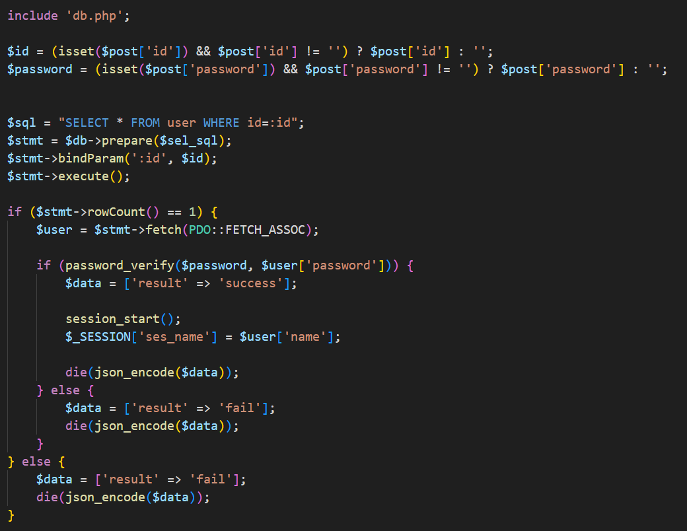

# 웹해킹 스터디 2주차: 회원가입 & 로그인 기능 구현

---

## 개요

- 회원가입 폼, 로그인 폼을 직접 제작하고, 입력값 유효성 검사 및 서버와의 JSON 통신을 구현
- DB 연동과 비밀번호 해시 처리, ID 중복 검사 등 실제 서비스에 가까운 흐름을 구현

---

## 실습 내용 정리

### 회원가입 기능 구현

우선 처음에 member DB 를 추가해주고 

- user 테이블 까지 추가해줬다. 사용자 식별을 위해 idx를 Primary Key로 지정하여 테이블에 추가했다.

- 우선 입력값의 유효성을 검사하기 위해, 빈 입력값인지 여부와 비밀번호 조건을 확인하는 조건문을 추가했다.

- 빈 입력값 조건문은 잘 된다.

- 비밀번호가 일치한지 아닌지 확인하는 조건문도 잘 되는것 같다.

- 이제 적은 데이터를 서버에 보내기 위해 js를 이용해서 값을 받아 볼것이다.

- `fetch()`를 사용해 로그인 정보를 **POST 방식**으로 서버에 전송하였다.
- JSON 형식으로 데이터를 전달하며, `Content-Type: application/json` 헤더를 설정하였다.
- 서버에서 처리한 결과는 `console.log(data)`로 출력하여 요청/응답 여부를 확인하였다.

- 서버는 JSON 응답을 위해 `Content-Type: application/json` 헤더를 설정하였다.
- 클라이언트로부터 전달받은 JSON 데이터는 `php://input`을 통해 수신하고, `json_decode()`로 배열로 변환한 후, `json_encode()`로 다시 JSON 문자열로 만들어 응답하였다.

이제 데이터를 서버에 보내고 console.log에 찍힌 걸 보자.

- 정상적으로 요청/응답이 이루어진걸 볼수 있다.

이제 회원가입 데이터를 저장할 DB를 설정 하자.

- `db.php` 파일에 DB 접속 정보를 변수로 따로 지정했다.
- `PDO` 객체를 통해 데이터베이스에 연결했다.
- 연결 과정에서 에러가 발생할 경우를 대비해 `try-catch` 문으로 예외 처리를 했다.

- `include`를 통해 `db.php`를 불러왔다.
- 요청이 성공일 경우 `$post`에 데이터를 할당하고, 실패 시에는 "문자가 없다"는 메시지를 반환하도록 처리했다.
- `INSERT` 문을 사용해 회원가입 정보를 DB에 저장했다.
- 저장 성공 시 `$data` 배열에 `'result' => 'success'` 값을 넣고, `json_encode()`로 응답을 생성한 뒤 `die()`로 즉시 종료했다.

후엔 JS 파일로 돌아가서

서버에서 받아온 응답 부분을 처리 해 주고.

 
후에 다시 회원가입을 하고 버튼을 누르면?

정상적으로 회원가입에 성공했다는 알림 창이 뜨고

DB에 접속을 해보면

이제 회원가입한 데이터를 DB에 정상적으로 저장할 수 있게 되었다.

이제 ID 중복 처리 부분을 추가해야겠다.

- `SELECT` 문으로 전달받은 `id`를 조회했다.
- `rowCount()`로 결과 행의 수를 확인해, 0보다 클 경우 중복된 ID로 간주했다.
- 중복된 경우 `$data` 배열에 `'result' => 'fail'`을 넣고,
`json_encode()`를 사용해 응답을 JSON 문자열로 변환한 뒤 클라이언트에 전달했다.
- 비밀번호 해쉬도 추가하였다.

JS 파일로 돌아가 

서버에서 받아온 응답 처리를 해주면?

정상적으로 잘 동작한다.

이제 DB에 들어가 보면

비밀번호에도 해시가 잘 적용이 되고 있다는 것을 알수 있다.

함수를 추가해 보기 편하게 코드를 수정 해줬다.

---

### 로그인 기능 구현

회원가입과 똑같이 유효성 검사를 한 후 fetch로 서버에 데이터를 전달 한 후에

- `SELECT` 문으로 전달된 `id`를 조회해, 일치하는 행이 존재하는지 확인했다.
- `rowCount()` 결과가 1일 경우, 해당 사용자 정보를 `$user` 변수에 저장했다.
- 사용자가 입력한 비밀번호와 DB에 저장된 해시된 비밀번호를 `password_verify()`로 비교했다.
- 일치할 경우 로그인 성공으로 처리하고, 사용자 이름을 세션에 저장했다.

이제 index.php 파일로 돌아가서

- 사용자 이름을 $ses_name 변수로 받게 하고, 없으면 빈 문자열로 받게 해뒀다.

로그인 한 사용자와 비회원인 사용자를 구분하기 위한 코드까지 짜봤습니다.

> 비회원 사용자

이제 ID : 회원가입, 이름 : 회원가입 합니다. 로 회원가입을 하고

로그인을 하면

정상적으로 잘 나오는 걸 볼수 있다.

DB에도 해시 비밀번호와 함게 잘 저장이 된 것을 확인할 수 있다.
