# 웹해킹 스터디 4주차: 게시판 CRUD & 자바스크립트 키로거, 쿠키 수집 기능 구현

## 개요

- 게시글 작성, 조회, 수정, 삭제 기능 구현 (최신글 우선 정렬 및 조회수 증가 기능 포함).
- 비밀번호 기반 수정/삭제 제어 및 세션 인증 처리 구현
- 로그인 입력 필드에서 keydown 이벤트를 활용한 키 입력 기록 수집 구현
- 서버에서는 log.txt 파일에 타임스탬프와 함께 기록

## 실습 내용 정리

### 게시판 읽기, 쓰기

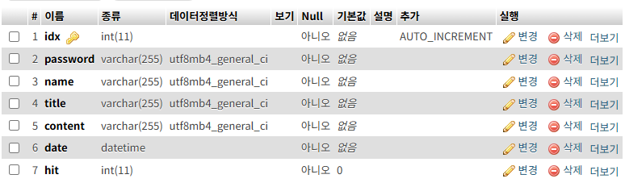

우선 처음에 board를 추가해줬다. 

> 게시판 고유번호, 게시판 비밀번호, 게시판 적은 사람 이름, 게시판 제목, 게시판 내용, 게시판 작성일, 게시판 조회수 이다.

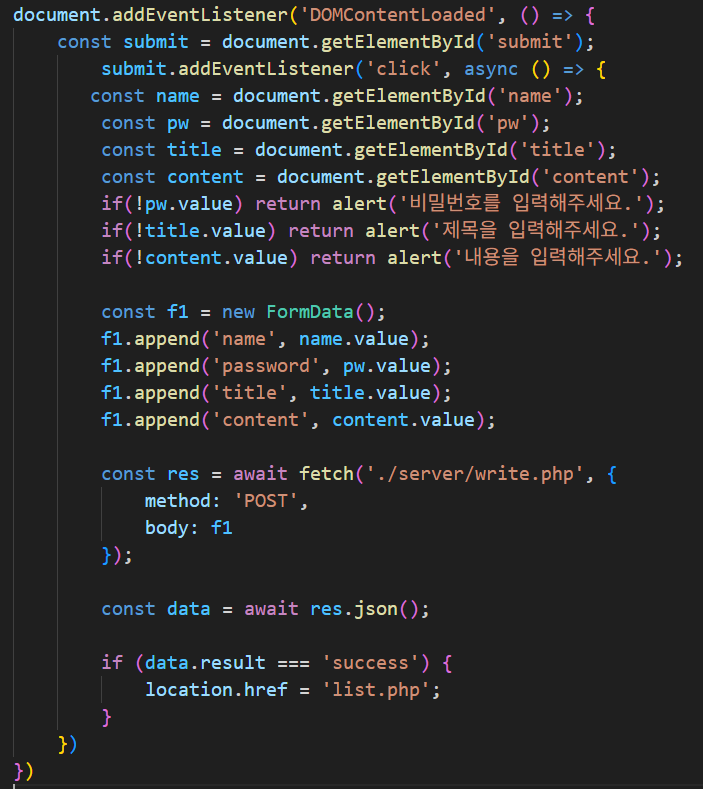

- 우선 `FormData` 로 받아온 후에 서버에 넘겨서 결과값을 받아오는 식으로 로직을 짰다.

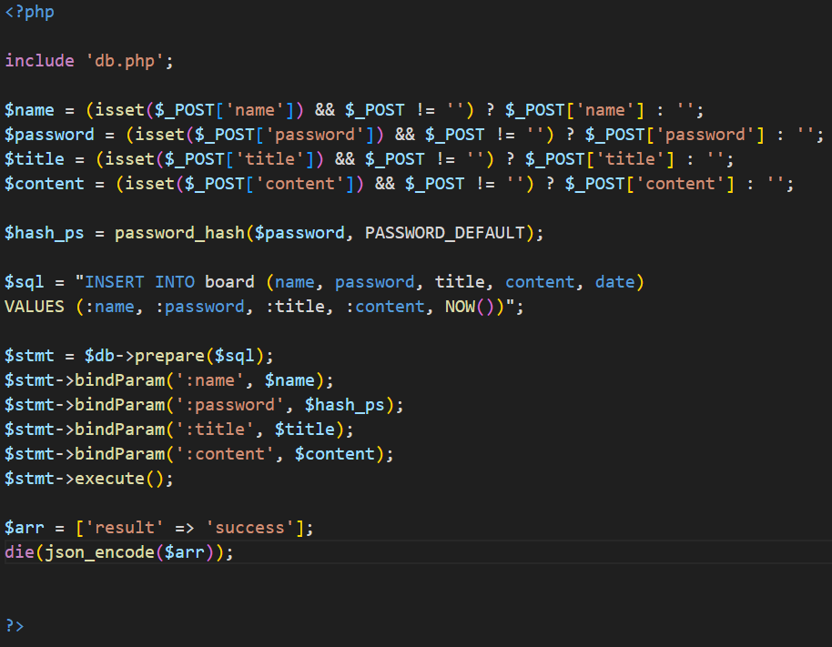

- 전송받은 데이터를 **SQL INSERT문을 통해 데이터베이스에 저장** 하였다.

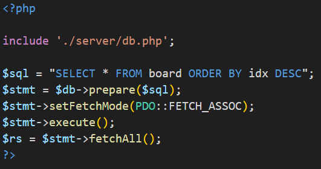

- SQL `ORDER BY` 절을 사용하여 게시글을 **작성일 기준 내림차순 정렬** 후, 최신 글이 상단에 표시되도록 구현하였고.

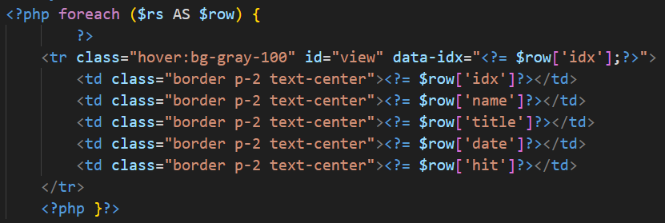

- `foreach` 문을 이용해 데이터베이스에서 가져온 게시글을 **반복 출력**하여 리스트 형태로 보여주었다.

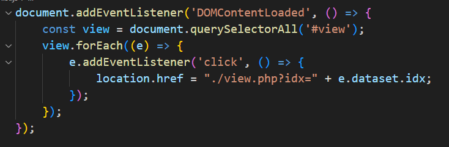

- `document.querySelectorAll()`로 가져온 모든 `.view` 요소에 대해 반복 처리하고, 각 요소에 클릭 이벤트 리스너를 등록하였다.
- `location.href`를 이용해 `idx` 값을 URL 파라미터로 전달하였다. (`view.php?idx=...`)

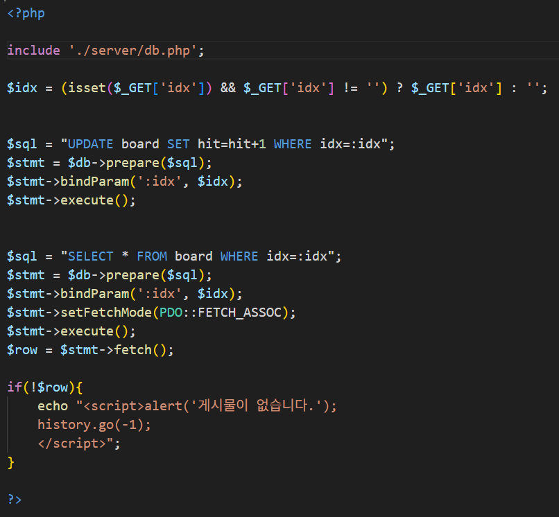

- 사용자가 게시글을 클릭하면, `GET` 방식으로 전달된 `idx` 값을 수신하고
- 해당 `idx`에 해당하는 게시글을 클릭하면 해당 게시글의 조회수(`hit`)를 **SQL `UPDATE`문을 통해 1 증가**
- 이후 동일한 `idx` 값을 기준으로 게시글 데이터를 **`SELECT`문으로 조회**하여, 가져온 데이터를 HTML로 출력하여 사용자에게 보여줌

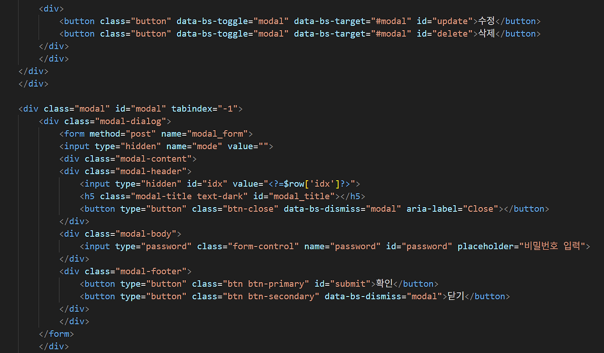

---

### 게시판 수정, 삭제

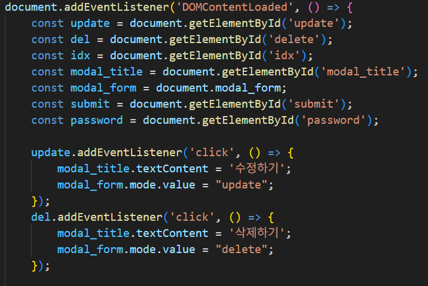

- 사용자가 입력한 비밀번호와 게시글에 저장된 비밀번호를 서버에서 비교하여, 일치할 경우에만 수정 또는 삭제가 가능하도록 구현하였다.

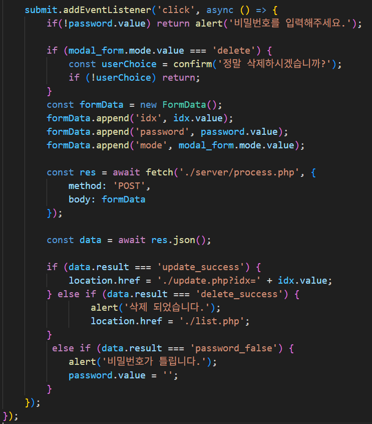

- 게시글 상세 보기 화면에서 **모달 폼을 통해 비밀번호를 입력받도록 구성**하였고
- 일치할 경우에만 수정 또는 삭제 기능이 동작하도록 처리하게 만들고, 비밀번호가 틀릴 경우에는 경고 메시지를 출력하고 동작을 중단하게 하는 로직을 구현하였다.

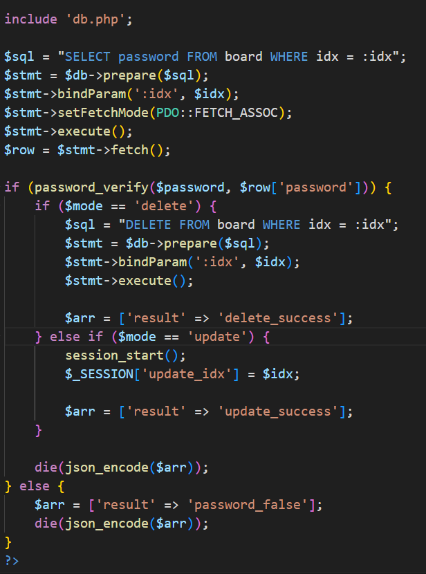

- 서버에 요청을 보내고, 응답 결과에 따라 동작을 분기하게 만들었다.
- `update_success` 응답 시 해당 게시글의 `idx` 값을 포함하여 `update.php`로 리다이렉션하고, 
`delete_success` 응답 시 해당 게시글을 삭제하는 로직을 구현하였다.

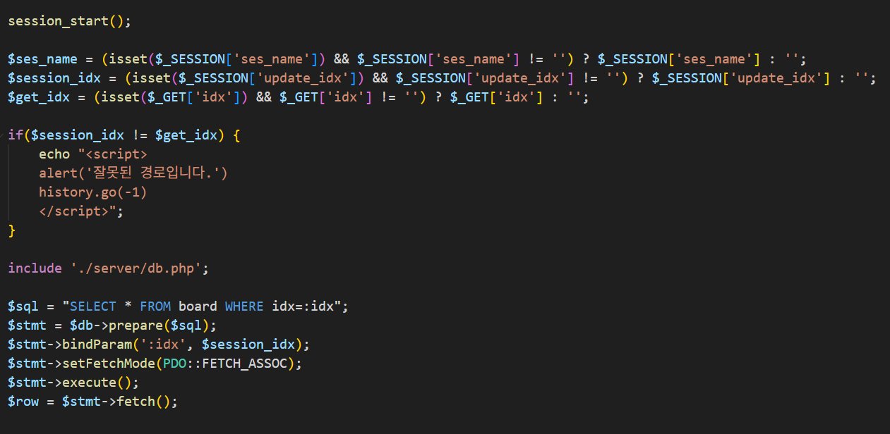

- `update_success` 응답 이후 접속한 페이지에서 **세션에 저장된 `idx` 값과 GET으로 전달된 `idx` 값을 비교**하게 만들었다.

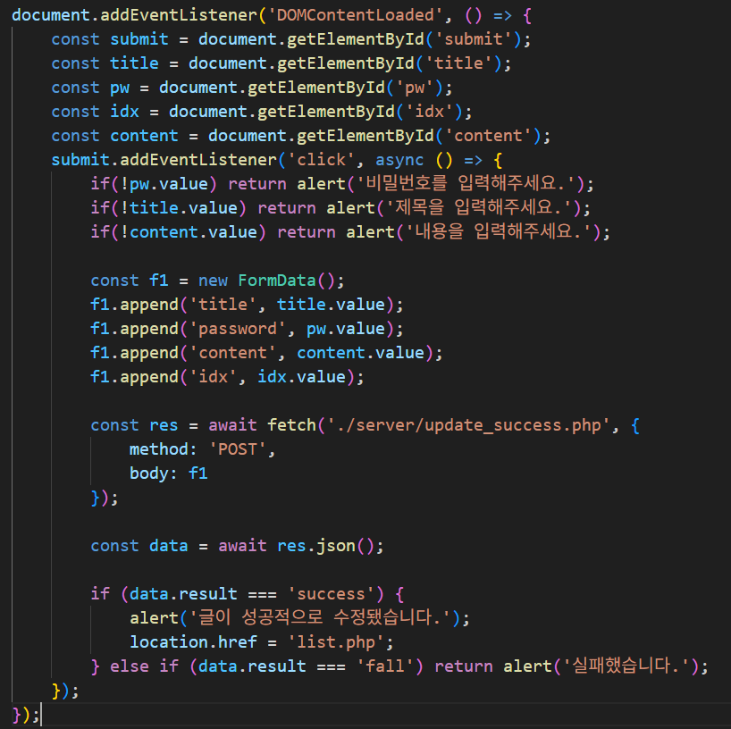

- 세션에 저장된 `idx` 값과 GET으로 전달된 `idx` 값이 일치할 경우, 사용자가 수정한 내용을 `fetch`를 통해 서버에 다시 전송

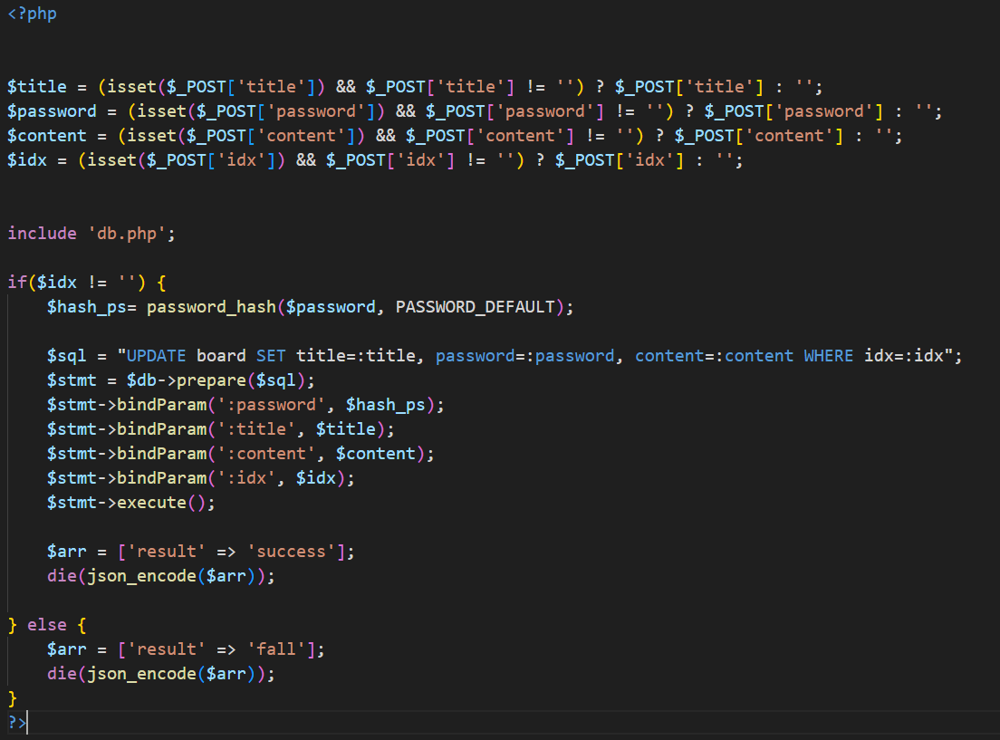

- 클라이언트로부터 전달된 데이터를 서버에서 처리하고, 처리 결과를 JSON 형태로 응답하여 클라이언트에서 후속 동작 가능하도록 구현 하였다.

> 이 과정을 통해 게시글 수정까지 포함한 전체 CRUD 기능을 완성하였다.

### 키로거 & 쿠키 수집 자바 스크립트

> 1주차에 만든 로그인 과정에서 JavaScript로 키 입력 및 쿠키 데이터를 수집하고, 이를 PHP 서버로 전송하여 리눅스 서버 경로에 txt 파일로 저장하도록 설계했다.

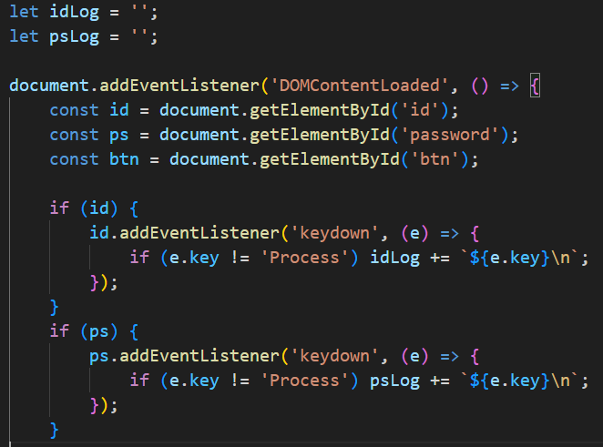

- 아이디와 비밀번호 입력 필드에 각각 키 입력 기록용 변수(keylog)를 할당 후
- `keydown` 이벤트를 통해 사용자의 입력값을 **실시간으로 수집**하도록 구현하였다.

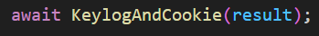

- 기존 로그인 코드에 성공/실패 결과를 받아오는 기능을 추가했다.

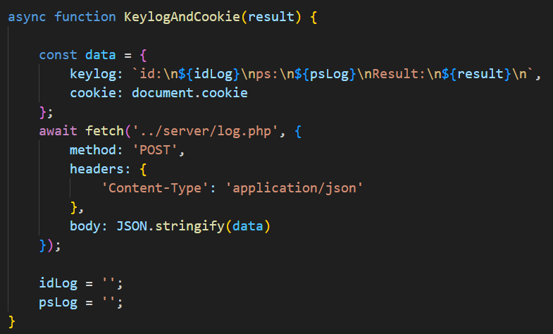

- 키로거 및 쿠키 데이터를 수집하는 함수를 만들어, `fetch`를 통해 PHP 서버로 전송했다.

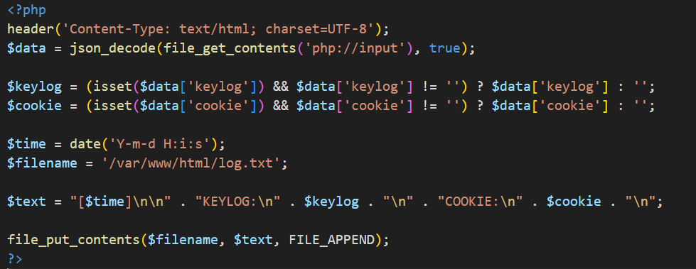

- 클라이언트에서 전달된 키로거 및 쿠키 데이터를 PHP에서 수신하여, 현재 시간을 포함해 지정된 경로에 `.txt` 파일로 저장되도록 설정하였다.

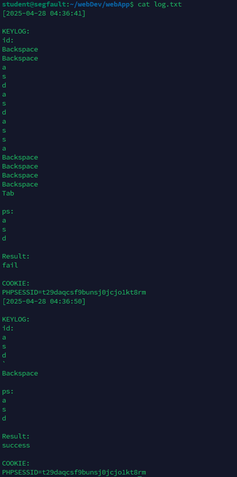

정상적으로 잘 된다.
