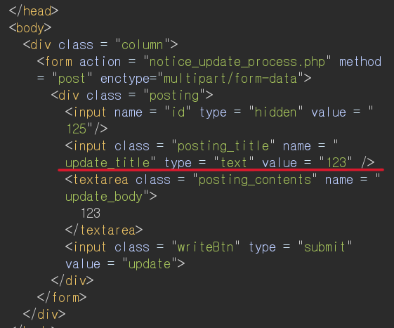

# XSS Report

## 개요

본 보고서는 귀사의 웹 서비스 내 여러 기능에서 발견된 **Cross-Site Scripting (XSS) 취약점**에 대한 분석 및 제보를 위해 작성되었습니다.

총 **6개의 개별 XSS 취약점**은 각각 서로 다른 위치와 방식으로 발생하였으며, **추가로 모든 문제에 공통적으로 존재하는 XSS 취약점 1건**도 함께 발견되었습니다.

각 취약점은 사용자의 입력값이 적절한 검증 또는 인코딩 없이 HTML이나 JavaScript 컨텍스트에 반영됨으로써, 악의적인 스크립트가 실행될 수 있는 구조를 가지고 있습니다.

---

## 요약

- 취약점 개수: 총 7건 (개별 6건 + 공통 1건)
- 취약점 유형:
    - Reflected XSS
    - Stored XSS
    - DOM-based XSS
- 영향도:
    - 악성 스크립트 실행
    - 사용자 세션 탈취
    - 클라이언트 측 조작
    - 피싱, 권한 상승 등 2차 피해 가능성

---

## 내용

### XSS 1

- 취약점 위치: 게시판 목록 페이지 (`http://ctf.segfaulthub.com:4343/xss_1/`)
> **사용자가 제목을 클릭할 경우 XSS 페이로드 실행**
- 취약점 발생 경로: 글 작성 시 제목에 XSS payload 삽입
- 취약점 유형: **Stored XSS**
- 설명: 사용자가 게시글의 제목에 `<script>` 태그를 삽입하면, 해당 게시글을 조회하는 모든 사용자 브라우저에서 스크립트가 실행됨.

#### 삽입된 스크립트가 화면에 출력된 모습

#### alert 팝업이 실제로 실행된 결과

---

### XSS 2

- 취약점 위치: 게시판 목록 페이지 (`http://ctf.segfaulthub.com:4343/xss_2/`)
> **잘못된 검색어 입력 시, 입력값이 경고 메시지에 그대로 출력되어 XSS가 발생함**
- 취약점 발생 경로: 게시판 상단 검색 기능에서 잘못된 검색어 입력 시 검색어가 화면에 그대로 출력됨
- 취약점 유형: **Reflected XSS**
- 설명: 존재하지 않는 작성자 ID로 검색할 경우, **사용자가 입력한 검색어가 결과 메시지에 포함되어 출력**되며, 필터링이 없어 악성 스크립트가 실행될 수 있음.

#### 검색창에 일반 입력값이 그대로 반영되어 오류 메시지에 출력되는 모습

#### alert 팝업이 실제로 실행된 결과

---

### XSS 3

- 취약점 위치: 개인정보 수정 페이지 (`http://ctf.segfaulthub.com:4343/xss_3/`)
> **로그인 후 진입 가능한 개인정보 수정 화면에서, `user` 파라미터가 HTML 속성 값으로 직접 반영되며 XSS 실행 가능**
- 취약점 발생 경로: URL 파라미터 user의 값이 클라이언트 화면에 `<input value="...">` 형태로 출력됨
- 취약점 유형: **Reflected XSS**
- 설명: 사용자가 URL에 입력한 user 파라미터 값이 **적절한 이스케이프 없이 `<input>` 태그의 value 속성에 삽입**됨.
" 문자로 속성을 닫고 `<script>`를 삽입함으로써 속성 탈출 후 DOM에 XSS 삽입이 가능함.

#### XSS 페이로드가 삽입된 입력값 화면

#### XSS 페이로드 실행 결과 (alert 발생)

---

### XSS 4

- 취약점 위치: 게시판 목록 페이지 (`http://ctf.segfaulthub.com:4343/xss_4/`)
> **제목 입력 시 `<SCRIPT>` 및 `confirm()`을 활용해 필터링 우회 후 클릭 시 XSS 실행됨**
- 취약점 발생 경로: 글 작성 시 제목 필드에 XSS payload 삽입
- 취약점 유형: **Stored XSS**
- 설명: `script`, `alert` 등 소문자 키워드는 필터링되어 정상 실행되지 않았으나, **대문자로 작성한 `<SCRIPT>`, `confirm()` 함수 사용 시 필터링을 우회하여 XSS 실행에 성공**함.

#### 게시글 제목에 삽입된 XSS 페이로드가 그대로 출력된 화면

#### script 태그가 실행되어 alert 팝업이 발생한 결과

---

### XSS 5

- 취약점 위치: 게시글 작성 페이지 (`http://ctf.segfaulthub.com:4343/xss_6/`)
> **클라이언트 측 필터링 로직이 JavaScript에 의존하고 있어, `javascript.enabled=false` 설정**
- 취약점 발생 경로: 게시글 작성 시 `내용 필드(create_body)`에 `<script>` 태그 삽입
- 취약점 유형: **Stored XSS**
- 설명: 클라이언트 측 JavaScript에서 `<` 및 `>` 문자를 필터링하는 로직이 존재하지만, 해당 로직은 onsubmit 시점에만 작동하며, **사용자가 JavaScript를 비활성화하고 게시글을 작성하면 필터링을 우회할 수 있음**.
작성된 XSS payload는 저장되며, 페이지 조회 시 alert 팝업이 실행됨.

#### 우회 방법
1. Firefox 주소창에 `about:config` 입력
2. `javascript.enabled`를 `false`로 변경 (JavaScript 비활성화)
3. 게시글 작성 페이지에서 payload 입력 후 "Create" 버튼 클릭
4. 게시글이 저장되며 필터링 우회됨
5. 다른 사용자가 해당 게시글 조회 시 alert 발생

#### 클라이언트 측 <, > 필터링을 수행하는 JavaScript 코드

#### Firefox에서 JavaScript를 비활성화한 설정

#### 비활성화 후 게시글 작성 시 내용 필드에 XSS 페이로드가 삽입된 화면

#### 저장된 페이로드가 실행되어 alert 팝업이 출력된 결과

---

### XSS 6

- 취약점 위치: 로그인 페이지 (`http://ctf.segfaulthub.com:4343/xss_7/`)
> **로그인 실패 시, 입력한 ID 값이 자바스크립트 코드에 삽입되어 XSS가 발생함**
- 취약점 발생 경로: 로그인 실패 시 사용자 입력값(ID)이 JavaScript 코드 내부에 삽입됨
- 취약점 유형: **Reflected XSS** 
- 설명: 로그인 실패 시 사용자 입력값(ID)이 **클라이언트 측 JavaScript 코드의 배열 또는 문자열 안에 직접 삽입**되며, 이 과정에서 `'`, `)` 등의 특수문자를 사용하면 기존 코드 흐름을 끊고 **임의의 스크립트 실행이 가능**해짐.

#### 로그인 실패 시 사용자 입력값이 오류 메시지에 반영된 기본 화면

#### 로그인 ID 필드에 XSS 페이로드 입력한 화면

#### 입력값이 자바스크립트에 삽입되어 alert 팝업이 출력된 결과

---

## 공통 취약점

- 취약점 위치: 게시글 수정 페이지 (`update_title` 제목 입력 필드)
> **사용자 입력값이 `<input>` 태그의 `value` 속성에 삽입될 때, `"`, `autofocus`, `onfocus` 등의 속성을 추가함으로써 JavaScript가 자동 실행됨**
- 취약점 발생 경로: 게시글 제목(`title`) 또는 기타 필드 값이 `<input>` 태그의 `value` 속성으로 삽입될 때 필터링이 적용되지 않음
- 취약점 유형: **Stored XSS**
- 설명: 게시글 수정 화면에서 입력한 제목이 `<input value="...">` 형태로 삽입되며, 사용자가 `" autofocus onfocus=alert("취약") x="` 와 같은 payload를 삽입하면 속성 우회를 통해 XSS가 발생함.

#### 게시글 수정 화면의 title 필드가 value 속성에 그대로 삽입되는 구조 확인

#### 게시글 제목 입력 시 속성 우회형 XSS 페이로드 삽입

#### 저장된 페이로드가 input 태그 속성 내부로 반영된 최종 HTML 구조

#### onfocus 이벤트를 통해 alert 팝업이 자동 실행된 결과

