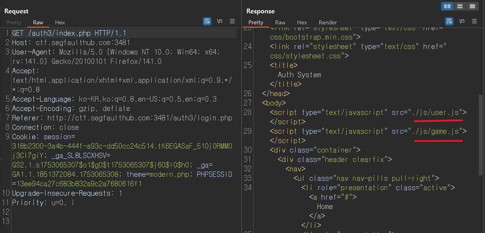

# 웹 해킹 스터디 16주차: Authorization

## 개요

- 이 문서는 Authorization(인가) 우회 취약점을 활용한 CTF 문제 풀이 기록입니다.
- 실습에서는 로그인 이후 사용자의 권한을 검증하는 로직의 불완전함을 악용하여, 일반 사용자 계정으로 관리자 기능에 접근하거나 타인의 정보를 탈취하는 과정을 다룹니다.
- URL 파라미터 변조, 미흡한 권한 검증 등을 통해 서버 측 인가 절차를 우회합니다.

---

## CTF 문제 풀이

### Authorization 1

> 문제에서 제공된 사용자 계정은 **sfUser / sfUser1234**

- 처음 문제 사이트에 접속하면 로그인 창이 나타난다.
이때 문제에서 제공된 아이디/비밀번호인 `sfUser / sfUser1234` 를 입력하여 일반 사용자 권한으로 로그인 시도한다.

- 로그인을 완료하면 아래와 같이 **"핵미사일 시스템" 페이지** 로 이동하게 되며, 화면 중앙에는 "발사 버튼은 관리자만 이용 가능합니다."라는 문구가 표시된다.
- 현재 계정은 **일반 사용자 권한**이기 때문에, 관리자 권한이 필요한 기능(예: 발사 버튼 등) 은 보이지 않거나 접근이 제한된 상태다.

이후 Burp Suite로 분석하여, **인가(Authorization) 방식**이 어떻게 처리되는지 확인해보겠다.

- Burp Suite로 응답 내용을 분석해보면, 페이지 하단에 `fire_attack_danger.php` 파일을 호출하는 `"Fire"` 버튼이 존재하는 것으로 확인된다.

직접 URI 를 통하여 해당 경로(`/auth2/fire_attack_danger.php`)에 접속을 시도해본다.

이렇게 서버 측에서 별도의 인가 검증 없이 요청을 처리하였고, 최종적으로 플래그를 획득할 수 있었다.

---

### Authorization 2

> 문제에서 제공된 사용자 계정은 **sfUser / sfUser1234**

- 일반 사용자 계정(sfUser / sfUser1234)로 로그인하면 "Fire" 버튼이 존재하지만, 클릭 시 JavaScript alert를 통해 `"권한이 없습니다"` 라는 메시지가 출력되며 동작이 차단된다.

이는 서버 측에서 추가적인 권한 검증 로직이 적용되어 있음을 의미한다.

- 이후 Burp Suite를 통해 요청 흐름을 분석하고, 인가 우회 가능 여부를 확인한다.

- 페이지에서 발사 버튼 클릭 시 **goMenu('1018', 'user')** 라는 JavaScript 함수가 호출된다.

- 페이지 소스 분석 결과 `user.js` 및 `game.js` 두 개의 JavaScript 파일이 로드되고 있었다.

URI를 통해 해당 JS 파일을 직접 열람하여 분석을 시도 해 보겠다.

- `/auth3/js/user.js` 파일을 분석한 결과, `goMenu()` 함수 내부에서 `user_auth_check()`를 통해 `userLevel` 값을 검사한 뒤, `admin`일 경우에만 `fire_nuclear_Attack.php`로 리다이렉트되는 로직이 구현되어 있었다.

- 하지만 이 권한 검사는 **클라이언트 측 JavaScript** 내에서만 수행되기 때문에, 사용자에 의해 쉽게 조작이 가능하다.

Burp Suite에서 Intercept 기능을 활성화한 뒤 `Response to this request` 옵션을 통해 응답 내용을 조작하거나, 브라우저 콘솔에서 `goMenu('1018', 'admin')` 을 수동으로 실행함으로써 관리자 권한이 요구되는 기능에 접근할 수 있다.

- `Response to this request` 옵션 설정 후 `goMenu('1018', 'admin')` 을 한 후 `Forward` 버튼을 클릭 하게 되면

최종적으로 클라이언트 측 JavaScript에서 수행되는 인가 로직을 우회하여 관리자 권한으로 `fire_nuclear_Attack.php` 페이지에 접근하였고, 플래그를 성공적으로 획득할 수 있었다.

---

### Authorization 3

- 로그인 후 게시판 페이지(`/index.php?page=board`)로 이동해보면, `NOTICE`라는 제목의 공지사항이 등록되어 있는 것을 확인할 수 있다.
해당 게시글의 작성자는 `admin`이며, 일반 사용자는 작성 기능을 사용할 수 없는 상태로 보인다.

- 게시글 상세 페이지(`/index.php?page=read&id=1`)로 이동해보면, 게시물의 내용을 확인할 수 있다.

이 URL 구조에서 **page=read** 라는 파라미터를 통해 현재 읽기 모드임을 알 수 있으며, 이를 통해 게시글 작성 페이지의 URI를 유추할 수 있다.

**page=write**와 같은 값을 시도해 보면, 관리자가 사용하는 게시글 작성 페이지에 접근할 수 있을 가능성이 있다.

주소를 (`/index.php?page=write`) 로 수동 변경하여 직접 접근을 시도하여 게시물 작성 결과 이렇게 플래그를 획득할 수 있었다.

---

### Authorization 4

- 이번 문제는 게시글에 포함된 플래그를 읽어내는 것이 핵심이다. 그러나 게시글 목록에서 해당 게시물을 클릭하면, **타인의 글을 읽을 수 없습니다** 라는 alert 창이 출력되며 접근이 차단되는 방식으로 보안이 구현되어 있다.

- 게시글 작성 후, 다른 사용자의 게시글은 `read` 페이지를 통해 직접 열람이 차단되어 있었기 때문에, `index.php?page=edit&id=?` 형태의 URI를 활용해 수정 페이지로 접근하여 게시글 내용을 우회적으로 조회하는 방식으로 접근을 시도하였다.

- `index.php?page=edit&id=2` 형태로 URI를 조작하여 특정 게시글의 수정 페이지에 접근할 수 있었다. 이를 통해 원래 접근이 불가능한 게시글의 내용을 확인할 수 있었고, 최종적으로 플래그를 획득하는 데 성공하였다.

---

### Authorization 5

- 마이페이지 에선 `index.php?page=mypage&id=?` 형식의 URI를 사용하며, 클라이언트 측에서 직접 사용자 ID 값을 제어할 수 있다.

- `index.php?page=mypage&id=1` 과 같이 URL의 id 파라미터를 직접 수정함으로써, 관리자 계정의 마이페이지로 접근할 수 있었고, 이를 통해 최종적으로 플래그를 획득하였다.